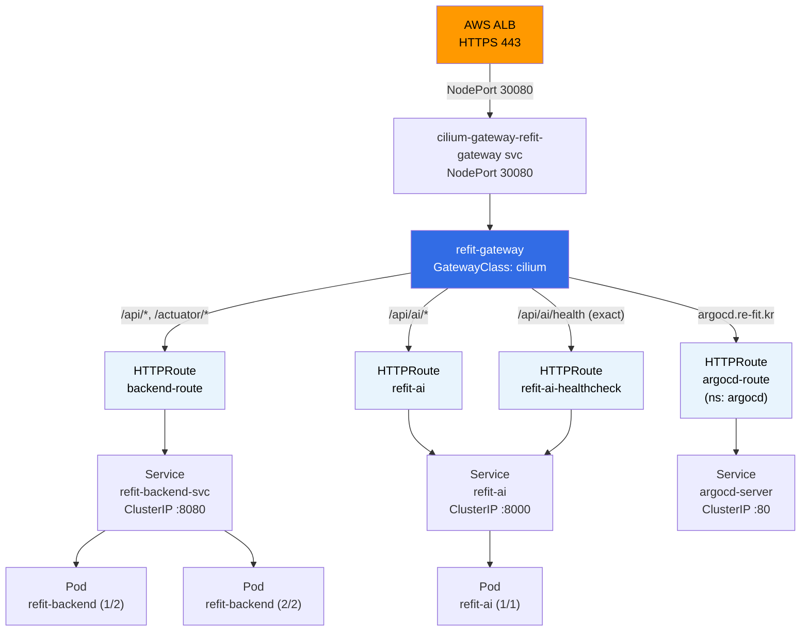
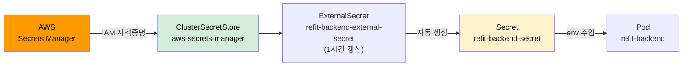
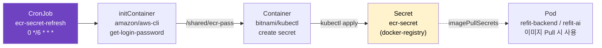

# ArgoCD 애플리케이션 리소스 가이드

> 각 ArgoCD Application이 관리하는 쿠버네티스 리소스의 역할을 정리한 문서입니다.
> 확인 방법: `kubectl get <kind> -n <namespace>` 또는 ArgoCD UI > Application Details Tree

---

## 전체 구조 요약

```
refit-stack (AppOfApps)
├── refit-foundation   → 네임스페이스, 리소스 제한, 외부 시크릿 스토어
├── refit-networking   → Gateway, HTTPRoute (트래픽 라우팅)
├── refit-infra        → ECR 인증 토큰 자동 갱신
├── refit-backend      → 백엔드 서버 워크로드
└── refit-ai           → AI 서버 워크로드
```

---

## 1. refit-foundation

**역할**: 클러스터의 기반 인프라를 구성합니다. 네임스페이스, 리소스 제한, 외부 시크릿 연동을 담당합니다.

### Namespace (ns)

| 이름 | 역할 |
|---|---|
| `argocd` | ArgoCD가 동작하는 네임스페이스 |
| `monitoring` | Prometheus, Grafana 등 모니터링 도구 네임스페이스 |
| `refit-app` | 실제 애플리케이션(backend, AI)이 동작하는 네임스페이스 |

### LimitRange (limits)

컨테이너별 CPU/메모리의 **기본값(default)**과 **최댓값(max)**을 설정합니다.
`resources`를 명시하지 않은 컨테이너에 자동으로 적용됩니다.

| 이름 | 대상 네임스페이스 | 기본 Request | 기본 Limit | 최대 Limit |
|---|---|---|---|---|
| `argocd-limits` | argocd | cpu:100m, mem:128Mi | cpu:500m, mem:512Mi | cpu:2, mem:4Gi |
| `monitoring-limits` | monitoring | cpu:100m, mem:128Mi | cpu:500m, mem:512Mi | cpu:2, mem:4Gi |
| `refit-app-limits` | refit-app | cpu:100m, mem:128Mi | cpu:500m, mem:512Mi | cpu:2, mem:4Gi |

### ResourceQuota (quota)

네임스페이스 전체에서 사용할 수 있는 리소스의 **총량 상한선**을 설정합니다.
Pod 수, 전체 메모리 합계를 제한합니다.

| 이름 | 대상 네임스페이스 | Pod 수 한도 | Request 메모리 한도 | Limit 메모리 한도 |
|---|---|---|---|---|
| `argocd-quota` | argocd | 15개 | 3Gi | 6Gi |
| `monitoring-quota` | monitoring | 10개 | 1Gi | 2Gi |
| `refit-app-quota` | refit-app | 15개 | 8Gi | 11Gi |

> **LimitRange vs ResourceQuota 차이**
> - LimitRange: 컨테이너 **1개**에 대한 제한 (개별 단위)
> - ResourceQuota: 네임스페이스 **전체** 합계에 대한 제한 (집합 단위)

### ClusterSecretStore (clustersecretstore)

| 이름 | 역할 |
|---|---|
| `aws-secrets-manager` | AWS Secrets Manager에 접근하기 위한 클러스터 전역 연결 설정. `external-secrets` 네임스페이스의 `refit-eso-credentials` 시크릿(IAM 키)을 사용해 ap-northeast-2 리전의 Secrets Manager에 ReadWrite 접근 |

이 스토어를 참조해 ExternalSecret 리소스들이 AWS에서 시크릿 값을 자동으로 가져옵니다.

---

## 2. refit-networking

**역할**: 외부 트래픽을 클러스터 내 서비스로 라우팅하는 Gateway API 리소스를 관리합니다.

```
인터넷 → ALB → NodePort(30080) → cilium-gateway-refit-gateway svc → refit-gateway → HTTPRoute → Service
```

### Gateway

| 이름 | 네임스페이스 | 역할 |
|---|---|---|
| `refit-gateway` | refit-app | Cilium이 제어하는 L7 게이트웨이. HTTP(80) 리스너를 열고 모든 네임스페이스의 HTTPRoute 연결 허용 (`allowedRoutes.from: All`) |

Cilium은 이 Gateway를 생성하면 자동으로 `cilium-gateway-refit-gateway` LoadBalancer 서비스를 함께 생성합니다.

### Service (자동 생성)

| 이름 | 타입 | NodePort | 역할 |
|---|---|---|---|
| `cilium-gateway-refit-gateway` | LoadBalancer | 30080 | Cilium이 Gateway에 대해 자동 생성하는 서비스. ALB가 이 NodePort(30080)로 트래픽을 전달하면 Cilium eBPF가 수신해 HTTPRoute 규칙에 따라 라우팅 |

### HTTPRoute

| 이름 | 네임스페이스 | 경로 | 대상 서비스 |
|---|---|---|---|
| `backend-route` | refit-app | `/api/*`, `/actuator/*` | refit-backend-svc:8080 |
| `refit-ai` | refit-app | `/api/ai/*` | refit-ai:8000 |
| `refit-ai-healthcheck` | refit-app | `/api/ai/health` (exact) | refit-ai:8000 |
| `argocd-route` | argocd | `argocd.re-fit.kr` (호스트 기반) | argocd-server:80 |

> `argocd-route`는 다른 네임스페이스(argocd)에 있지만, Gateway의 `allowedRoutes.from: All` 설정으로 연결 가능합니다.

---

## 3. refit-infra

**역할**: ECR(Elastic Container Registry) 인증 토큰을 6시간마다 자동 갱신합니다.

ECR 토큰은 12시간마다 만료됩니다. 토큰이 만료되면 파드가 이미지를 Pull하지 못해 배포가 실패합니다.

### ServiceAccount (sa)

| 이름 | 역할 |
|---|---|
| `ecr-secret-refresher` | CronJob Pod가 사용하는 서비스 계정. `ecr-secret-refresher` Role과 바인딩되어 Secret 조작 권한을 가짐 |

### Role

| 이름 | 권한 |
|---|---|
| `ecr-secret-refresher` | `refit-app` 네임스페이스의 Secret에 대해 `get`, `create`, `patch`, `update` 허용 |

### RoleBinding (rb)

| 이름 | 역할 |
|---|---|
| `ecr-secret-refresher` | ServiceAccount `ecr-secret-refresher`에 `ecr-secret-refresher` Role을 바인딩 |

### CronJob

| 이름 | 스케줄 | 역할 |
|---|---|---|
| `ecr-secret-refresh` | `0 */6 * * *` (6시간마다) | ECR 토큰을 갱신해 `ecr-secret` docker-registry Secret을 업데이트 |

**CronJob 동작 방식:**
1. **initContainer** (`get-ecr-token`): `aws ecr get-login-password`로 ECR 토큰 발급 → `/shared/ecr-pass`에 저장
2. **container** (`update-secret`): 저장된 토큰으로 `kubectl create secret docker-registry ecr-secret ... --dry-run | kubectl apply` 실행

---

## 4. refit-backend

**역할**: Spring Boot 백엔드 서버의 워크로드를 관리합니다.

### Service (svc)

| 이름 | 타입 | 포트 | 역할 |
|---|---|---|---|
| `refit-backend-svc` | ClusterIP | 8080 | 백엔드 파드로의 클러스터 내부 트래픽 라우팅. HTTPRoute `backend-route`의 대상 |

### Deployment (deploy)

| 이름 | 레플리카 | 역할 |
|---|---|---|
| `refit-backend` | 2 | 백엔드 컨테이너의 배포 설정. 이미지, 환경변수, 리소스 등 정의. ReplicaSet을 통해 파드를 관리 |

### ReplicaSet (rs)

Deployment가 자동 생성합니다. 지정된 수의 파드가 항상 실행되도록 유지합니다.

### Pod

실제로 Spring Boot 애플리케이션이 실행되는 컨테이너 단위. 현재 2개 운영 중.

### HorizontalPodAutoscaler (hpa)

| 이름 | 최소/최대 레플리카 | 스케일 기준 |
|---|---|---|
| `refit-backend` | 2 / 5 | CPU 사용률 70% 초과 시 스케일 아웃 |

트래픽 증가에 따라 파드 수를 자동으로 늘리고, 감소하면 줄입니다.

### ExternalSecret (externalsecret)

| 이름 | 연결 스토어 | 갱신 주기 | 역할 |
|---|---|---|---|
| `refit-backend-external-secret` | aws-secrets-manager | 1시간 | AWS Secrets Manager에서 백엔드 환경변수(DB URL 등)를 가져와 `refit-backend-secret` 생성 |

### Secret (secret)

| 이름 | 타입 | 역할 |
|---|---|---|
| `refit-backend-secret` | Opaque | ExternalSecret이 자동 생성. 백엔드 파드에 환경변수로 주입되는 DB 연결 정보 등 |

### HTTPRoute

| 이름 | 역할 |
|---|---|
| `backend-route` | `/api/*`, `/actuator/*` 경로를 `refit-backend-svc:8080`으로 라우팅 |

---

## 5. refit-ai

**역할**: Python FastAPI AI 서버의 워크로드를 관리합니다.

### ServiceAccount (sa)

| 이름 | 역할 |
|---|---|
| `refit-ai` | AI 파드가 사용하는 서비스 계정. IRSA(IAM Role for Service Account) 연동 시 AWS 서비스 접근에 사용 |

### Service (svc)

| 이름 | 타입 | 포트 | 역할 |
|---|---|---|---|
| `refit-ai` | ClusterIP | 8000 | AI 파드로의 클러스터 내부 트래픽 라우팅 |

### Deployment (deploy)

| 이름 | 레플리카 | 역할 |
|---|---|---|
| `refit-ai` | 1 | AI 컨테이너 배포 설정 |

### HorizontalPodAutoscaler (hpa)

| 이름 | 최소/최대 레플리카 | 스케일 기준 |
|---|---|---|
| `refit-ai` | 1 / 3 | CPU 사용률 70% 초과 시 스케일 아웃 |

### HTTPRoute

| 이름 | 역할 |
|---|---|
| `refit-ai` | `/api/ai/*` 경로를 `refit-ai:8000`으로 라우팅 |
| `refit-ai-healthcheck` | `/api/ai/health` (정확 일치)를 `refit-ai:8000`으로 라우팅. ALB 헬스체크용 |

> `refit-ai-healthcheck`를 별도로 분리한 이유: ALB 헬스체크 엔드포인트에 인증 미들웨어를 적용하지 않기 위해서입니다.

### PodDisruptionBudget (pdb)

| 이름 | 설정 | 역할 |
|---|---|---|
| `refit-ai` | `maxUnavailable: 1` | 노드 드레인이나 롤링 업데이트 시 최대 1개 파드만 동시에 중단 허용. AI 서비스 가용성 보장 |

---

## 리소스 간 관계 다이어그램

### 트래픽 라우팅 흐름



### 시크릿 공급 흐름



### ECR 인증 갱신 흐름


