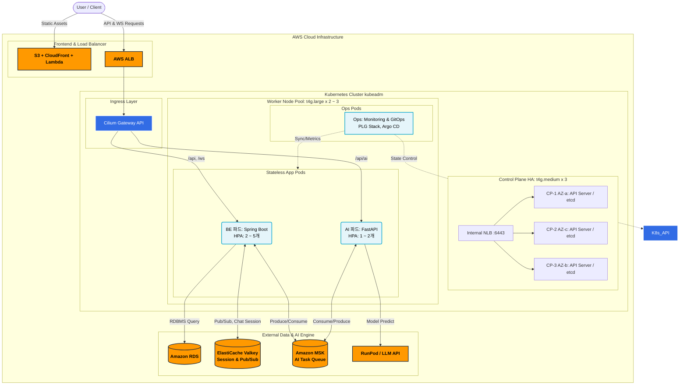
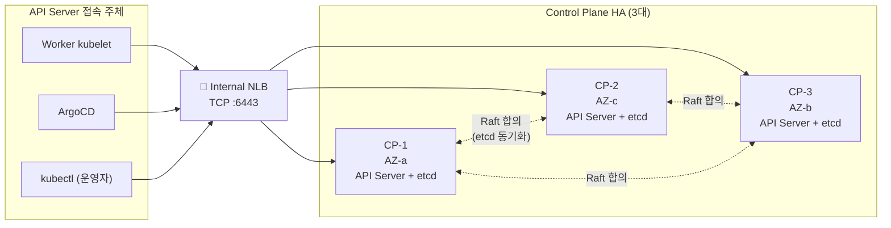

# Re-Fit 쿠버네티스 클러스터 설계서 (최종)

> **문서 목적**: 현재 운영 중인 클러스터의 실제 구성을 반영한 최종 설계 문서입니다.
> 초기 설계(v2) 대비 변경된 내용은 각 섹션에 별도 표기했습니다.
>
> 최종 갱신: 2026-03-17 | 클러스터 버전: K8s v1.34.5 | OS: Ubuntu 22.04.5 LTS (kernel 6.8.0-1047-aws)

## 목차

1. [쿠버네티스 전환 이유](#1-쿠버네티스-전환-이유)
2. [기대효과](#2-기대효과)
3. [클러스터 내 구성요소 및 배치 이유](#3-클러스터-내-구성요소-및-배치-이유)
4. [워크로드 정의 및 자원 할당 정책](#4-워크로드-정의-및-자원-할당-정책)
5. [노드 구성](#5-노드-구성)
6. [CNI 선정: Cilium (VXLAN 모드)](#6-cni-선정-cilium-vxlan-모드)
7. [Ingress 설계: Gateway API (Cilium 구현체)](#7-ingress-설계-gateway-api-cilium-구현체)
8. [무중단 배포](#8-무중단-배포)
9. [모니터링 전략](#9-모니터링-전략)
10. [오토스케일링 전략](#10-오토스케일링-전략)
11. [헬스체크 설계](#11-헬스체크-설계)
12. [장애 대응](#12-장애-대응)

---

## 1. 쿠버네티스 전환 이유
| **종류** | **비시즌 (평상시)** | **채용 시즌 (Peak)** | **비고** |
| --- | --- | --- | --- |
| **MAU** | ~ 100,000 |  ~ 400,000 | 고관여 구직자 중심의 활성 사용자 |
| **DAU** | 5,000 ~ 8,000 | 30,000 ~ 50,000 | 시즌 시 평소 대비 약 5 ~ 7배 트래픽 급증 |
| **피크 동시 접속(CCU)** | ~ 800 |  ~ 5,000 | DAU의 약 10%가 피크 시간대(공고 직후) 집중 |
| **피크 RPS** | ~ 100 |  ~ 500 | API 요청 및 WebSocket 통신 부하 포함 |
| **AI 분석 요청** | ~ 400건/일 |  ~ 2,500건/일 | 이력서 파싱 및 분석 리포트 생성 건수 |

### 전환의 핵심 동기: 성능이 아닌 운영 편의성

- Re-Fit의 현재 트래픽 규모(피크 RPS ~ 500, DAU ~ 5만)는 기존 Docker + ASG 아키텍처로도 **성능적으로는 충분히 처리 가능한 수준**
- 전환의 목적은 트래픽 증가에 따른 고가용성 확보가 아니라, **서비스를 안정적으로 운영하기 위한 자동화·편의성 확보**에 있음
- 실시간 통신(WebSocket)과 AI 분석이 결합된 복합 워크로드를 운영하면서, 장애 감지/복구·무중단 배포·독립적 스케일링 등 **수동으로 해결해야 했던 운영 과제**들이 쿠버네티스의 기본 기능으로 자동화됨
- 즉, "더 큰 트래픽을 버티기 위해서"가 아니라 **"같은 트래픽을 더 적은 운영 비용과 더 높은 안정성으로 처리하기 위해"** 전환

### 기존 아키텍처(Docker + ASG)의 한계

- **장애 감지/복구 부재**
  - EC2 인스턴스 레벨 상태 체크만 가능, 컨테이너 내부(데드락, OOM 등) 애플리케이션 레벨 장애 감지 불가
  - ALB Health Check 주기(30초) 단위로만 감지 → 장애 컨테이너에 트래픽 지속 전달
  - 채팅 중 사용자에게 30초간 서비스 중단 체감

- **배포/운영 자동화 부족**
  - 무중단 배포를 위해 수동 트래픽 제어 또는 스크립트 기반 배포 필요
  - 배포 중 문제 발생 시 롤백이 까다로움
  - WebSocket 연결의 Graceful Shutdown 자동화 부재

- **비효율적인 자원 활용**
  - 시즌/비시즌 트래픽 변동 5 ~ 7배이나, ASG는 EC2 인스턴스 단위 확장 → 프로비저닝 3 ~ 5분 소요
  - 인스턴스 단위 스케일링이므로 세밀한 자원 조절이 어렵고, 비시즌 유휴 자원 낭비 발생

### K8s 도입으로 해결되는 점

- **Self-Healing**: Pod 단위 헬스체크(startup/readiness/liveness Probe) → 장애 즉시 감지 및 자동 재기동
- **선언적 배포(GitOps)**: ArgoCD + GitHub Actions로 배포 자동화, Git 기반 즉각 롤백
- **Pod 단위 스케일링**: HPA로 BE/AI를 독립적으로 수평 확장, 초 단위 반응
- **WebSocket 안정성**: PreStop Hook + Graceful Shutdown으로 배포 중 채팅 연결 유지

---

## 2. 기대효과

- **운영 자동화**: 헬스체크 → 배포 → 스케일링까지 제어 루프 기반 자동 관리, 수동 운영 오버헤드 급감
- **서비스 연속성 향상**: Self-Healing + 롤링 업데이트로 무중단 상태 보장
- **비용 효율적 가용성 확보**: 중소형 인스턴스(t4g 시리즈, ARM/Graviton) 통합 운영 + HA Control Plane으로 컨트롤 플레인 무중단 보장

---

## 3. 클러스터 내 구성요소 및 배치 이유
### 아키텍처 다이어그램




### 클러스터 내부 배치

| 구성요소 | 형태 | 배치 이유 |
|:---------|:-----|:---------|
| **BE (Spring Boot)** | Deployment | Self-Healing과 HPA가 채팅 안정성에 직결 |
| **AI (FastAPI)** | Deployment | 채용 시즌 AI Pod만 독립 확장 필요 → BE와 분리 |
| **Gateway API** | Cilium Gateway API (Envoy 프록시) | K8s 공식 차세대 트래픽 관리 표준. CNI(Cilium)와 통합되어 경로별 타임아웃 제어 + 별도 Ingress Controller Pod 없이 동작 |
| **모니터링 (PLG + Tempo)** | DaemonSet / StatefulSet | Pod 재시작, OOMKilled 등 클러스터 내부 이벤트를 실시간 수집하려면 클러스터 안에 위치 필요 |
| **ArgoCD** | Deployment | Git 상태와 클러스터 상태를 자동 동기화하는 GitOps 컨트롤러 |

### 클러스터 외부 유지

| 구성요소 | 유지 이유 |
|:---------|:---------|
| **DB (PostgreSQL / RDS)** | 핵심 데이터 영속성 + Multi-AZ 복구를 AWS RDS에 위임 |
| **Redis → ElastiCache Valkey** | 초기 설계 대비 변경. 클러스터 내 단일 Pod 대비 관리형 서비스의 HA·자동 Failover가 채팅 세션 안정성에 더 적합하다고 판단. 비용 증가(월 ~$25)는 운영 부담 감소로 상쇄 |
| **Kafka → Amazon MSK** | 초기 설계 대비 변경. MSK Serverless로 비시즌 비용 최소화 + 시즌 트래픽 급증 시 자동 처리량 확장. 클러스터 내 Kafka Pod 관리(KRaft 설정, 디스크 I/O 튜닝)에 드는 운영 오버헤드 제거 |
| **AI 모델 (RunPod)** | GPU 연산 필요, Serverless로 공채 시즌에만 비용 발생 |
| **FE (React/Next.js)** | Lambda@Edge + CloudFront + S3 CDN 자동 확장 → 클러스터 자원을 BE/AI에 집중 |

---

## 4. 워크로드 정의 및 자원 할당 정책

- 노드 스펙 결정 전, 클러스터 위에서 **무엇을 얼마만큼 돌릴 것인가**를 먼저 확정
- 이 섹션의 Pod 수 및 requests/limits 합계 → 다음 섹션(5. 노드 구성)의 사이징 입력값

### 4.1 네임스페이스 설계

- `default` 네임스페이스에 전체 워크로드 배치 시, 모니터링 스택 메모리 급증이 서비스 Pod를 OOMKilled로 연쇄 영향
- **워크로드 성격별 네임스페이스 분리** → ResourceQuota로 자원 상한 강제

| 네임스페이스 | 포함 워크로드 | 분리 목적 |
|:-----------|:-----------|:---------|
| `refit-app` | BE, AI, Gateway API (Cilium Envoy Proxy) | **서비스 핵심 워크로드** 전용. 사용자 트래픽을 직접 처리하는 컴포넌트만 배치 |
| `monitoring` | Prometheus, Loki, Grafana, Tempo, Grafana Alloy | **관측 스택** 격리. Prometheus의 메트릭 수집이나 Loki의 로그 인제스트가 서비스 Pod와 자원을 경합하지 않도록 분리 |
| `argocd` | ArgoCD Server, Repo Server, Application Controller | **배포 파이프라인** 격리. Git Sync 작업이 서비스나 모니터링에 영향을 주지 않도록 독립 |

### 4.2 워크로드별 Pod 수 및 리소스 할당

**산정 원칙:**

- **requests**: Pod 정상 동작을 위해 **항상 보장**되어야 하는 최소 자원. 스케줄러의 노드 배치 기준
- **limits**: 순간 부하 대응을 위한 최대 허용 자원. 초과 시 CPU throttling / Memory OOMKilled
- **limits ≤ requests × 2**: 과도한 limits → 다수 Pod 동시 burst 시 노드 실제 자원 초과 → 연쇄 OOMKilled 발생 (Over-commit 방지)

#### `refit-app` 네임스페이스 워크로드

| 워크로드 | 상시 수량 | 피크 수량 | CPU req / lim | Memory req / lim | 산정 근거 |
|:---------|:---------|:---------|:-------------|:----------------|:---------|
| **BE (Spring Boot)** | 2 Pod | 5 Pod (HPA) | 250m / 500m | 300Mi / 768Mi | `-XX:MaxRAMPercentage=60.0 -XX:InitialRAMPercentage=50.0` 설정 기준 실측 메모리 사용량 반영. 초기 설계 512Mi/1Gi에서 실운영 데이터 기반 하향 조정 |
| **AI (FastAPI)** | 1 Pod | 3 Pod (HPA) | 500m / 2 | 1Gi / 3Gi | 초기 설계(200m/400m, 256Mi/512Mi) 대비 대폭 상향. GCP Vertex AI 연동 + 이력서 파싱 등 로컬 연산이 포함되어 실제 AI 서비스가 예상보다 무거운 것으로 확인됨. HPA max도 2→3으로 상향 |
| **Cilium Envoy Proxy** | DaemonSet (노드당 1) | — | — | — | Cilium Gateway API가 자동 관리하는 DaemonSet. 별도 리소스 설정 불필요 |

#### `monitoring` 네임스페이스 워크로드

| 워크로드 | 수량 | CPU req / lim | Memory req / lim | 산정 근거 |
|:---------|:-----|:-------------|:----------------|:---------|
| **Prometheus** | 1 Pod | 300m / 500m | 512Mi / 1Gi | 15초 scrape 주기 × 대상 ~15개 Pod. 메트릭 수집 시 메모리가 burst하므로 limits 2배 |
| **Loki** | 1 Pod | 200m / 400m | 256Mi / 1Gi | 레이블만 인덱싱하여 Elasticsearch 대비 경량. 로그 인제스트 burst 시 메모리 급증 대비 limits 여유 |
| **Grafana** | 1 Pod | 100m / 200m | 128Mi / 256Mi | 대시보드 조회 위주. 동시 사용자가 운영팀으로 제한되어 경량 |
| **Grafana Alloy** | 노드당 1 (DaemonSet) | 100m / 200m | 128Mi / 256Mi | 로그·메트릭·트레이스를 단일 에이전트로 수집. 초기 설계의 OTel Collector를 Grafana Alloy로 대체 (OTel 호환 + Prometheus Agent 통합) |
| **Tempo** | 1 Pod | 100m / 500m | 256Mi / 1Gi | 분산 추적 백엔드. 초기 설계에 없었으나 AI 파이프라인 지연 분석을 위해 추가 |

#### `argocd` 네임스페이스 워크로드

| 워크로드 | 수량 | CPU req / lim | Memory req / lim | 산정 근거 |
|:---------|:-----|:-------------|:----------------|:---------|
| **ArgoCD** (Server + Controller + Repo) | 3 Pod | 총 300m / 600m | 총 512Mi / 1Gi | Git Sync 3분 주기. 매니페스트 렌더링 시 일시적 CPU 사용 |

### 4.3 자원 합산 및 요약

> 이 합계 → 5장 노드 사이징의 직접 입력값

**상시(비시즌) 총 requests:**

| 네임스페이스 | CPU requests 합계 | Memory requests 합계 |
|:-----------|:-----------------|:--------------------|
| `refit-app` | 250m×2 + 500m + 100m = **1,100m** | 300Mi×2 + 1Gi + 128Mi = **~1.8Gi** |
| `monitoring` | 300m + 200m + 100m + 100m + 100m×(노드 수) = **900m ~ 1core** | 512Mi + 256Mi + 128Mi + 256Mi + 128Mi×(노드 수) = **~1.4Gi** |
| `argocd` | **300m** | **~1Gi** |
| **전체 합계** | **~2.3 ~ 2.4 core** | **~4.2Gi** |

**피크(채용 시즌) 추가 requests:**

| 확장 대상 | 추가 Pod 수 | 추가 CPU | 추가 Memory |
|:---------|:-----------|:---------|:-----------|
| BE (2→5) | +3 | +750m | +900Mi |
| AI (1→3) | +2 | +1,000m | +2Gi |
| **확장분 합계** | | **+1,750m** | **+2.9Gi** |
| **피크 시 전체 합계** | | **~4.1 core** | **~7.1Gi** |

### 4.4 ResourceQuota

- 네임스페이스별 자원 총량 상한 강제 → 단일 네임스페이스의 클러스터 자원 독점 방지

| 네임스페이스 | Pod 수 상한 | Memory requests 상한 | Memory limits 상한 | 근거 |
|:-----------|:----------|:--------------------|:------------------|:-----|
| `refit-app` | **15개** | **8Gi** | **11Gi** | BE 5 Pod(300Mi×5) + AI 3 Pod(1Gi×3) + 여유. AI 피크 스케일 아웃 수용 |
| `monitoring` | **10개** | **1Gi** | **2Gi** | Alloy 경량화로 초기 설계(4Gi) 대비 대폭 절감. 실운영 메모리 측정 기반 |
| `argocd` | **15개** | **3Gi** | **6Gi** | 실운영에서 ArgoCD 컴포넌트 메모리 사용이 초기 예상(1Gi)보다 높아 상향 조정 |

### 4.5 LimitRange

- requests/limits 미지정 컨테이너의 무제한 자원 소비 방지
- LimitRange로 **컨테이너 단위 기본값·최대값 강제**

**`refit-app` 네임스페이스:**

| 항목 | CPU | Memory | 적용 목적 |
|:-----|:----|:-------|:---------|
| **default** (미지정 시 자동 적용되는 limits) | 500m | 512Mi | requests/limits를 빠뜨린 신규 Pod가 무한정 자원을 먹지 않도록 방어 |
| **defaultRequest** (미지정 시 자동 적용되는 requests) | 100m | 128Mi | 스케줄러가 적절히 분산 배치할 수 있도록 최소 requests 보장 |
| **max** (컨테이너 1개 최대값) | 1 core | 2Gi | 단일 컨테이너가 노드 전체를 독점하는 것을 차단 |
| **min** (컨테이너 1개 최소값) | 50m | 64Mi | 지나치게 작은 requests로 인한 불안정한 스케줄링 방지 |

**`monitoring` 네임스페이스:**

| 항목 | CPU | Memory | 적용 목적 |
|:-----|:----|:-------|:---------|
| default | 300m | 512Mi | Prometheus 등 자원 집약 컴포넌트의 기본 상한 |
| defaultRequest | 100m | 256Mi | — |
| max | 1 core | 2Gi | Loki 인제스터 등 burst 시에도 상한 제어 |

---

## 5. 노드 구성

### 선정 결과

- **Control Plane**: t4g.medium (2 vCPU / 4Gi) × 3대 (HA 구성, 3개 AZ 분산)
- **Worker Node**: t4g.large (2 vCPU / 8Gi) × 2 ~ 3대 (단일 풀, 통합 배치)

---

### 5.1 Control Plane 사이징

#### 고려 요소

Control Plane 스펙 결정 시 고려할 네 가지 요소:

| 고려 요소 | 설명 |
|:---------|:-----|
| **① K8s 시스템 컴포넌트 메모리** | kube-apiserver, kube-controller-manager, kube-scheduler, etcd 등 Control Plane 데몬들이 상주하며 소비하는 기본 메모리 |
| **② etcd 데이터 크기 및 I/O** | 클러스터 내 오브젝트(Pod, Service, ConfigMap 등)의 수에 비례하여 etcd의 메모리와 디스크 I/O가 증가 |
| **③ API Server 요청 빈도** | kubelet의 하트비트, HPA 메트릭 조회, ArgoCD Sync 등 API 호출 빈도가 CPU 사용량에 영향 |
| **④ 노드·Pod 규모** | 관리하는 Worker Node 수와 총 Pod 수가 증가할수록 스케줄링 연산과 Watch 이벤트 처리량이 증가 |

#### Re-Fit 환경 대입

| 고려 요소 | Re-Fit 산정 | 필요 자원 |
|:---------|:-----------|:---------|
| ① 시스템 컴포넌트 | kube-apiserver(~500MB) + etcd(~200MB) + controller-manager(~200MB) + scheduler(~100MB) + OS/kubelet(~600MB) | **메모리 ~1.6GB 상시 점유** |
| ② etcd 데이터 | Worker 2~3대, 총 Pod 15~20개, Service/ConfigMap 등 소규모 오브젝트 → etcd DB 크기 수십 MB 이내 | **메모리 추가 부담 미미** |
| ③ API 호출 빈도 | Worker 2~3대의 kubelet 하트비트(10초 주기) + HPA 메트릭 조회(15초 주기) + ArgoCD Sync(3분 주기) → 초당 요청 수 ~10건 미만 | **CPU 부담 매우 낮음** |
| ④ 노드·Pod 규모 | 최대 Worker 3대, 상시 Pod ~15개 / 피크 시 ~20개 → K8s 공식 권장 최소 기준(2 vCPU, 2GB) 내 여유있게 수용 | **최소 사양 충족** |

#### 왜 t4g.medium (2 vCPU / 4GB)인가

- **하한선 (t4g.small, 2GB)**: 시스템 컴포넌트 ~1.6GB 소비 → 남은 400MB로는 etcd 스냅샷 생성(일시 ~500MB 급증)·kubectl 실행 등 운영 작업 시 OOM 위험 상존
- **적정선 (t4g.medium, 4GB)**: 시스템 컴포넌트 ~1.6GB + etcd 스냅샷/운영 여유 ~1GB + OS 파일 캐시 ~1.4GB → kubeadm 공식 최소 사양(2 vCPU, 2GB)의 2배 여유 확보
- **상한선 (t4g.large, 8GB)**: Worker 3대 / Pod 20개 미만 소규모 클러스터에서 8GB 과잉 → 추가 비용(월 ~$31)을 Worker에 할당하는 것이 전체 안정성에 더 효율적

#### Control Plane HA(3대) 구성을 선택한 이유

**HA(High Availability)란?** 시스템의 핵심 컴포넌트를 다중화하여, 일부가 장애를 일으켜도 전체 시스템이 중단 없이 계속 동작하도록 보장하는 구성입니다. K8s에서 HA CP란 **Control Plane 노드를 3대로 구성**하여, 1대가 장애를 일으켜도 나머지 2대가 클러스터 관리를 이어받는 것을 의미합니다.

##### 단일 CP의 위험: "CP 장애 + α" 시나리오

단일 CP 장애 시 기존 Pod는 정상 동작을 유지하지만, **동시에 다른 장애가 발생하면 복구 능력이 완전히 마비**됩니다:

| 시나리오 | 단일 CP에서의 결과 |
|:---------|:------------------|
| CP 장애 + BE Pod OOMKilled | Pod 재생성 불가 → **채팅 서비스 부분 장애** |
| CP 장애 + 채용 시즌 트래픽 급증 | HPA 확장 불가 → **기존 Pod만으로 버텨야 함** |
| CP 장애 + Worker 1대 NotReady | 해당 노드의 Pod 재스케줄링 불가 → **서비스 반쪽 장애** |
| CP 장애 + 긴급 롤백 필요 | `kubectl rollout undo` 불가 → **장애 버전이 계속 서빙** |

→ WebSocket 기반 채팅이 핵심인 Re-Fit에서, CP 부재 중 Pod 재생성·HPA 확장이 불가능한 것은 **채팅 중인 사용자 연결 유실로 직결**

##### HA CP 구성 시 필요한 세 가지 요소

**① etcd 쿼럼 (Quorum)**

etcd는 K8s 클러스터의 **모든 상태(Pod, Service, Deployment 등)를 저장하는 분산 데이터베이스**입니다. 3대의 etcd가 Raft 합의 알고리즘으로 데이터를 동기화하며, 데이터 일관성을 위해 **과반수(3대 중 2대 이상)가 정상이어야** 읽기/쓰기가 가능합니다. 이 과반수 조건을 "쿼럼(Quorum)"이라고 합니다.

- 3대 구성: 1대 장애까지 허용 (2대 생존 = 과반수 유지 ✅)
- 2대 장애 시: 과반수 미달 → etcd 읽기 전용 또는 중단 ❌

kubeadm의 **Stacked etcd** 방식을 사용합니다. 각 CP 노드에 API Server와 etcd가 함께 실행되므로 별도의 etcd 전용 노드가 불필요합니다.

**② NLB (Network Load Balancer) — API Server 앞단 로드밸런서**

단일 CP에서는 Worker 노드의 kubelet이 CP의 IP로 직접 통신합니다. CP가 3대가 되면, kubelet이 **어떤 CP에 접속해야 하는지** 결정할 단일 진입점이 필요합니다. 이 역할을 하는 것이 NLB입니다.



- AWS Internal NLB(TCP 모드)로 API Server 6443 포트를 로드밸런싱
- `kubeadm init` 시 `--control-plane-endpoint=<NLB DNS>:6443`으로 지정
- CP 1대가 죽으면 NLB Health Check가 감지하여 나머지 2대로만 트래픽 분산

**③ 인증서 공유**

kubeadm HA 구성 시, 최초 CP에서 생성된 CA(인증 기관) 인증서를 나머지 CP에 복제해야 합니다. `kubeadm init` 시 `--upload-certs` 옵션으로 인증서를 클러스터 Secret에 업로드하고, 추가 CP는 `kubeadm join --control-plane --certificate-key <key>`로 자동 수신합니다.

##### 비교 종합

| 비교 항목 | 단일 CP (1대) | HA CP (3대) |
|:---------|:-------------|:-----------|
| **CP 장애 시 영향** | "신규 스케줄링 불가" + 연쇄 장애 복구 마비 | **1대 장애 시 무중단**, 자동 페일오버 |
| **AZ 장애 시 영향** | CP가 해당 AZ에 있으면 CP도 함께 유실 | **3개 AZ에 분산 → 어느 AZ가 죽어도 2대 생존(쿼럼 유지)** |
| **추가 비용** | 없음 | 인스턴스 2대 + NLB (월 +~$99, 약 +13만원) |
| **운영 복잡도** | 낮음 | 중간 (NLB + 인증서 관리 + etcd 모니터링) |
| **복구 전략** | etcd S3 백업 + 수동 재구축 (30분) | 자동 페일오버. etcd 백업은 **전체 클러스터 재구축 시 2차 방어선**으로 유지 |

→ WebSocket 기반 실시간 채팅 서비스에서 CP 부재 시 HPA·Self-Healing·롤백이 동시에 불가능해지는 리스크가 크므로, **비용 +월 13만원 대비 컨트롤 플레인 무중단의 이득이 더 큼**

---

### 5.2 Worker Node 사이징

#### 고려 요소

Worker Node 스펙 결정 시 고려할 다섯 가지 요소:

| 고려 요소 | 설명 |
|:---------|:-----|
| **① 시스템 예약 자원 (System Reserved)** | kubelet, containerd, OS 커널, CNI(Cilium) 등이 노드 자원의 일부를 선점. 이 자원은 Pod에 할당할 수 없음 |
| **② 상시 워크로드 requests 합산** | 모든 Pod의 `resources.requests` 합계. 이것이 스케줄링 기준이며 노드 Allocatable 범위를 초과하면 Pod가 `Pending` 상태에 빠짐 |
| **③ HPA 확장 여유분** | 피크 시 BE 2→5, AI 1→2로 확장될 때 추가 Pod를 수용할 수 있는 여유 자원 |
| **④ DaemonSet 오버헤드** | 노드마다 1개씩 뜨는 DaemonSet(OTel Collector, kube-proxy, Cilium 등)의 고정 자원 소모 |
| **⑤ 메모리 특성 (JVM vs Python)** | Spring Boot(JVM)는 heap 메모리를 사전에 크게 예약하므로 메모리가 사이징의 제1 병목. FastAPI는 상대적으로 경량 |

#### Re-Fit 환경 대입: Bottom-Up 워크로드 적산

**Step 1. 노드당 시스템 예약 자원 산출**

| 항목 | CPU | Memory |
|:-----|:----|:-------|
| kubelet + containerd | 100m | 256Mi |
| kube-proxy | 100m | 128Mi |
| Cilium (CNI + eBPF) | 250m | 256Mi |
| OS 커널 / 파일 캐시 | — | ~512Mi |
| **소계 (노드당 고정 소모)** | **~450m** | **~1.15Gi** |

→ t4g.large (2 vCPU = 2000m / 8Gi) 기준, Pod에 할당 가능한 Allocatable 자원: **~1,550m CPU / ~6.85Gi Memory**

**Step 2. 상시 워크로드 requests 합산 (비시즌 기준)**

| 워크로드 | 수량 | CPU requests | Memory requests |
|:---------|:-----|:-------------|:----------------|
| BE (Spring Boot) | 2 Pod | 250m × 2 = 500m | 300Mi × 2 = 600Mi |
| AI (FastAPI) | 1 Pod | 500m × 1 = 500m | 1Gi × 1 = 1Gi |
| PLG (Prometheus + Loki + Grafana + Tempo) | 각 1 Pod | 700m | 1.1Gi (합산) |
| ArgoCD | 1 Pod | 200m | ~1Gi |
| Grafana Alloy (DaemonSet) | 노드당 1 | 100m × 2 = 200m | 128Mi × 2 |
| **상시 합계** | | **~2.1 ~ 2.3 core** | **~3.9 ~ 4.2Gi** |

**Step 3. 피크 시(채용 시즌) HPA 확장 자원 산출**

| 워크로드 | 비시즌 → 피크 | 추가 CPU | 추가 Memory |
|:---------|:------------|:---------|:-----------|
| BE (Spring Boot) | 2 → 5 Pod (+3) | 250m × 3 = 750m | 300Mi × 3 = 900Mi |
| AI (FastAPI) | 1 → 3 Pod (+2) | 500m × 2 = 1,000m | 1Gi × 2 = 2Gi |
| **확장분 합계** | | **~1.75 core** | **~2.9Gi** |

→ **피크 시 총 필요 자원: ~4.1 core / ~7.1Gi**

**Step 4. 노드 수 결정**

| 구성 | 총 Allocatable | 상시 워크로드 | 피크 시 | 여유율 (피크 대비) |
|:-----|:--------------|:-----------|:-------|:----------------|
| **Worker 2대** | ~3.1 core / ~13.7Gi | ✅ 충분 | ⚠️ AI HPA max 3개 시 메모리 압박 | 비시즌 기본 구성 |
| **Worker 3대** | ~4.65 core / ~20.5Gi | ✅ 충분 | ✅ 여유 ~12% | 채용 시즌 구성 |

→ 비시즌 Worker 2대 운영, 채용 시즌 진입 직전 CA minSize=3으로 사전 확장하는 탄력적 운영

#### 왜 t4g.large (2 vCPU / 8GB)인가

- **하한선 (t4g.medium, 4GB)**: 시스템 예약(~1.15Gi) 후 Allocatable ~2.85Gi → BE 1개(512Mi) + Redis(256Mi) + Kafka(512Mi) = ~1.3Gi 소비 → Prometheus(~512Mi) 추가 시 여유 ~1Gi → HPA 확장 시 즉시 `Pending`. JVM의 높은 메모리 요구량 감안 시 **4GB 노드는 Pod 2~3개가 한계**
- **적정선 (t4g.large, 8GB)**: Allocatable ~6.85Gi → 상시(~4.2Gi) + HPA 확장분(~1.75Gi) 수용 + 메모리 스파이크 대비 여유 확보 → OOMKilled 위험 최소화
- **상한선 (t4g.xlarge, 16GB)**: Node당 10Gi 이상 유휴 메모리 발생 → 월 비용 2배($61 → $122/대), 사용률 30% 미만 → 비용 대비 효율 급감

#### 왜 t4g 시리즈인가 (인스턴스 패밀리 선정 근거)

| 인스턴스 패밀리 | 특성 | Re-Fit 적합도 |
|:-------------|:-----|:-------------|
| **t4g (Burstable, ARM/Graviton)** | AWS Graviton2(ARM) 프로세서 기반 Burstable 인스턴스. t3과 동일한 CPU 크레딧 모델(유휴 시 적립, 버스트 시 사용)이면서 **t3 대비 ~20% 저렴**. ARM 아키텍처로 에너지 효율이 높고 동일 vCPU 대비 동등하거나 더 나은 성능 제공 | ⭐ **최적** — 비시즌 CPU 사용률 20~30%에서 크레딧 적립 + 채용 시즌 버스트 소화. t3 대비 ~20% 비용 절감. Re-Fit의 컨테이너 이미지(Spring Boot JVM, FastAPI Python, Redis, Kafka 등)는 모두 ARM(linux/arm64) 지원 |
| t3 (Burstable, x86) | 기존 x86 기반 Burstable. t4g과 동일 크레딧 모델이나 비용이 ~20% 더 높음 | 차선 — 기능적으로 동등하나 t4g 대비 비용 효율이 낮음 |
| m5/m6i (범용) | 고정 CPU 성능, 안정적이지만 비용이 t4g 대비 ~50% 비쌈 | 적합하나 비용 과잉 — 상시 고부하가 아니므로 고정 성능에 대한 프리미엄이 불필요 |
| c5/c6i (컴퓨팅 최적화) | CPU 집약 워크로드 최적 | 부적합 — AI 연산은 외부(RunPod)에서 수행하므로 클러스터 내 CPU 집약 워크로드 없음 |
| r5/r6i (메모리 최적화) | 대용량 메모리 워크로드 최적 | 부적합 — Redis/Kafka가 단일 Pod 경량 구성이므로 메모리 최적화 인스턴스는 과잉 |

→ Re-Fit 트래픽의 대부분은 **비시즌(RPS ~100)** → t4g 버스트 모델과 정확히 부합. 비시즌에 CPU 크레딧 적립, 채용 시즌 피크에 활용하는 비용 효율적 운영. ARM(Graviton) 아키텍처는 x86 대비 에너지 효율이 높고, Re-Fit의 모든 컨테이너 이미지가 multi-arch(ARM 포함)를 지원하므로 호환성 이슈 없음

### 월 비용 요약

| 항목 | 스펙 | 수량 | 월 비용 (서울 리전, On-Demand) |
|:-----|:-----|:-----|:---------------------------|
| Control Plane (HA) | t4g.medium | 3대 | ~$30 × 3 = ~$90 |
| Internal NLB | TCP 6443 | 1개 | ~$18 |
| Worker Node | t4g.large | 2대 | ~$61 × 2 = ~$122 |
| EBS (OS + PV) | gp3 | ~210GB | ~$20 |
| **합계** | | | **~$250 (약 33만원)** |

---

### 5.3 Pod 스케줄링 전략 (Label · Selector · Affinity)

#### Label / Selector 설계

- K8s에서 Service, HPA, NetworkPolicy 등 모든 리소스는 **Label Selector**로 대상 Pod를 식별
- 일관된 Label 체계가 없으면 잘못된 Pod에 트래픽이 전달되거나, NetworkPolicy가 의도하지 않은 Pod를 허용/차단하는 사고 발생

**Label 규칙:**

| Label Key | 값 예시 | 용도 |
|:----------|:-------|:-----|
| `app` | `refit-be`, `refit-ai`, `refit-redis`, `refit-kafka` | Service Selector, NetworkPolicy podSelector, HPA scaleTargetRef |
| `component` | `backend`, `ai`, `cache`, `queue`, `monitoring`, `gitops` | 워크로드 성격별 그룹핑 (운영 시 일괄 조회용) |
| `tier` | `app`, `infra`, `ops` | Stateless 앱 / Stateful 인프라 / 운영 도구 구분 |

**적용 예시:**

- `Service(refit-be-svc)` → `selector: { app: refit-be }` → BE Pod만 트래픽 수신
- `NetworkPolicy(refit-be-egress)` → `podSelector: { app: refit-be }` → BE Pod의 아웃바운드만 제어
- `HPA(refit-be-hpa)` → `scaleTargetRef: Deployment/refit-be` → BE Deployment만 확장

#### Pod AntiAffinity

- **목적**: 동일 Deployment의 Pod가 단일 노드에 집중되는 것을 방지 → 노드 1대 장애 시에도 서비스 유지
- **적용 대상**: BE Deployment (replicas ≥ 2인 핵심 서비스)
- **정책**: `preferredDuringSchedulingIgnoredDuringExecution` (Soft 방식)
  - Hard(`required`) 방식은 Worker 2대에 replicas 3 이상일 때 Pending 발생 가능 → Soft로 설정하되 weight 100으로 최우선 적용
  - `topologyKey: kubernetes.io/hostname` → 같은 노드에 동일 app Pod 배치를 회피

| 대상 | AntiAffinity 방식 | topologyKey | 근거 |
|:-----|:-----------------|:-----------|:-----|
| **BE (refit-be)** | preferred (weight: 100) | `kubernetes.io/hostname` | replicas 2~5. 노드 장애 시 채팅 연결 전체 유실 방지 |
| **AI (refit-ai)** | 미적용 | — | 상시 1 Pod → AntiAffinity 의미 없음. 피크 시 2 Pod이나, AI는 Kafka 비동기 처리이므로 동일 노드 배치도 무방 |
| **Redis / Kafka** | 미적용 | — | 각 1 Pod 고정 → 분산 대상 없음 |

#### Taint / Toleration — 미사용 근거

- Taint/Toleration은 **특정 노드에 특정 워크로드만 배치**하기 위한 메커니즘
- 일반적으로 앱 노드/인프라 노드를 분리할 때 사용 (예: `node-role=infra:NoSchedule`)
- Re-Fit은 **단일 Worker Pool** 구조 → 모든 노드가 동일 역할
  - 워크로드 분리가 필요할 만큼 노드 수가 많지 않음 (2~3대)
  - Taint 적용 시 특정 노드에만 Pod가 집중되어 오히려 자원 불균형 발생
  - 네임스페이스 + ResourceQuota로 논리적 격리 충분
- → **Taint/Toleration 미사용**, 스케줄러 기본 분산 + AntiAffinity로 배치 최적화

#### AZ 분산 배치

**Worker 노드:**
- Worker 2대 이상을 **2개 AZ** (ap-northeast-2a, ap-northeast-2c)에 분산 배치
- Node Label로 AZ 정보 명시: `topology.kubernetes.io/zone=ap-northeast-2a`
- Pod AntiAffinity의 `topologyKey: kubernetes.io/hostname`과 결합하여, BE Pod가 서로 다른 AZ의 노드에 배치되도록 유도
- **효과**: 단일 AZ 장애 시에도 다른 AZ의 BE Pod가 트래픽 처리 → 서비스 무중단 유지

**Control Plane 노드 (HA):**
- CP 3대를 **3개 AZ** (ap-northeast-2a, ap-northeast-2c, ap-northeast-2b)에 **1:1:1로 분산** 배치
- etcd 쿼럼(과반수) 조건 상, 2개 AZ에 2:1로 배치하면 2대가 있는 AZ 장애 시 쿼럼 붕괴(3대 중 1대만 생존 → 과반수 미달) → **반드시 3개 AZ 분산 필수**
- **효과**: 어떤 AZ가 장애를 일으켜도 CP 2대 생존 → etcd 쿼럼 유지 → 스케줄링·HPA·롤백 모두 정상 동작

---

## 6. CNI 선정: Cilium (VXLAN 모드)

### CNI란

CNI(Container Network Interface)는 쿠버네티스 클러스터 내 **Pod 간 통신을 가능하게 하는 네트워크 플러그인**입니다. 쿠버네티스 자체는 "모든 Pod가 서로 통신할 수 있어야 한다"는 규칙만 정의하고, **실제 네트워크를 구현하는 것은 CNI의 몫**입니다. CNI 없이는 Pod에 IP가 할당되지 않고, Pod 간 통신 자체가 불가능합니다.

### 6.1 Re-Fit 클러스터에서 CNI가 해결해야 하는 문제

Re-Fit 클러스터의 특성을 먼저 정리합니다:

- 서비스(BE/AI), 인프라(Redis/Kafka), 운영(PLG/ArgoCD) Pod가 **동일 워커 노드 풀에 혼재**
- Redis에 세션 토큰·채팅 메시지, Kafka에 이력서 분석 요청이 저장 — K8s 기본 상태에서는 **모든 Pod가 자유 접근 가능**
- EKS가 아닌 **kubeadm 자체 구축 환경**
- Worker 2~3대, 총 Pod ~20개의 소규모 클러스터

이 특성에서 CNI가 해결해야 하는 세 가지 문제를 도출합니다:

| # | 문제 | 왜 문제인가 |
|:--|:-----|:-----------|
| ① | **Pod 간 접근 제어 (NetworkPolicy)** | 서비스·인프라·운영 Pod가 혼재하므로, Grafana나 ArgoCD에 보안 취약점이 발생하면 공격자가 해당 Pod를 거점으로 Redis/Kafka에 자유 접근 가능. **최소 권한 원칙(Least Privilege)**에 따라 BE Pod만 Redis/Kafka에 접근하도록 격리 필수 |
| ② | **kubeadm + AWS VPC 환경 호환** | AWS VPC 위의 kubeadm 클러스터에서 VPC 라우팅 테이블 수동 관리 없이 Pod 네트워크가 즉시 구성되어야 함 |
| ③ | **네트워크 관측성 (Observability)** | 네트워크 문제 발생 시 **원인을 빠르게 파악**할 수 있어야 함. "BE → Redis 연결 실패" 시 어떤 정책이 차단했는지, 어떤 Pod가 비정상 접근을 시도했는지 **실시간 확인** 가능해야 함 |

### 6.2 후보 비교

| CNI | ① NetworkPolicy (접근 제어) | ② kubeadm + AWS 호환 | ③ 네트워크 관측성 | 판정 |
|:----|:-------------------------|:-------------------|:----------------|:-----|
| **Cilium** | ⭐ L3/L4/L7 NetworkPolicy + DNS 기반 정책. Pod IP·포트뿐 아니라 HTTP 경로·DNS 이름 기반까지 세밀한 정책 가능 | ✅ VXLAN 모드: AWS VPC 설정 변경 없이 즉시 동작 (Amazon Linux 2 커널 5.10+ 충족) | ⭐ **Hubble** 내장 — 모든 Pod 간 트래픽 흐름을 실시간 시각화. `hubble observe --verdict DROPPED`로 차단된 트래픽 즉시 필터링. Prometheus 메트릭 export → 기존 Grafana 대시보드에 네트워크 관측 통합 | ⭐ **선정** |
| **Calico** | ✅ L3/L4 NetworkPolicy 완전 지원 | ⭐ VXLAN 모드 즉시 동작 | ⚠️ `iptables -L`, `conntrack -L` 등 표준 도구로 디버깅은 가능하나, 규칙이 수십~수백 줄이 되면 수동 분석 비용이 높음. 트래픽 흐름 시각화 없음 | 차선 — 관측성 부족 |
| **Flannel** | ❌ NetworkPolicy **미지원** | ⭐ VXLAN 모드 즉시 동작 | ⭐ 가장 단순 | ❌ 탈락 — ①번 문제 해결 불가 |
| **AWS VPC CNI** | ⚠️ 자체적으로는 제한적, Calico 병행 필요 | ❌ EKS 전제 설계. kubeadm에서 ENI 관리·IAM 연동 등 추가 작업 과중 | ✅ | ❌ 탈락 — ②번 문제 해결 불가 |
| **Weave Net** | ✅ NetworkPolicy 지원 | ✅ 오버레이 즉시 동작 | ⚠️ | ❌ 탈락 — 2024년 프로젝트 유지보수 중단(archive), 보안 패치 미지원 위험 |

### 6.3 Cilium 선정 근거 (상세)

**① Pod 간 접근 제어 — 최소 권한 원칙 적용**

Calico의 L3/L4 NetworkPolicy만으로도 "BE Pod만 Redis 6379 접근 허용"은 구현 가능합니다. 그러나 Cilium은 L7까지 지원하여, 향후 "특정 HTTP 경로만 허용"이나 "특정 DNS 이름으로의 아웃바운드만 허용" 등 더 세밀한 정책으로 확장할 수 있습니다. 현재는 L3/L4 수준의 정책만 사용하더라도, 서비스 성장에 따른 보안 요구사항에 대응할 여지를 확보합니다.

**② kubeadm + AWS 환경 호환**

Cilium VXLAN 모드는 AWS VPC의 라우팅 테이블이나 ENI 설정 변경 없이 즉시 동작합니다. 유일한 요구사항은 **커널 5.10 이상**인데, Re-Fit이 사용하는 Amazon Linux 2의 기본 커널이 5.10이므로 추가 조치 없이 충족됩니다.

**③ 네트워크 관측성 — Hubble + 기존 PLG 스택 통합**

Cilium을 선정한 결정적 이유입니다. Re-Fit은 이미 **Prometheus + Grafana** 기반 모니터링 스택을 운영하고 있습니다. Cilium에 내장된 Hubble은:

| 기능 | 상세 |
|:-----|:-----|
| **실시간 트래픽 시각화** | `hubble observe --from-pod refit-be --to-pod refit-redis` → BE↔Redis 간 모든 트래픽과 적용된 정책을 즉시 확인 |
| **차단 트래픽 필터링** | `hubble observe --verdict DROPPED` → NetworkPolicy에 의해 차단된 트래픽만 필터링하여 정책 오류 즉시 진단 |
| **Prometheus 메트릭 연동** | Hubble이 네트워크 메트릭(RPS, 에러율, 레이턴시)을 Prometheus 형식으로 export → **기존 Grafana 대시보드에 네트워크 관측 패널을 추가**하여 별도 도구 없이 통합 관측 가능 |
| **DNS 관측** | Pod 간 DNS 쿼리 추적 → 잘못된 Service 이름이나 DNS 해석 오류를 즉시 파악 |

→ Calico의 `iptables -L` 기반 수동 디버깅 대비, Hubble은 **원인 파악까지의 시간을 단축**합니다. 별도 도구가 아니라 기존 PLG 스택에 통합되므로 추가 인프라 비용이 없습니다.

**④ 프로젝트 지속성**

Cilium은 **2024년 CNCF Graduated** 프로젝트로, 장기 지속성과 거버넌스가 보장됩니다. 또한 Cilium은 CNI 역할뿐 아니라 **Gateway API 구현체**를 내장하고 있어, Ingress Controller와 통합 운영이 가능합니다 (→ 7장에서 상세).

**Calico 대비 인지해야 할 비용:**

| 항목 | 영향 | 완화 방안 |
|:-----|:-----|:---------|
| 리소스 증가 | Cilium agent 노드당 ~250m/256Mi (Calico ~150m/128Mi 대비 +100m/+128Mi) | Ingress Controller를 Cilium Gateway API로 통합하면 별도 ingress Pod(~100m/128Mi) 불필요 → **순 증가분 미미** |
| eBPF 학습 곡선 | eBPF 내부 동작 이해 필요 | 일상 운영은 `cilium status`, `hubble observe` 수준. eBPF 내부까지 이해할 필요 없음. Hubble UI가 직관적이라 진입 장벽 낮음 |

### 6.4 Cilium 네트워킹 모드: VXLAN 선택

Cilium은 여러 네트워킹 모드를 지원합니다:

| 모드 | 동작 방식 | 장점 | 단점 |
|:-----|:---------|:-----|:-----|
| **VXLAN (오버레이)** | Pod 패킷을 VXLAN/Geneve 헤더로 캡슐화하여 노드 간 전송 | ⭐ **AWS VPC 라우팅 테이블 수정 불필요**. 어떤 환경에서든 즉시 동작 | 캡슐화 오버헤드로 ~5~10% 레이턴시 추가 |
| **Native Routing** | 호스트 라우팅 테이블을 직접 사용 | 캡슐화 없어 네이티브 성능 | AWS VPC에서 각 노드의 Pod CIDR을 라우팅 테이블에 등록 필요 |
| **AWS ENI** | AWS ENI를 직접 Pod에 할당 | VPC 네이티브 IP, 최고 성능 | EKS 전제. kubeadm 환경에서 사용 불가 |

→ kubeadm 환경에서 AWS VPC 라우팅 테이블을 수동 관리하는 부담을 피하기 위해 **VXLAN 모드**를 선택. Re-Fit의 내부 트래픽(BE↔Redis, BE↔Kafka)은 동일 노드 또는 인접 노드 간 통신이므로, VXLAN 오버헤드의 실질적 영향은 미미합니다 (노드 간 RTT ~0.5ms 추가 수준).

### 6.5 NetworkPolicy 적용

> **중요**: Cilium Gateway API 환경에서 표준 `NetworkPolicy`만으로는 트래픽 라우팅이 정상 동작하지 않습니다.
> cilium-envoy DaemonSet은 `hostNetwork: true`로 실행되기 때문에 Cilium eBPF 보안 모델에서
> `reserved:host` / `reserved:remote-node` 아이덴티티를 가집니다. 표준 NetworkPolicy의 `podSelector`는
> 이를 매칭하지 못하므로, **`CiliumNetworkPolicy`를 함께 사용**해야 합니다.

**적용 정책 (실제 구성):**

```yaml
# 1. 기본 Ingress 차단 (표준 NetworkPolicy)
apiVersion: networking.k8s.io/v1
kind: NetworkPolicy
metadata:
  name: default-deny-ingress
  namespace: refit-app
spec:
  podSelector: {}
  policyTypes:
  - Ingress
---
# 2. cilium-envoy(Gateway API) 트래픽 허용 (CiliumNetworkPolicy 필수)
apiVersion: cilium.io/v2
kind: CiliumNetworkPolicy
metadata:
  name: allow-gateway-ingress
  namespace: refit-app
spec:
  endpointSelector: {}
  ingress:
  - fromEntities:
    - host         # 동일 노드의 cilium-envoy
    - remote-node  # 다른 노드의 cilium-envoy (cross-node 라우팅)
---
# 3. 모니터링 스크랩 허용 (표준 NetworkPolicy)
apiVersion: networking.k8s.io/v1
kind: NetworkPolicy
metadata:
  name: allow-monitoring-scrape
  namespace: refit-app
spec:
  podSelector: {}
  policyTypes:
  - Ingress
  ingress:
  - from:
    - namespaceSelector:
        matchLabels:
          kubernetes.io/metadata.name: monitoring
    ports:
    - protocol: TCP
      port: 8080   # BE metrics
    - protocol: TCP
      port: 8000   # AI metrics
```

> Redis/Kafka가 외부 관리형 서비스(ElastiCache, MSK)로 전환되어 클러스터 내 Egress 제어 필요성이 낮아짐.
> 향후 보안 요구사항에 따라 BE/AI Egress 정책을 CiliumNetworkPolicy로 추가 가능.

### 6.6 네트워크 CIDR

| CIDR | 대역 | 선택 이유 |
|:-----|:-----|:---------|
| Pod CIDR | `10.244.0.0/16` | kubeadm 기본값. 최대 65,536개 Pod IP 확보. Re-Fit 규모(Pod ~20개)에서 충분하며, Cilium VXLAN과의 호환성이 검증된 기본 대역 |
| Service CIDR | `10.96.0.0/12` | kubeadm 기본값. 최대 1,048,576개 Service IP 확보. VPC CIDR(10.0.0.0/16)과 겹치지 않도록 대역 분리 |

→ 두 CIDR 모두 kubeadm 기본값을 그대로 사용. 기본값을 변경할 기술적 이유가 없으며, 커뮤니티 레퍼런스·트러블슈팅 문서가 기본 CIDR 기준으로 작성되어 있어 디버깅 시 참고 자료 활용이 용이

---

## 7. Ingress 설계: Gateway API (Cilium 구현체)

### Gateway API란

Gateway API는 K8s **공식 차세대 트래픽 관리 표준**입니다. 기존 Ingress API를 대체하기 위해 K8s SIG-Network에서 설계했으며, 2023.10 v1.0 GA 이후 주요 구현체들이 안정화되었습니다. Gateway API는 **스펙(규칙)**이고, 이를 실행하는 **구현체**를 별도로 선택해야 합니다.

| | 기존 Ingress API | Gateway API |
|:--|:---------------|:-----------|
| 타임아웃 제어 | 구현체별 어노테이션 (비표준) | **HTTPRoute `timeouts` 필드로 표준화** |
| 경로별 설정 | 구현체에 따라 다름 | **route 단위 설정이 기본 설계** |
| 역할 분리 | 단일 리소스에 모든 설정 | Gateway(인프라팀) / HTTPRoute(개발자) 분리 |
| 프로젝트 지속성 | ingress-nginx: 2026.03 EOL | K8s SIG-Network 공식 표준, **EOL 없음** |

### 7.1 Re-Fit에서 Ingress가 해결해야 하는 문제

Re-Fit의 트래픽 특성을 먼저 정리합니다:

- **두 가지 성격의 트래픽 공존**: REST API(`/api/*`)는 요청-응답 즉시 종료, WebSocket 채팅(`/ws/*`)은 수십 분~수 시간 장기 연결 유지
- **kubeadm 자체 구축 환경**: 클라우드 전용 로드밸런서 컨트롤러 사용 제약
- **제한된 노드 자원**: Worker 2~3대(t4g.large)에 모든 워크로드 배치
- **장기 운영 가능성**: 새로 채택하는 도구가 곧 EOL되면 재선정·재학습 비용 발생

이 특성에서 Ingress가 해결해야 하는 세 가지 문제를 도출합니다:

| # | 문제 | 왜 문제인가 |
|:--|:-----|:-----------|
| ① | **경로별 타임아웃 차등 제어** | `/ws` 경로에 짧은 타임아웃(60초)이 적용되면 정상 채팅 연결이 강제 종료됨. 반대로 `/api` 경로에 3,600초가 적용되면 버려진 연결이 오래 유지되어 프록시 자원 낭비. **경로마다 다른 타임아웃**이 필수 |
| ② | **kubeadm 환경 호환 + 최소 리소스** | 클라우드 API에 의존하면 추가 설정 부담 과중. Worker 자원이 제한적이므로 Ingress 자체의 리소스 점유 최소화 필요 |
| ③ | **장기 지속 가능한 기술 선택** | 새로 채택하는 도구의 EOL이 임박하면 곧 재전환이 필요. **K8s 공식 표준 기반**으로 장기 지속성을 확보해야 함 |

### 7.2 후보 비교

> 각 항목의 평가는 공식 문서·GitHub Issue·커뮤니티 벤치마크를 기반으로 작성했습니다.

| 후보 | ① 경로별 타임아웃 | ② kubeadm 호환 + 리소스 | ③ 장기 지속성 | 종합 판정 |
|:-----|:---------------|:---------------------|:------------|:---------|
| **Gateway API (Cilium 구현체)** | ⭐ HTTPRoute `timeouts` 필드로 **route 단위** 네이티브 제어 | ⭐ CNI(Cilium)에 통합 → 별도 Ingress Pod 최소화. 내부적으로 Envoy 프록시 사용 | ⭐ K8s 공식 표준 + Cilium CNCF Graduated | ⭐ **선정** |
| **ingress-nginx** | ✅ Ingress 어노테이션으로 리소스 단위 제어 (비표준) | ⭐ `helm install` 즉시 동작, ~100m/128Mi | ❌ **2026.03 커뮤니티 EOL** — 보안 패치 중단 | 탈락 — EOL |
| **Contour** | ✅ HTTPProxy CRD `timeoutPolicy` | ✅ 호환 | ✅ CNCF Incubating | 차선 — Envoy 2계층 운영 복잡도 |
| **Traefik** | ❌ EntryPoint 글로벌 레벨에서만 설정 가능 (경로별 제어 **미지원**, GitHub Issue #3237) | ⭐ 즉시 동작, 경량 | ✅ 활발한 개발 | 탈락 — ①번 문제 해결 불가 |
| **Kong** | ✅ KongIngress CRD로 라우트 단위 제어 | ❌ ~300m/512Mi (BE Pod 1개분 이상) | ✅ 활발한 개발 | 탈락 — 과잉 리소스 + 기능 중복 |
| **AWS ALB Controller** | ❌ ALB 단위 타임아웃만 (경로별 불가) | ❌ EKS 전제 설계 | ✅ AWS 관리형 | 탈락 — ①②번 모두 해결 불가 |

### 7.3 Gateway API + Cilium 구현체 선정 근거

**① 경로별 타임아웃 — K8s 표준 필드로 네이티브 제어**

Gateway API의 `HTTPRoute`는 `rules[].timeouts` 필드를 **표준 스펙**으로 제공합니다. 구현체별 어노테이션이 아니라 K8s 공식 API의 일부이므로, 구현체를 교체하더라도 동일한 설정이 그대로 동작합니다.

```yaml
# /ws 경로: WebSocket 장기 연결 유지
apiVersion: gateway.networking.k8s.io/v1
kind: HTTPRoute
metadata:
  name: refit-ws
spec:
  parentRefs:
    - name: refit-gateway
  rules:
    - matches:
        - path:
            type: PathPrefix
            value: /ws
      timeouts:
        request: 3600s        # WebSocket 연결 최대 1시간
        backendRequest: 3600s
      backendRefs:
        - name: refit-be-svc
          port: 8080
---
# /api 경로: 일반 API 기본 타임아웃
apiVersion: gateway.networking.k8s.io/v1
kind: HTTPRoute
metadata:
  name: refit-api
spec:
  parentRefs:
    - name: refit-gateway
  rules:
    - matches:
        - path:
            type: PathPrefix
            value: /api
      timeouts:
        request: 60s           # API 응답 60초 초과 시 타임아웃
        backendRequest: 60s
      backendRefs:
        - name: refit-be-svc
          port: 8080
```

- **ingress-nginx**: 동일 기능을 어노테이션(`nginx.ingress.kubernetes.io/proxy-read-timeout`)으로 구현하나, 이는 NGINX 전용 비표준 설정. 구현체 교체 시 설정 재작성 필요
- **Traefik**: 타임아웃이 EntryPoint(글로벌) 레벨에서만 설정 가능하여 경로별 차등 자체가 **불가능**

**② CNI와 통합 운영 — 컴포넌트 수 최소화**

Cilium을 CNI로 이미 사용하므로, Cilium의 내장 Gateway API 구현체를 활성화하면 **별도 Ingress Controller를 추가 설치하지 않아도** L7 라우팅이 가능합니다. Cilium은 내부적으로 Envoy를 프록시로 사용하여 Gateway/HTTPRoute 리소스를 처리합니다.

| 구성 | 컴포넌트 수 | 관리 포인트 |
|:-----|:-----------|:-----------|
| Calico + ingress-nginx (기존) | CNI DaemonSet + Ingress Deployment = **2개** | Calico 설정 + NGINX 어노테이션 = **2개 도구** |
| **Cilium + Gateway API (변경)** | Cilium DaemonSet (CNI + Gateway API 통합) + Envoy Proxy = **1개 도구** | Cilium Helm values + Gateway API 표준 리소스 = **1개 도구** |

→ NetworkPolicy와 트래픽 라우팅을 동일 Cilium 정책 엔진에서 처리하므로, 정책 간 충돌·불일치 위험이 감소합니다.

**③ 장기 지속성 — EOL 없는 K8s 공식 표준**

ingress-nginx 커뮤니티 프로젝트(`kubernetes/ingress-nginx`)는 **2026년 3월 EOL**이 예정되어 있어, 현 시점에서 신규 채택하면 곧 보안 패치가 중단됩니다. Gateway API는 K8s SIG-Network 공식 표준으로 EOL 우려가 없으며, 향후 다른 구현체(Envoy Gateway 등)로 전환하더라도 HTTPRoute 매니페스트를 그대로 재사용할 수 있습니다.

**탈락 후보 요약:**

| 후보 | 탈락 사유 |
|:-----|:---------|
| **ingress-nginx** | 2026.03 커뮤니티 EOL. 현 시점에서 신규 채택 시 보안 패치 중단 리스크. 경로별 타임아웃은 가능하나 비표준 어노테이션 의존 |
| **Traefik** | WebSocket 타임아웃이 EntryPoint 글로벌 레벨에서만 설정 가능 (2018년부터 커뮤니티 feature request 중 미지원). 핵심 요구사항 미충족 |
| **Contour** | 기능적으로 우수(경로별 타임아웃 + Envoy 동적 리로드)하나, HTTPProxy CRD 학습 + Envoy 2계층 운영 복잡도가 추가됨. Cilium Gateway API가 동일 Envoy 기반으로 더 적은 컴포넌트로 동일 기능 제공 |
| **Kong** | DB-less 모드에서도 ~300m/512Mi 리소스 소비. API Gateway 기능(인증, Rate Limit)이 Spring Security + ALB WAF와 중복 → 기능 과잉 + 리소스 과잉 |
| **AWS ALB Controller** | kubeadm에서 IAM/VPC/IRSA 연동 부담 과중 + ALB 단위 타임아웃으로 경로별 WebSocket 차등 제어 불가 |

### 7.4 구성

- **Cilium Gateway API** (Envoy 프록시, NodePort 30080) + **AWS ALB** 연동
- TLS 종료: AWS ALB + ACM에서 처리, 클러스터 내부는 HTTP 통신
- Gateway 리소스: `refit-gateway` (GatewayClass: `cilium`)

### 7.5 트래픽 흐름

- 사용자(HTTPS) → CloudFront + WAF → AWS ALB(ACM TLS 종료) → NodePort 30080 → Cilium Envoy Proxy → BE/AI Service

### 7.6 WebSocket 설정

WebSocket 엔드포인트(`/api/ws`)와 일반 REST 엔드포인트를 **단일 HTTPRoute 내 별도 규칙**으로 분리합니다.

```yaml
# refit-backend HTTPRoute (단일 리소스, 규칙 2개)
rules:
- matches:
  - path:
      type: PathPrefix
      value: /api/ws      # WebSocket 전용 규칙 (더 구체적인 경로 → 먼저 매칭)
  timeouts:
    request: "3600s"
    backendRequest: "3600s"
  backendRefs:
  - name: refit-backend-svc
    port: 8080
- matches:
  - path:
      type: PathPrefix
      value: /api         # 일반 REST API
  - path:
      type: PathPrefix
      value: /actuator    # 헬스체크/메트릭
  timeouts:
    request: "60s"
    backendRequest: "60s"
  backendRefs:
  - name: refit-backend-svc
    port: 8080
```

- `/api/ws`가 `/api`보다 구체적이므로 Gateway API 스펙에 따라 항상 먼저 매칭됨
- ALB `idle_timeout`: 3,600초 이상 설정 필수 (ALB가 먼저 끊으면 WebSocket 종료)
- Envoy 기반 xDS 동적 업데이트 → 타임아웃 변경 시 기존 연결 무중단 반영

### 7.7 인지해야 할 한계

| 한계 | 심각도 | 완화 방안 |
|:-----|:------|:---------|
| Cilium Gateway API 커뮤니티 레퍼런스가 ingress-nginx 대비 적음 | 중간 | Cilium 공식 문서 + Cilium Slack 커뮤니티 활용. Gateway API 자체는 K8s 공식 표준이므로 구현체 무관 자료 활용 가능 |
| CNI + Ingress를 하나의 도구(Cilium)에 의존 | 중간 | CNI 장애 자체가 클러스터 전체 네트워크 장애이므로, 분리해도 실질적 차이 없음. Gateway API 표준 사용으로 구현체 교체 시 매니페스트 재사용 가능 |

---

## 8. 무중단 배포

### 핵심 과제

- WebSocket은 수십 분 ~ 수 시간 장기 연결 → Pod 종료 시 채팅 중 사용자 연결 즉시 끊김
- **목표**: 배포 중에도 채팅 연결 유지, 5xx 에러율 0.1% 미만

### Rolling Update 전략

- `maxUnavailable: 0` → 배포 중 가용 Pod 수 유지
- `maxSurge: 1` → 새 버전 Pod 1개 추가 후 헬스체크 통과 시 구 버전 제거
- `minReadySeconds: 30` → readinessProbe 통과 후 JVM 워밍업 안정화 대기
- `terminationGracePeriodSeconds: 60` → WebSocket 연결 정리 시간 확보

### WebSocket Graceful Shutdown (PreStop Hook)

1. readiness를 실패 상태로 전환 → Service에서 트래픽 차단 (신규 연결 차단)
2. `sleep 15` → 기존 WebSocket 연결 드레이닝 대기
3. Spring Boot graceful shutdown 트리거 → 잔여 요청 처리 후 종료

### GitOps 기반 배포 파이프라인

- **CI (GitHub Actions)**: 테스트 → Docker 빌드 → Trivy 보안 스캔 → ECR 푸시 → K8s 매니페스트 이미지 태그 업데이트
- **CD (ArgoCD)**: Git 변경 감지 → 클러스터 자동 동기화 → Rolling Update 실행
- selfHeal 옵션으로 수동 변경 시 Git 기준 상태로 자동 복원

### 자동 롤백

| 트리거 | 임계치 | 롤백 방법 |
|:-------|:-------|:---------|
| readinessProbe 연속 실패 | 600초 내 배포 미진행 | `kubectl rollout undo` |
| 5xx 에러율 급증 | 배포 후 5분 내 5% 초과 | ArgoCD Rollback + Slack 알림 |
| 신규 Pod OOMKilled 반복 | 3회 이상 | ArgoCD Rollback |

---

## 9. 모니터링 전략

### 구성: Grafana Alloy + PLG + Tempo

초기 설계의 OTel Collector를 **Grafana Alloy**로 대체하고, 분산 추적을 위해 **Tempo**를 추가합니다.

| 컴포넌트 | 역할 | 비고 |
|:---------|:-----|:-----|
| **Grafana Alloy** (DaemonSet) | 로그·메트릭·트레이스를 단일 에이전트로 수집. OTel Collector + Prometheus Agent 통합 | 초기 OTel Collector 대체 |
| **Prometheus** (kube-prometheus-stack) | 메트릭 수집 및 AlertManager 관리 | Prometheus Operator 방식 |
| **Loki** | 레이블 기반 로그 저장. Elasticsearch 대비 저메모리 | — |
| **Grafana** | 메트릭·로그·트레이스 통합 시각화 | — |
| **Tempo** | 분산 추적 백엔드 (AI 파이프라인 지연 분석) | 초기 설계에 없었으나 추가됨 |

### 수집 흐름

```
BE/AI 애플리케이션
  ├── OTLP(메트릭/트레이스) → Grafana Alloy → Prometheus / Tempo
  └── stdout 로그           → Grafana Alloy → Loki

노드 시스템 메트릭
  └── node-exporter (DaemonSet) → Prometheus
```

### 핵심 모니터링 항목

- 서비스 SLO: RPS, 5xx 에러율, p95 latency
- WebSocket 활성 연결 수
- HPA 스케일링 이벤트 (스케일 아웃 빈도, 시간)
- AI 분석 MSK 큐 lag
- VPA 권고값 (메모리 requests 최적화 추적)

### 알람 (Alertmanager → Discord)

- Pod CrashLoopBackOff 5분 지속
- 5xx 에러율 1분 내 5% 초과
- 노드 NotReady 1분 이상
- Memory requests 실사용량이 limits 80% 초과 (OOMKilled 사전 감지)

---

## 10. 오토스케일링 전략

Re-Fit의 트래픽 특성:
- **비시즌/시즌 격차**: DAU 기준 5~7배 (5천→3~5만), RPS 기준 ~100 → ~500
- **워크로드 이질성**: REST API(초 단위 응답), WebSocket(시간 단위 연결), AI 추론(수~수십 초 처리)
- **AI 자원 불확실성**: 이력서 파싱·분석 등 요청 복잡도에 따라 메모리 사용량이 크게 달라짐

이 특성을 감안하여 HPA · VPA · CA 세 계층으로 오토스케일링을 구성합니다.

```
부하 증가
  │
  ├─► HPA: 파드 수 증가 (CPU 기준, 수십 초 반응)
  ├─► VPA: 파드 크기 최적화 (메모리 기준, 권고 후 반영)
  └─► CA:  노드 수 증가 (Pending 파드 기준, 1~3분 반응)
```

---

### 10.1 HPA (Horizontal Pod Autoscaler)

| 서비스 | 메트릭 | 목표 | min / max |
|:-------|:-------|:-----|:----------|
| BE | CPU 사용률 | 70% | 2 / 5 |
| AI | CPU 사용률 | 70% | 1 / 3 |

**AI HPA max를 3으로 설정한 이유**: AI 서비스는 GCP Vertex AI 연동 + 로컬 파싱 연산 포함으로 실제 자원 사용이 초기 설계 예상보다 높음. 채용 시즌 동시 요청 급증 시 Pod 3개까지 확장하여 처리량 보장.

**채용 시즌 사전 스케일링:**
- 채용 시즌(3~4월, 9~10월) 진입 전 minReplicas 사전 증가: BE 2→3, AI 1→2
- HPA 반응형 + 사전 확보 병행으로 트래픽 급증 초기 지연 방지

---

### 10.2 VPA (Vertical Pod Autoscaler)

**HPA와 VPA 동시 운용 원칙: CPU는 HPA에게, 메모리는 VPA에게.**

HPA가 CPU 사용률로 스케일 아웃을 판단하는 상황에서 VPA가 CPU requests를 동시에 조정하면, VPA가 CPU requests를 올릴 때 Pod가 재시작되어 HPA가 스케일 아웃해야 할 타이밍을 놓칩니다. VPA는 메모리만 제어하도록 제한합니다.

#### AI 서비스 VPA (우선 적용)

AI 서비스는 이력서 복잡도에 따라 메모리 사용량 편차가 크기 때문에 VPA 효과가 가장 큽니다.

```yaml
apiVersion: autoscaling.k8s.io/v1
kind: VerticalPodAutoscaler
metadata:
  name: refit-ai-vpa
  namespace: refit-app
spec:
  targetRef:
    apiVersion: apps/v1
    kind: Deployment
    name: refit-ai
  updatePolicy:
    updateMode: "Off"      # 1단계: 권고만 수집, 직접 values.yaml에 반영
  resourcePolicy:
    containerPolicies:
    - containerName: refit-ai
      controlledResources:
      - memory             # 메모리만 VPA 제어 (CPU는 HPA에 위임)
      minAllowed:
        memory: 512Mi
      maxAllowed:
        memory: 4Gi
```

#### BE 서비스 VPA

Spring Boot JVM은 `-XX:MaxRAMPercentage` 설정으로 어느 정도 메모리 사용량이 예측 가능하나, JVM Metaspace·스레드 스택이 예상보다 증가할 수 있습니다. VPA로 실측 기반 requests를 지속 최적화합니다.

```yaml
apiVersion: autoscaling.k8s.io/v1
kind: VerticalPodAutoscaler
metadata:
  name: refit-backend-vpa
  namespace: refit-app
spec:
  targetRef:
    apiVersion: apps/v1
    kind: Deployment
    name: refit-backend
  updatePolicy:
    updateMode: "Off"
  resourcePolicy:
    containerPolicies:
    - containerName: refit-backend
      controlledResources:
      - memory
      minAllowed:
        memory: 256Mi
      maxAllowed:
        memory: 1Gi
```

#### VPA 운용 단계

| 단계 | updateMode | 시점 | 주의 |
|:-----|:----------|:-----|:-----|
| **Off** | Off | 도입 초기 (현재) | VPA가 권고값만 생성. `kubectl describe vpa`로 권고값 확인 후 values.yaml에 수동 반영 |
| **Initial** | Initial | 권고값 검증 후 | 파드 최초 생성 시에만 적용. 실행 중 파드 재시작 없음 |
| **Auto** | Auto | 신뢰 확보 후 | 메모리 자동 조정. 파드 재시작 수반 → PodDisruptionBudget 설정 필요 |

VPA 권고값 확인:
```bash
kubectl describe vpa refit-ai-vpa -n refit-app
# → Recommendation.containerRecommendations[].target.memory 값을 values.yaml에 반영
```

---

### 10.3 CA (Cluster Autoscaler)

HPA가 파드를 스케일 아웃했는데 노드 자원이 부족하면 파드가 `Pending` 상태에 빠집니다. CA는 이 신호를 감지하여 노드를 추가합니다.

#### 설계: Cluster Autoscaler (AWS ASG 연동)

kubeadm 자체 관리 클러스터 + AWS 환경에서 **Cluster Autoscaler**를 AWS Auto Scaling Group에 연동합니다.

```
피크 시 HPA 스케일 아웃
  │
  ▼ Pod Pending (노드 자원 부족)
  │
  CA 감지 → ASG Scale Out → EC2 t4g.large 추가 (1~3분)
  │
  새 노드 Ready → Cilium 초기화 → Pod 스케줄링 완료
```

**CA 도입 시 주의사항:**

| 항목 | 내용 |
|:-----|:-----|
| **cilium-envoy 초기화 시간** | 새 노드가 추가되면 cilium-envoy DaemonSet이 뜨는 데 약 30~60초 소요. CA의 `--new-pod-scale-up-delay` 설정으로 신규 노드 안정화 후 파드 스케줄링 |
| **ECR secret 갱신** | ecr-secret CronJob은 6시간 주기. 새 노드에 파드가 스케줄링될 때 ecr-secret이 최신 상태인지 확인 필요 |
| **AI Pod의 높은 메모리 requests (1Gi)** | AI Pod 1개가 추가될 때 노드에 1Gi 이상 여유가 필요. CA 노드 추가 기준(Pending 파드 requests 합산)에 의해 정확히 동작 |
| **PodDisruptionBudget** | refit-ai에 `maxUnavailable: 1` PDB 적용 중 → CA의 노드 drain 시 AI 서비스 가용성 보장 |

**비시즌/시즌 노드 구성:**

| 구분 | Worker 노드 수 | 근거 |
|:-----|:-------------|:-----|
| 비시즌 (상시) | 2대 | 상시 requests(~1.8Gi/노드) + 여유 공간 충분 |
| 채용 시즌 진입 | 3대 (사전 확보) | HPA max(BE 5 + AI 3)까지 확장 시 피크 requests ~7.1Gi → 3대 필요 |
| CA 자동 확장 범위 | 2 ~ 3대 | ASG min=2, max=3 |

---

## 11. 헬스체크 설계

### Probe 분리 원칙

| Probe | 역할 | 실패 시 동작 |
|:------|:-----|:-----------|
| startupProbe | 앱 초기 기동 완료 확인 (JVM 워밍업 등) | 재시작. 통과 전까지 liveness 미동작 |
| readinessProbe | 트래픽 수신 가능 여부 (DB, Kafka 의존성 포함) | Service에서 제외 → 트래픽 차단. **재시작하지 않음** |
| livenessProbe | 데드락, 무한루프 등 복구 불가 상태 감지 (DB 미포함) | 컨테이너 재시작 |

### 핵심: liveness에 DB 체크 미포함

- DB 일시 지연 + liveness에 DB 포함 → Pod 재시작 → DB 재접속 시도 → 또 느림 → CrashLoopBackOff → WebSocket 반복 끊김
- DB 장애는 Pod 재시작으로 해결 불가 → liveness는 앱 프로세스 생존만 확인

---

## 12. 장애 대응

### 장애 유형별 대응

| 장애 유형 | 자동 대응 | 수동 대응 |
|:---------|:---------|:---------|
| Pod OOMKilled | kubelet 자동 재시작 | VPA 권고값 확인 → Memory limits 조정 후 재배포 |
| Pod CrashLoopBackOff | 지수 백오프 재시작 | 로그 분석 → 버그 수정 배포 |
| readinessProbe 실패 | 트래픽 자동 차단 | 원인 분석 (DB, 외부 API) |
| Node NotReady | Pod 다른 노드로 재스케줄. CA가 감지 시 새 노드 추가 | 노드 점검/교체 |
| Control Plane 1대 다운 | etcd 쿼럼 유지, 자동 페일오버. 서비스·스케줄링 무중단 | 장애 노드 점검/교체 후 `kubeadm join --control-plane`으로 재합류 |
| Control Plane 2대 이상 다운 | 없음 (etcd 쿼럼 붕괴) | etcd S3 백업 기반 클러스터 재구축 |
| ElastiCache / MSK 장애 | BE/AI의 readinessProbe 실패 → 트래픽 자동 차단 | AWS 콘솔에서 Failover 트리거 (ElastiCache Multi-AZ) / MSK 브로커 교체 |
| cilium-envoy xDS 스트림 불안정 | — | `kubectl delete pod -n kube-system -l k8s-app=cilium-envoy` 로 빠른 복구 |


