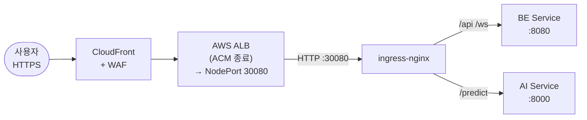
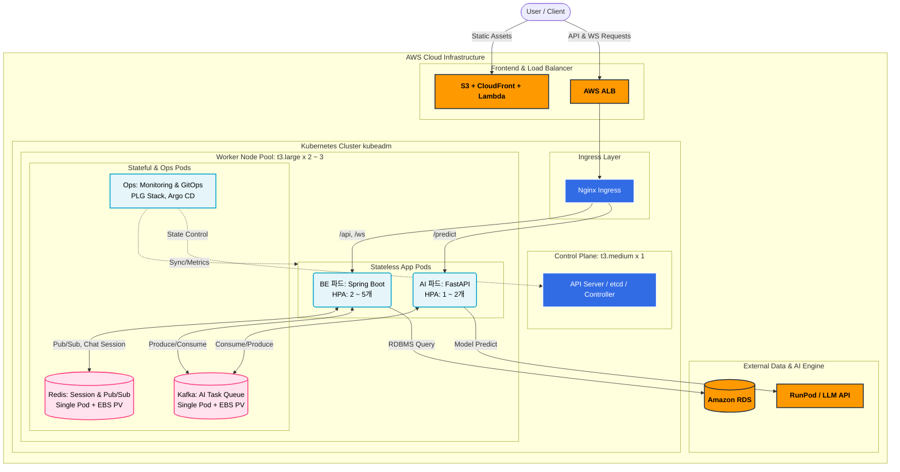

# K8s 도입 설계 문서

## 목차

**Part 1. 도입 배경 및 필요성**

- [1. 서비스 특성 및 현황](#1-서비스-특성-및-현황)
- [2. 기존 아키텍처의 한계](#2-기존-아키텍처의-한계)
- [3. 주요 요구사항 및 기대효과](#3-주요-요구사항-및-기대효과)

**Part 2. 클러스터 아키텍처 설계**

- [4. 클러스터 구성 요소 및 전환 범위](#4-클러스터-구성-요소-및-전환-범위)
- [5. 노드 구성 및 적정 용량 산정](#5-노드-구성-및-적정-용량-산정)
- [6. 네트워크 설계 (CNI)](#6-네트워크-설계-cni)
- [7. Ingress 설계 (AWS ALB 연동)](#7-ingress-설계-aws-alb-연동)
- [8. 모니터링 전략 (OTel + PLG)](#8-모니터링-전략-otel--plg)
- [9. 아키텍처 다이어그램](#9-아키텍처-다이어그램)

**Part 3. 워크로드 운영 전략**

- [10. 헬스체크 및 Probe 설계](#10-헬스체크-및-probe-설계)
- [11. 무중단 배포 전략](#11-무중단-배포-전략)
- [12. 오토스케일링 전략](#12-오토스케일링-전략)
- [13. 장애 대응 전략](#13-장애-대응-전략)

**Part 4. 기술 명세 및 구축 방안**

- [14. Kafka 및 Redis 구성](#14-kafka-및-redis-구성)
- [15. TLS 인증서 전략](#15-tls-인증서-전략)
- [16. CI/CD 배포 자동화](#16-cicd-배포-자동화)
- [17. 자원 할당 및 격리 정책 (ResourceQuota · LimitRange)](#17-자원-할당-및-격리-정책-resourcequota--limitrange)
- [18. kubeadm 클러스터 구축 절차](#18-kubeadm-클러스터-구축-절차)

---

# Part 1. 도입 배경 및 필요성

## 1. 서비스 특성 및 현황

### 1.1 Re-Fit 서비스 개요

Re-Fit은 구직자와 현직자를 연결하여 이력서 피드백 및 AI 기반 커리어 분석을 제공하는 취업 지원 플랫폼입니다. 커피챗(현직자 ↔ 취준생 1:1 비동기 채팅 상담)을 핵심으로, AI 분석 리포트 및 AI Chat Agent로 기능이 확장되고 있습니다.

| 항목 | 내용 |
|:-----|:-----|
| 서비스명 | **Re-Fit** |
| 핵심 기능 | 커피챗(1:1 비동기 채팅), AI 이력서 분석 리포트, AI Chat Agent |
| 기술 스택 | React + Next.js (FE), Spring Boot (BE), FastAPI (AI), PostgreSQL (DB) |
| 메시지 브로커 | Kafka (비동기 채팅 메시지 및 AI 분석 요청 처리) |
| 세션 스토어 | Redis (세션 관리 및 Pub/Sub) |

### 1.2 트래픽 현황

Re-Fit은 채용 시즌에 트래픽이 집중되는 **계절성 트래픽 특성**을 가지고 있으며, 주요 지표는 다음과 같습니다.
기존 Docker 기반 다중 인스턴스 환경에서도 해당 규모의 트래픽을 처리하고 있었으나, 실시간 통신(웹소켓)과 AI 분석이 결합된 복합적인 워크로드를 운영하면서 시즌/비시즌 트래픽 변동에 따른 **운영 리소스 증가**와 **장애 대응의 한계**에 직면하게 되었습니다.

| **종류** | **비시즌 (평상시)** | **채용 시즌 (Peak)** | **비고** |
| --- | --- | --- | --- |
| **MAU** | ~ 100,000 | ** ~ 400,000** | 고관여 구직자 중심의 활성 사용자 |
| **DAU** | 5,000 ~ 8,000 | **30,000 ~ 50,000** | 시즌 시 평소 대비 약 5 ~ 7배 트래픽 급증 |
| **피크 동시 접속(CCU)** | ~ 800 | ** ~ 5,000** | DAU의 약 10%가 피크 시간대(공고 직후) 집중 |
| **피크 RPS** | ~ 100 | ** ~ 500** | API 요청 및 WebSocket 통신 부하 포함 |
| **AI 분석 요청** | ~ 400건/일 | ** ~ 2,500건/일** | 이력서 파싱 및 분석 리포트 생성 건수 |

### 1.3 서비스의 구조적 특성

Re-Fit의 트래픽 구조는 일반적인 SaaS와 다른 두 가지 특수성을 갖습니다. 이 특수성이 이후 모든 인프라 설계 결정의 출발점이 됩니다.

**① 채팅이 서비스의 핵심 부하다**

전체 API 요청의 상당수가 채팅(WebSocket + REST)에서 발생합니다. 단순 조회 API와 달리 채팅은 WebSocket 장기 연결을 유지해야 하므로, Pod 종료 시 연결이 끊어지면 사용자가 즉각 체감합니다. 인프라 설계에서 **WebSocket 연결 안정성**이 가장 우선시되어야 하는 이유입니다.

**② AI 분석 요청은 예측 가능한 Burst 패턴을 갖는다**

공채 마감 1 ~ 2일 전, AI 이력서 분석 요청이 평시 대비 5 ~ 10배 급증합니다. 이 폭증은 랜덤이 아니라 **매년 반복되는 예측 가능한 패턴**입니다. 또한 AI 분석은 응답 시간이 수 초 ~ 수십 초에 달하므로, 동기 처리 시 공채 피크 때 BE 스레드가 전부 AI 응답 대기 상태에 빠져 채팅 요청조차 처리하지 못하는 상황이 발생합니다. **Kafka 비동기 처리로 BE와 AI 서버를 완전히 분리**해야 하는 이유입니다.

<br>

## 2. 기존 아키텍처의 한계

현재 규모의 트래픽을 기존 Docker 기반 다중 인스턴스 아키텍처로 처리하는 데 있어 성능 자체의 한계보다는, **안정적인 서비스 운영 및 관리적 관점에서의 한계**가 두드러집니다.

### 2.1 장애 감지 및 복구(Self-Healing) 부재

EC2 인스턴스 레벨의 상태 체크는 가능하지만, 내부의 컨테이너(Spring Boot, FastAPI 등) 프로세스가 데드락에 빠지거나 OOM으로 비정상 종료되는 등의 애플리케이션 레벨 장애를 즉각적으로 감지하고 복구할 수 없습니다. Docker/ASG 방식에서 컨테이너 장애는 **ALB Health Check 주기(30초)** 단위로만 감지되며, 채팅 중인 사용자 입장에서 30초는 서비스가 죽어있는 시간입니다. 장애가 발생한 컨테이너로 지속해서 트래픽이 전달되어 사용자 경험 저하를 유발합니다.

### 2.2 배포 및 운영 자동화의 한계

무중단 배포를 위해 수동으로 트래픽을 제어하거나 스크립트 기반의 배포를 진행해야 하며, 배포 중 문제가 생길 경우 롤백이 까다롭습니다. 주요 기능인 웹소켓 연결 등 기존의 커넥션을 배포 시점에 안전하게 종료(Graceful Shutdown)하고 새 버전으로 매끄럽게 넘겨주는 운영 자동화가 부족합니다.

### 2.3 효율적인 자원 활용의 어려움

시즌/비시즌 트래픽 변동폭이 5 ~ 7배에 달하지만, ASG(Auto Scaling Group)는 EC2 인스턴스 단위로 확장되므로 스케일링 속도가 다소 느리고(프로비저닝 3 ~ 5분) 자원 파편화가 발생하여 비시즌 유휴 자원 낭비가 존재합니다. 또한 **AI 분석 요청만 급증해도 BE 인스턴스 전체가 함께 확장**되어 비용 낭비와 확장 속도 저하가 동시에 발생합니다.

**⇒ 위 한계를 동시에 해결하기 위해 Kubernetes(kubeadm) 기반 오케스트레이션을 도입합니다.**

<br>

## 3. 주요 요구사항 및 기대효과

### 3.1 주요 요구사항

- **가용성 보장 및 장애 격리 (Self-Healing)**
    - 노드나 컨테이너 레벨에서 문제가 발생 시 시스템이 이를 스스로 감지하고 비정상 컴포넌트를 즉각 재배치·재기동하여 전체 서비스로 장애가 확산되지 않도록 해야 합니다.
- **운영 자동화 및 선언적 배포 (GitOps)**
    - 배포 파이프라인과 연계하여 수동 조작 및 스크립트 작성에 드는 공수를 최소화하고 즉각적인 롤백이 가능한 구조여야 합니다.
- **웹소켓 및 실시간 서비스 안정성 보장**
    - 트래픽이 한정적인 규모일수록 개별 연결의 중요도가 더욱 체감됩니다. 배포 중에도 기존 사용자의 세션이 끊기지 않는 매끄러운 연결 관리가 필수적입니다.
- **비용 최적화 및 실용적인 아키텍처**
    - 오버프로비저닝과 과도한 Multi-Node 구성을 피하고, 필수적인 K8s 기능만을 활용한 비용 효율적인 단일 워커 풀(Worker Pool) 구조를 지향합니다.

### 3.2 K8s 도입 기대효과

- **운영 프로세스 대폭 자동화**: 애플리케이션의 헬스체크부터 배포, 스케일링까지 쿠버네티스의 제어 루프를 통한 '원하는 상태(Desired State)' 자동 관리로 수동 운영 오버헤드가 급감합니다.
- **서비스 연속성 및 신뢰성 향상**: 빈번한 업데이트에도 Self-Healing, 롤링 업데이트 기법으로 무중단 상태를 보장하여 신뢰 높은 서비스를 사용자에게 제공할 수 있습니다.
- **인프라 비용 최적화**: 중소형 인스턴스 단일 풀로 노드를 통합 운영하여 추가 인스턴스 비용 발생을 억제하면서 효율적인 오케스트레이션을 달성합니다.

<br>

---

# Part 2. 클러스터 아키텍처 설계

제시된 트래픽(DAU 5만, RPS ~ 500) 규모는 쿠버네티스의 기본 기능만으로도 충분히 여유 있게 방어할 수 있는 수준입니다. 따라서 성능 극대화보다는 **운영의 편의성과 비용 최적화**를 최우선 가치로 설계합니다.

## 4. 클러스터 구성 요소 및 전환 범위

### 4.1 전환 범위 결정 원칙

Kubernetes로 모든 것을 이관하는 것이 목적이 아닙니다. Re-Fit의 서비스 특성과 각 컴포넌트의 운영 효율을 기준으로 전환 범위를 결정합니다.

| 컴포넌트 | 배치 | Re-Fit 관점의 이유 |
|:---------|:-----|:----------------|
| **BE (Spring Boot)** | 클러스터 내 (Deployment) | Self-Healing과 HPA가 채팅 안정성에 직결됩니다. |
| **AI 서버 (FastAPI)** | 클러스터 내 (Deployment) | 채용 시즌 트래픽 급증 시 AI Pod만 독립적으로 확장해야 하므로, BE와 분리된 Deployment가 필요합니다. |
| **Ingress Controller** | 클러스터 내 (ingress-nginx) | WebSocket 타임아웃 등 Re-Fit 맞춤 라우팅 정책을 클러스터 레벨에서 직접 제어해야 합니다. |
| **모니터링 스택 (PLG)** | 클러스터 내 (DaemonSet/StatefulSet) | Pod 재시작, OOMKilled 등 클러스터 내부 이벤트를 실시간으로 수집하려면 클러스터 안에 위치해야 합니다. |
| **Kafka** | 클러스터 내 (Single Pod + EBS PV) | RPS 500 규모에서 외부 MSK/EC2는 과잉 비용입니다. 단일 Pod + EBS PV로 데이터 영속성을 보장하되, K8s Self-Healing으로 장애 시 자동 재기동합니다. |
| **Redis** | 클러스터 내 (Single Pod + EBS PV) | 동일 규모에서 ElastiCache 비용 대비 내부 배치가 효율적입니다. EBS PV로 영속성을 보장하고, 장애 시 K8s가 자동으로 재스케줄링합니다. |
| **DB (PostgreSQL / RDS)** | 클러스터 외부 유지 | 핵심 데이터가 저장되므로 데이터 영속성과 Multi-AZ 복구를 AWS RDS에 위임합니다. |
| **AI 모델 (RunPod)** | 클러스터 외부 유지 | GPU 연산은 EC2로 처리 불가하며, Serverless 방식으로 공채 시즌에만 비용이 발생합니다. |
| **FE (React/Next.js)** | 클러스터 외부 유지 | Lambda@Edge + CloudFront + S3로 CDN이 자동 확장하므로, 클러스터 자원을 BE/AI에 집중시킵니다. |

### 4.2 Stateful 애플리케이션 (Kafka, Redis) 운영/비용 최적화 전략

RPS 500 규모에서 Kafka(Broker 3대)와 Redis(Sentinel HA)를 멀티 노드로 분산 구성하는 것은 장애 대비(HA) 측면에서는 좋으나 인프라 비용과 관리 복잡도를 지나치게 가중시킵니다. 비용 대비 효율을 극대화하기 위해 **"클러스터 내부 단일 노드(Single Pod) 구성"**을 채택합니다.

- Kafka와 Redis를 각각 단일 Pod으로 띄우되, **EBS 기반의 PV(Persistent Volume)**를 연결하여 데이터 영속성을 보장합니다.
- 클러스터가 컨테이너를 감시하다가 장애 시 다른 노드로 안전하게 재기동(Self-Healing)해주므로 이 규모에서는 단일 구성으로도 충분히 목적을 이룹니다.

<br>

## 5. 노드 구성 및 적정 용량 산정

### 5.1 선정 결과

> **Control Plane 1대 + Worker Node 2 ~ 3대 (초기 구성)**

기존의 고사양 인스턴스(m5.xlarge, r5.large)와 앱/인프라 노드를 분리하던 전략 대신, 가성비가 뛰어난 **t3 시리즈**를 공용으로 사용하는 단일 워커 노드 풀을 조성합니다.

| **구분** | **주요 역할** | **스펙** | **수량** | **특이사항** |
| --- | --- | --- | --- | --- |
| **마스터 노드** | 클러스터 제어 및 상태 관리 | **t3.medium** (2 vCPU / 4Gi) | 1대 | Kubeadm 컨트롤 플레인 |
| **통합 워커 노드** | BE, AI, Redis, Kafka, Monitoring | **t3.large** (2 vCPU / 8Gi) | 2 ~ 3대 | 애플리케이션 및 인프라 통합 배치 |

### 5.2 Control Plane: 단일 구성을 선택한 이유

Control Plane 구성을 고민할 때 가장 먼저 따져본 것은 "Control Plane이 다운되면 서비스가 죽는가"였습니다. 실제로는 **Worker Node에서 이미 실행 중인 Pod는 Control Plane이 다운되어도 계속 정상 동작합니다.** 즉, 단일 Control Plane 장애는 "서비스 중단"이 아니라 "신규 Pod 스케줄링 불가" 상태입니다. 채팅 서비스는 유지되지만, 트래픽이 급증해도 HPA가 Pod를 더 늘리지 못하는 상황이 됩니다.

HA Control Plane(3 Master)은 etcd 쿼럼 유지, NLB 구성, 인증서 공유 등 운영 부담이 상당합니다. kubeadm 자체도 처음 도입하는 시점에서 HA Control Plane까지 구성하면 운영 복잡도가 지나치게 높아진다고 판단했습니다.

etcd 6시간 주기 S3 백업과 AMI 기반 30분 이내 복구 절차를 사전에 준비해두면, 현재 팀 규모에서 HA 구성의 운영 부담 대비 실익이 크지 않습니다.

| 고려 항목 | 단일 Control Plane | HA Control Plane (3대) | 결정 |
|:---------|:------------------|:---------------------|:-----|
| 운영 복잡도 | 낮음 | 높음 (NLB, etcd 클러스터, 인증서 공유) | 단일 선택 |
| 장애 영향 | 신규 스케줄링 불가. 기존 Pod 동작 유지 | 무중단 | 단일 선택 |
| 추가 비용 | 없음 | 인스턴스 3대 추가 | 단일 선택 |
| 복구 전략 | etcd S3 백업 + AMI 재구축 (30분 목표) | 자동 복구 | 단일 선택 |

### 5.3 Worker Node 용량 산정

**워크로드별 리소스 계산 (Worker 2 ~ 3대, t3.large 2vCPU/8Gi 기준):**

| 워크로드 | requests 합계 | 비고 |
|:---------|:------------|:-----|
| BE Pod × 2 (250m / 512Mi) | 500m / 1Gi | 평시 기본 배치 |
| AI Pod × 1 (200m / 256Mi) | 200m / 256Mi | Kafka 비동기 큐로 순차 소화 |
| Redis Pod × 1 (100m / 256Mi) | 100m / 256Mi | 세션 스토어 + Pub/Sub |
| Kafka Pod × 1 (200m / 512Mi) | 200m / 512Mi | AI Task Queue |
| PLG 모니터링 스택 |  ~ 800m / 2Gi | Prometheus + Loki + Grafana |
| OTel Collector (DaemonSet) | 노드당 100m / 128Mi | 메트릭·로그 수집 |
| Ingress-nginx | 100m / 128Mi | 트래픽 라우팅 |
| ArgoCD | 200m / 512Mi | GitOps |
| **합계** | ** ~ 2.3 core /  ~ 5Gi** | Worker 2대 총 가용:  ~ 4 core /  ~ 16Gi |

여유 자원은 HPA 확장 Pod(피크 시 BE 4 ~ 5개, AI 2개)와 채용 시즌 대응에 활용됩니다. Worker 3대 구성 시 더욱 여유로운 확장이 가능합니다.

- AI 서버가 무거운 모델을 직접 메모리에 로드하지 않고 외부(RunPod 등)를 원격 호출하는 방식이므로, 해당 파드들의 리소스 점유율이 매우 낮습니다.
- 굳이 인프라 노드와 앱 노드를 Taint/Toleration으로 나누지 않고, 단일 풀 내에서 통합 배치하여도 클러스터 자원 관리에 문제가 없습니다.
- 예상 비용 관점: t3.large 노드 2 ~ 3대를 상시 유지함에 따라 월 청구 금액(대략 10만원 내외)을 획기적으로 낮출 수 있습니다.

**JVM 컨테이너 인식 메모리 설정:**

```yaml
# BE Deployment의 JVM 설정
env:
- name: JAVA_OPTS
  value: "-XX:MaxRAMPercentage=70.0 -XX:+UseG1GC -XX:MaxGCPauseMillis=200"
```

컨테이너 환경에서 JVM이 노드 전체 메모리를 기준으로 heap을 설정하면 OOMKilled가 발생하므로, MaxRAMPercentage로 컨테이너 limits 기준 70% 이내로 제한합니다.

**가용성 확보 (Pod AntiAffinity):**

Worker 2대 이상을 2개의 AWS AZ(ap-northeast-2a, ap-northeast-2c)에 분산 배치합니다. Pod AntiAffinity로 동일 Deployment의 Pod가 단일 노드에 집중되지 않도록 강제하여, 노드 1대 장애 시에도 서비스가 유지됩니다.

```yaml
# BE Deployment AntiAffinity 설정
affinity:
  podAntiAffinity:
    preferredDuringSchedulingIgnoredDuringExecution:
    - weight: 100
      podAffinityTerm:
        labelSelector:
          matchExpressions:
          - key: app
            operator: In
            values: [refit-be]
        topologyKey: "kubernetes.io/hostname"
```

### 5.4 애플리케이션 스케일링 전략

RPS 500 수준의 트래픽은 엄청난 수의 Pod 확장을 필요로 하지 않습니다.

| 단계 | BE replicas | AI replicas | 방식 |
|:-----|:-----------|:------------|:-----|
| 상시 (비시즌) | 2 | 1 | HPA minReplicas |
| 채용 시즌 | 4 ~ 5 | 2 | HPA 자동 확장 또는 수동 조정 |

- **BE (Spring Boot)**: 평시 파드 2개 유지, 피크 시즌 4 ~ 5개 정도로 느슨하게 오토스케일링(HPA)해도 가뿐히 방어됩니다.
- **AI (FastAPI)**: 상시 1 ~ 2개 파드 유지로도 Kafka 비동기 큐에서 전달되는 분석 작업을 순차 소화할 수 있습니다.

<br>

## 6. 네트워크 설계 (CNI)

### 6.1 CNI 선정 결과

> **Calico를 선정합니다.**

| CNI | 성능 | NetworkPolicy | 관측성 | 운영 복잡도 |
|:----|:-----|:-------------|:-------|:-----------|
| Flannel | 보통 | 미지원 | 낮음 | 최저 |
| **Calico** | **높음** | **L3/L4 지원** | **중간** | **중간** |
| Cilium | 최고 (eBPF) | L3/L4/L7 | 최고 (Hubble) | 높음 |
| Weave Net | 높음 | L3/L4 지원 | 중간 | 중간 |

### 6.2 Calico를 선택한 이유

클러스터 내부에 이력서나 피드백 등 민감한 유저 데이터를 다루는 Redis, Kafka가 포함되어 있으므로 **보안 격리**가 중요합니다.

Kubernetes는 기본적으로 모든 Pod가 서로 통신할 수 있는 "모두 허용" 상태로 동작합니다. CNI가 NetworkPolicy를 지원하지 않으면 임의의 Pod가 Redis나 Kafka에 직접 접근하는 것을 막을 방법이 없습니다. Calico의 `NetworkPolicy`를 통해 인가된 파드(BE, AI)만 Redis 및 Kafka에 접근하도록 세밀하게 네트워크 통신을 제한합니다.

Cilium은 L7까지 제어하고 eBPF 기반으로 성능도 더 뛰어나지만, 커널 5.10 이상을 요구하고 eBPF 프로그램 수준의 디버깅 역량이 없으면 장애 상황에서 원인 파악이 어렵습니다. kubeadm을 처음 도입하는 시점에서 **NetworkPolicy 지원 + iptables 기반의 검증된 안정성 + 운영 복잡도 중간**이라는 조합이 가장 균형 잡힌 선택입니다.

**NetworkPolicy 예시 (BE Pod 아웃바운드):**

```yaml
apiVersion: networking.k8s.io/v1
kind: NetworkPolicy
metadata:
  name: refit-be-egress
spec:
  podSelector:
    matchLabels:
      app: refit-be
  policyTypes: [Egress]
  egress:
  - to:
    - podSelector:
        matchLabels:
          app: refit-redis
    ports:
    - protocol: TCP
      port: 6379    # Redis
  - to:
    - podSelector:
        matchLabels:
          app: refit-kafka
    ports:
    - protocol: TCP
      port: 9092    # Kafka
  - to:
    - ipBlock:
        cidr: 10.0.0.0/16   # VPC 내부 (RDS 등 외부 서비스)
    ports:
    - protocol: TCP
      port: 5432    # RDS PostgreSQL
```

### 6.3 Pod / Service CIDR 구성

| 항목 | 값 |
|:-----|:---|
| Pod CIDR | `10.244.0.0/16` |
| Service CIDR | `10.96.0.0/12` |
| Worker Node Subnet | 기존 VPC Private Subnet 재활용 (`10.0.0.0/16`) |

<br>

## 7. Ingress 설계 (AWS ALB 연동)

### 7.1 Ingress 구성

> **ingress-nginx (NodePort) + AWS ALB 연동 방식을 사용합니다.**
>
> TLS 종료는 AWS ALB + ACM에서 처리하고, 클러스터 내부는 HTTP로 통신합니다. Re-Fit의 WebSocket 트래픽에 맞는 타임아웃 정책을 ingress-nginx 레벨에서 직접 제어합니다.

### 7.2 트래픽 흐름



### 7.3 WebSocket 트래픽 처리

Re-Fit의 커피챗은 WebSocket 기반으로 동작합니다. WebSocket은 HTTP Upgrade 핸드셰이크 후 장기 연결을 유지하는 프로토콜로, **일반 HTTP 설정 그대로 사용하면 타임아웃으로 연결이 끊어집니다.**

```yaml
apiVersion: networking.k8s.io/v1
kind: Ingress
metadata:
  name: refit-ingress
  annotations:
    # WebSocket 장기 연결을 위한 타임아웃 설정 (기본값 60초 → 1시간)
    nginx.ingress.kubernetes.io/proxy-read-timeout: "3600"
    nginx.ingress.kubernetes.io/proxy-send-timeout: "3600"
    nginx.ingress.kubernetes.io/proxy-connect-timeout: "60"
    # 동일 클라이언트를 같은 BE Pod로 라우팅 (불필요한 세션 재연결 방지)
    nginx.ingress.kubernetes.io/upstream-hash-by: "$remote_addr"
spec:
  ingressClassName: nginx
  rules:
  - http:
      paths:
      - path: /ws/
        pathType: Prefix
        backend:
          service:
            name: refit-be-svc
            port:
              number: 8080
      - path: /api/
        pathType: Prefix
        backend:
          service:
            name: refit-be-svc
            port:
              number: 8080
      - path: /predict/
        pathType: Prefix
        backend:
          service:
            name: refit-ai-svc
            port:
              number: 8000
```

**설정값 근거:**

- `proxy-read-timeout: 3600`: 유휴 상태의 채팅 WebSocket 연결이 60초 기본값으로 인해 끊어지는 것을 방지합니다. 사용자가 잠시 채팅을 멈춰도 연결이 유지되어야 합니다.
- `upstream-hash-by: "$remote_addr"`: Redis Pub/Sub으로 Pod 간 메시지 전달이 가능하므로 Sticky가 필수는 아닙니다. 그러나 동일 사용자의 WebSocket이 같은 Pod로 향하면 불필요한 세션 재연결 오버헤드를 줄일 수 있습니다.
- ALB `idle_timeout`: 반드시 3,600초 이상으로 설정해야 합니다. ALB가 먼저 연결을 끊으면 ingress 설정과 무관하게 WebSocket이 종료됩니다.

<br>

## 8. 모니터링 전략 (OTel + PLG)

### 8.1 OTel + PLG 스택을 선택한 이유

> **OpenTelemetry Collector + PLG(Prometheus + Loki + Grafana)를 선택합니다.**
>
> Re-Fit은 "서버가 살아있는가"를 넘어, **어느 Pod에서 채팅 오류가 발생했는지, AI 분석 Kafka lag가 왜 급증했는지**를 실시간으로 추적해야 합니다.

kubeadm은 EKS·GKE와 달리 모니터링 에이전트를 자동 주입하지 않으므로 수집 파이프라인을 직접 구성해야 합니다. OTel Collector를 앞단에 두면 **애플리케이션은 OTLP 단일 프로토콜로만 전송**하고, 백엔드 라우팅(Prometheus, Loki)은 Collector 설정으로만 제어합니다. Loki는 레이블만 인덱싱하는 구조로 Elasticsearch 대비 메모리 사용이 낮아 제한된 Worker 자원 환경에 적합합니다.

### 8.2 OTel Collector 역할 및 파이프라인

OTel Collector는 DaemonSet으로 각 Worker Node에 배포하여 Pod 로그·메트릭을 수집하고, Prometheus·Loki로 내보냅니다.

```
[BE / AI]                [Redis / Kafka / infra]
 OTLP (gRPC 4317)         node-exporter
        │                       │
        ▼                       ▼
 ┌─────────────────────────────────────┐
 │   OTel Collector (DaemonSet)        │
 │   receivers: otlp, prometheus       │
 │   processors: batch, resource       │
 │   exporters:  prometheusremotewrite │
 │               loki (log)            │
 └─────────────────────────────────────┘
        │                       │
        ▼                       ▼
   Prometheus               Loki
        └───────────────────────┘
                   │
               Grafana
```

**OTel Collector 주요 설정:**

```yaml
receivers:
  otlp:
    protocols:
      grpc:
        endpoint: 0.0.0.0:4317
  prometheus:
    config:
      scrape_configs:
        - job_name: kube-pods
          kubernetes_sd_configs:
            - role: pod

processors:
  batch:
    timeout: 5s
  resource:
    attributes:
      - key: k8s.cluster.name
        value: refit-prod
        action: insert

exporters:
  prometheusremotewrite:
    endpoint: http://prometheus:9090/api/v1/write
  loki:
    endpoint: http://loki:3100/loki/api/v1/push
    labels:
      resource:
        k8s.namespace.name: "namespace"
        k8s.pod.name: "pod"
        k8s.container.name: "container"

service:
  pipelines:
    metrics:
      receivers: [otlp, prometheus]
      processors: [batch, resource]
      exporters: [prometheusremotewrite]
    logs:
      receivers: [otlp]
      processors: [batch, resource]
      exporters: [loki]
```

### 8.3 애플리케이션 계측

**BE (Spring Boot):** `spring-boot-starter-actuator` + `micrometer-registry-otlp`를 추가하면 JVM heap, DB 커넥션 풀, RPS, p95 latency, WebSocket 활성 연결 수를 OTLP로 OTel Collector에 전송합니다.

```yaml
# application.yaml
management:
  otlp:
    metrics:
      export:
        url: http://otel-collector:4317
  tracing:
    sampling:
      probability: 0.1    # 상시 10% 샘플링, 에러는 100% 수집
```

**AI (FastAPI):** `opentelemetry-sdk` + `opentelemetry-exporter-otlp`로 Kafka consume 지연, RunPod 응답시간, 요청 처리량을 수집합니다.

```python
from opentelemetry import trace
from opentelemetry.exporter.otlp.proto.grpc.trace_exporter import OTLPSpanExporter
from opentelemetry.sdk.trace import TracerProvider
from opentelemetry.sdk.trace.export import BatchSpanProcessor

provider = TracerProvider()
provider.add_span_processor(
    BatchSpanProcessor(OTLPSpanExporter(endpoint="http://otel-collector:4317"))
)
trace.set_tracer_provider(provider)
```

### 8.4 수집 대상 및 핵심 메트릭

| 수집 대상 | 수집 방법 | Re-Fit 핵심 메트릭 |
|:---------|:---------|:----------------|
| Pod 리소스 | OTel Collector (prometheus receiver → cAdvisor) | CPU/Memory 사용률, 재시작 횟수, OOMKilled |
| 클러스터 상태 | kube-state-metrics → Prometheus | Deployment 상태, HPA 스케일링 이벤트, Pod Pending/Failed |
| 노드 리소스 | node-exporter (DaemonSet) | 노드 CPU/Memory/Disk/Network |
| BE 애플리케이션 | OTLP → OTel Collector | RPS, p95/p99 latency, DB 커넥션 풀, JVM heap, WebSocket 활성 연결 수 |
| AI 서버 | OTLP → OTel Collector | AI 요청 처리 시간, Kafka produce/consume lag |
| ingress-nginx | prometheus receiver | 요청 처리량, 4xx/5xx 에러율, 업스트림 응답시간 |

### 8.5 핵심 모니터링 항목

Grafana 대시보드는 서비스 SLO(RPS · 5xx 에러율 · p95 latency), WebSocket 활성 연결 수, HPA 스케일링 이벤트, AI 분석 Kafka lag를 중심으로 구성합니다.

Alertmanager 알람은 Pod CrashLoopBackOff 5분 지속, 5xx 에러율 1분 내 5% 초과, 노드 NotReady 1분 이상 발생 시 Slack으로 전송합니다.

<br>

## 9. 아키텍처 다이어그램

비용 효율성을 고려해 통합된 워커 노드 구조와 단일 노드 기반의 Redis/Kafka 배치가 반영된 다이어그램입니다.



<br>

---

# Part 3. 워크로드 운영 전략

## 10. 헬스체크 및 Probe 설계

### 10.1 Probe 적용 원칙

> **세 가지 Probe를 모두 적용하되, 각 역할을 명확히 분리합니다.**

Probe를 설계하면서 처음에 가졌던 가장 큰 의문은 "readiness와 liveness를 왜 굳이 분리해야 하는가"였습니다. 하나의 헬스 엔드포인트로 모든 것을 처리하면 더 단순하지 않을까 생각했는데, 실제로 그렇게 하면 문제가 생깁니다.

DB가 일시적으로 응답이 느려지는 상황을 예로 들어봤습니다. liveness에 DB 헬스 체크가 포함되어 있으면, DB가 느린 동안 Pod가 재시작됩니다. 재시작된 Pod가 다시 DB에 접속하려 하면 또 느리고, 또 재시작됩니다. 결국 CrashLoopBackOff로 이어지고, 채팅 중인 사용자는 반복적으로 연결이 끊어지는 경험을 하게 됩니다. **DB 문제를 Pod 재시작으로 해결할 수 없는데, 재시작을 트리거하는 것은 오히려 상황을 악화시킵니다.**

| Probe | 역할 | 실패 시 동작 |
|:------|:-----|:-----------|
| **startupProbe** | 앱 초기 기동 완료 확인 (JVM 워밍업, DB 커넥션 풀 초기화) | 실패 시 재시작. 이 Probe가 통과하기 전까지 liveness는 동작하지 않음 |
| **readinessProbe** | 실제 트래픽 수신 가능 여부 확인 | 실패 시 Service Endpoints에서 제외 → 트래픽 차단. **재시작하지 않음** |
| **livenessProbe** | 데드락, 무한루프 등 복구 불가 상태 감지 | 실패 시 컨테이너 재시작 |

**핵심 원칙:**

- readinessProbe 실패는 "격리"이지 "재시작"이 아닙니다. DB 연결이 일시적으로 실패한 Pod를 트래픽에서 제외하되, DB가 복구되면 자동으로 트래픽을 받도록 합니다.
- livenessProbe의 failureThreshold는 보수적으로 설정합니다. GC Pause, Full GC 상황에서 불필요한 재시작이 일어나면 WebSocket 연결 유실이 발생합니다.

### 10.2 BE (Spring Boot) Probe 설정

```yaml
startupProbe:
  httpGet:
    path: /actuator/health
    port: 8080
  initialDelaySeconds: 30    # JVM, Spring Context, DB 커넥션 풀 초기화 대기
  periodSeconds: 10
  failureThreshold: 30       # 최대 30 × 10s = 5분 허용
  successThreshold: 1

readinessProbe:
  httpGet:
    path: /actuator/health/readiness  # DB, Kafka 등 의존성 포함한 Ready 상태
    port: 8080
  periodSeconds: 10
  failureThreshold: 3        # 30초 연속 실패 시 트래픽 차단
  successThreshold: 1

livenessProbe:
  httpGet:
    path: /actuator/health/liveness   # DB 체크 미포함. 앱 프로세스 생존만 확인
    port: 8080
  periodSeconds: 15
  failureThreshold: 5        # 75초 연속 실패 시 재시작 (GC Pause 여유 포함)
  successThreshold: 1
```

**Spring Boot Actuator 설정 (application.yaml):**

```yaml
management:
  endpoint:
    health:
      probes:
        enabled: true        # /actuator/health/liveness, /readiness 활성화
      show-details: always
  health:
    livenessState:
      enabled: true
    readinessState:
      enabled: true
```

**liveness와 readiness 엔드포인트를 분리하는 이유:** liveness에 DB 헬스 체크를 포함하면, DB가 일시적으로 응답이 느릴 때 Pod가 재시작됩니다. liveness는 **앱 프로세스 자체의 생존**만 확인하고, DB 의존성은 readiness에서만 확인합니다.

AI (FastAPI)도 동일 구조를 적용하되, initialDelaySeconds: 15, failureThreshold 값을 FastAPI 기동 특성에 맞게 조정합니다.

<br>

## 11. 무중단 배포 전략

### 11.1 배포 목표

무중단 배포를 고민할 때 Re-Fit에서 가장 까다로운 부분은 WebSocket입니다. HTTP 요청은 Pod가 종료되기 전에 응답만 완료되면 사용자는 아무것도 느끼지 못합니다. 그런데 WebSocket은 연결 자체가 수십 분, 길게는 수 시간 동안 유지됩니다. Pod를 그냥 종료하면 현재 채팅 중인 사용자의 연결이 즉시 끊어집니다.

**배포 중에도 채팅 연결을 유지**하는 것이 핵심 목표입니다.

| 목표 | 기준 |
|:-----|:-----|
| 배포 중 5xx 에러율 | 0.1% 미만 유지 |
| WebSocket 연결 유실 | Graceful Draining으로 최소화 |
| 자동 롤백 트리거 | readinessProbe 연속 실패 또는 5xx 급증 |

### 11.2 선언적 배포 및 GitOps (GitHub Actions + Argo CD)

인프라의 모든 상태를 코드로 선언하여 관리합니다.

- **CI (GitHub Actions)**: 코드 테스트 후 이미지를 빌드/푸시하고, K8s 매니페스트 저장소를 갱신합니다.
- **CD (Argo CD)**: K8s 내부에 상주하며 저장소 변경 감지 시 클러스터의 현재 상태를 선언된 상태와 시각적으로 동일하게 동기화합니다.

GitOps의 핵심은 **Git이 클러스터의 Single Source of Truth가 되어야 한다**는 원칙입니다. GitHub Actions는 코드 변경에 반응하여 이미지를 빌드하고 Git에 이미지 태그를 기록하는 역할만 담당하고, ArgoCD가 Git 상태를 클러스터에 동기화하는 역할을 맡습니다. ArgoCD의 selfHeal 옵션으로 수동 변경이 자동으로 Git 기준 상태로 복원됩니다.

### 11.3 Rolling Update 전략

```yaml
spec:
  replicas: 2
  strategy:
    type: RollingUpdate
    rollingUpdate:
      maxUnavailable: 0    # 배포 중 가용 Pod 수 유지 (트래픽 처리 용량 감소 방지)
      maxSurge: 1          # 여유 자원 내에서 새 버전 파드를 1개 추가로 띄워 교체
  minReadySeconds: 30      # readinessProbe 통과 후 30초 안정화 대기 (JVM 워밍업)
  progressDeadlineSeconds: 600  # 10분 내 배포 미완료 시 실패 판정
  template:
    spec:
      terminationGracePeriodSeconds: 60  # WebSocket 연결 정리를 위한 종료 대기
```

**설정값 근거:**

- `maxUnavailable: 0`: 배포 중에도 전체 처리 용량을 유지합니다.
- `maxSurge: 1`: 여유 자원 내에서 새 버전 파드를 1개 추가로 띄워 헬스체크를 우선 수행한 뒤, 기존 버전을 하나 내리는 방식입니다.
- `minReadySeconds: 30`: readinessProbe 통과 직후 바로 구 Pod를 종료하면 JVM이 충분히 워밍업되지 않은 상태에서 트래픽을 받습니다.

### 11.4 WebSocket 특화 Graceful Shutdown

트래픽이 적을수록 단 한 명의 구직자가 튕길 때 겪는 불쾌감이 크게 작용합니다. Pod 종료 신호(SIGTERM) 수신 즉시 프로세스를 종료하면 활성 WebSocket 연결이 끊어집니다. PreStop Hook으로 새 연결을 차단하고 기존 연결을 안전하게 드레이닝합니다.

```yaml
lifecycle:
  preStop:
    exec:
      command:
      - /bin/sh
      - -c
      - |
        # 1. readiness를 실패 상태로 전환 → Service에서 트래픽 차단 (신규 연결 차단)
        curl -s -X POST http://localhost:8080/actuator/health/readiness/shutdown
        # 2. 기존 WebSocket 연결 드레이닝 대기
        sleep 15
        # 3. Spring Boot graceful shutdown 트리거
        curl -s -X POST http://localhost:8080/actuator/shutdown
```

**Spring Boot Graceful Shutdown 설정 (application.yaml):**

```yaml
server:
  shutdown: graceful
spring:
  lifecycle:
    timeout-per-shutdown-phase: 45s
```

### 11.5 자가 치유 (Self-Healing) 및 에러 복원력

- **Liveness & Readiness Probe**: 주기적으로 컴포넌트의 헬스를 자체 체크하여 애플리케이션(DB 커넥션 고갈, 데드락 등)이 죽었을 경우 파드를 자동으로 재시작시켜 정상 상태로 복구(Self-Healing)합니다.
- **Pod Disruption Budget (PDB)**: 노드 재시작이나 업데이트 상황에서도 필수적인 앱 구동 수를 고정 보장합니다.
- **원터치 롤백 (Automatic Rollback)**: 새 버전 배포 후 모니터링 경고가 울리거나 에러율이 급증하면 Argo CD의 Git 히스토리를 통해 안정화되었던 직전 버전으로 신속하게 롤백합니다.

### 11.6 배포 후 자동 롤백

| 롤백 트리거 | 임계치 | 롤백 방법 |
|:-----------|:-------|:---------|
| readinessProbe 연속 실패 | progressDeadlineSeconds(600초) 내 배포 미진행 | `kubectl rollout undo` |
| 5xx 에러율 급증 | 배포 후 5분 내 5% 초과 | ArgoCD Rollback + Slack 알림 |
| 신규 Pod OOMKilled 반복 | 3회 이상 | ArgoCD Rollback |

<br>

## 12. 오토스케일링 전략

### 12.1 HPA 구성

Re-Fit의 두 가지 서비스 특성에 맞는 메트릭을 HPA에 적용합니다.

- **BE**: 채팅 WebSocket 연결 수는 CPU보다 메모리와 연결 수가 병목이 됩니다. CPU 사용률과 WebSocket 활성 연결 수를 동시에 기준으로 삼습니다.
- **AI**: Kafka Consumer이므로 CPU보다 **Kafka lag**가 더 의미 있는 확장 트리거입니다.

| 서비스 | 메트릭 | 목표 임계치 | minReplicas | maxReplicas |
|:-------|:-------|:-----------|:-----------|:-----------|
| **BE** | CPU 사용률 | 70% | 2 | 5 |
| **BE** | WebSocket 연결 수 (커스텀) | Pod당 300개 | — | — |
| **AI** | CPU 사용률 | 70% | 1 | 2 |

```yaml
apiVersion: autoscaling/v2
kind: HorizontalPodAutoscaler
metadata:
  name: refit-be-hpa
spec:
  scaleTargetRef:
    apiVersion: apps/v1
    kind: Deployment
    name: refit-be
  minReplicas: 2
  maxReplicas: 5
  metrics:
  - type: Resource
    resource:
      name: cpu
      target:
        type: Utilization
        averageUtilization: 70
  behavior:
    scaleUp:
      stabilizationWindowSeconds: 60     # 급증 시 1분 안정화 후 확장
      policies:
      - type: Pods
        value: 2
        periodSeconds: 60
    scaleDown:
      stabilizationWindowSeconds: 300    # 축소는 5분간 안정화 후 진행
      policies:
      - type: Pods
        value: 1
        periodSeconds: 60
```

### 12.2 채용 시즌 사전 스케일링

HPA는 트래픽이 급증한 *이후*에 반응하는 구조입니다. Re-Fit의 채용 시즌은 매년 3 ~ 4월, 9 ~ 10월로 패턴이 명확합니다. 예측 가능한 트래픽 급증에 반응형 HPA로만 대응하는 것은 비효율적이므로, 사전에 minReplicas를 올려두는 전략을 병행합니다.

| 시점 | BE replicas | AI replicas | 방식 |
|:-----|:-----------|:------------|:-----|
| 상시 (비시즌) | 2 | 1 | HPA minReplicas |
| 채용 시즌 진입 시 | 3 | 2 | `kubectl` 또는 ArgoCD values 수정 |
| 시즌 종료 후 | 2 (기본 복귀) | 1 (기본 복귀) | 복귀 |

<br>

## 13. 장애 대응 전략

### 13.1 장애 유형별 자동/수동 대응

| 장애 유형 | 감지 방법 | 자동 대응 | 수동 대응 |
|:---------|:---------|:---------|:---------|
| Pod OOMKilled | Grafana 알람 (OOMKilled > 0) | kubelet 자동 재시작 | Memory limits 조정 후 재배포 |
| Pod CrashLoopBackOff | kube-state-metrics | kubelet 지수 백오프 재시작 | 로그 분석 후 버그 수정 배포 |
| readinessProbe 실패 | Prometheus + Grafana | 트래픽 자동 차단 (Service 제외) | 원인 분석 (DB 연결, 외부 API) |
| Node NotReady | node-exporter 메트릭 끊김 | Pod 다른 노드로 재스케줄 | 노드 상태 점검, 필요 시 교체 |
| Control Plane 다운 | CloudWatch + 외부 모니터링 | 없음 (단일 CP) | etcd 백업으로 복구 (30분 목표) |
| Kafka/Redis Pod 장애 | livenessProbe | K8s 자동 재기동 (EBS PV 데이터 유지) | EBS 스냅샷 확인, 필요 시 복원 |

### 13.2 Control Plane 장애 대응 절차

Control Plane이 다운되어도 Worker Node에서 실행 중인 Pod는 계속 동작합니다. 단, 신규 Pod 스케줄링, HPA 동작, 서비스 업데이트가 불가합니다.

**복구 절차 (목표: 30분 이내):**

1. CloudWatch 알람 수신 (API Server 응답 없음)
2. 사전 준비된 EC2 AMI로 Control Plane 인스턴스 교체 (5분)
3. S3에서 etcd 스냅샷 복구 (10분)
4. `kubeadm init` 재실행 + Worker Node 재조인 (15분)
5. 클러스터 상태 확인 및 모니터링 복구

**etcd 정기 백업:**

```bash
# Kubernetes CronJob으로 매 6시간 실행
ETCDCTL_API=3 etcdctl snapshot save /tmp/etcd-snapshot-$(date +%Y%m%d-%H%M).db \
  --endpoints=https://127.0.0.1:2379 \
  --cacert=/etc/kubernetes/pki/etcd/ca.crt \
  --cert=/etc/kubernetes/pki/etcd/healthcheck-client.crt \
  --key=/etc/kubernetes/pki/etcd/healthcheck-client.key

aws s3 cp /tmp/etcd-snapshot-*.db s3://refit-k8s-backup/etcd/
```

<br>

---

# Part 4. 기술 명세 및 구축 방안

## 14. Kafka 및 Redis 구성

### 14.1 Kafka: 클러스터 내부 단일 Pod 구성

Re-Fit에서 Kafka는 AI 분석 요청 메시지를 저장하는 브로커입니다. 사용자가 AI 분석을 요청하면 BE가 Kafka에 메시지를 produce하고, AI 서버가 이를 consume하여 RunPod를 호출합니다. 이 메시지는 처리가 완료되기 전까지 **절대로 유실되어서는 안 됩니다.**

RPS 500 규모에서 Kafka를 외부 EC2나 MSK로 운영하면 월 $70 ~ 100의 추가 비용이 발생하여, 전체 인프라 비용의 50% 이상 증가를 의미합니다. 단일 Pod + EBS PV 구성으로 데이터 영속성을 보장하되 K8s Self-Healing으로 장애 시 자동 재기동합니다.

| 항목 | 값 |
|:-----|:---|
| 구성 | **단일 Pod** (KRaft 모드) |
| 리소스 | 200m / 512Mi (requests) |
| 스토리지 | EBS gp3 50GB (PersistentVolume) |
| Replication Factor | 1 |
| Partition 수 | 토픽당 3개 |

### 14.2 Redis: 클러스터 내부 단일 Pod 구성

Re-Fit에서 Redis는 두 가지 역할을 합니다. 첫째, BE Pod가 수평 확장될 때 어떤 Pod에서도 동일한 WebSocket 세션 정보를 조회할 수 있는 **중앙 세션 스토어**. 둘째, Pod 간 채팅 메시지 브로드캐스트를 위한 **Pub/Sub 채널**.

동일 규모에서 ElastiCache(월  ~ $25)보다 클러스터 내부 배치가 비용 효율적이며, EBS PV로 데이터를 영속화하여 Pod 재시작 시에도 세션 데이터를 유지합니다.

| 항목 | 값 |
|:-----|:---|
| 구성 | **단일 Pod** |
| 리소스 | 100m / 256Mi (requests) |
| 스토리지 | EBS gp3 10GB (PersistentVolume) |
| 역할 | 세션 스토어 + Pub/Sub |

### 14.3 EBS PV 운영 보완

- **EBS 스냅샷 자동 백업**: CronJob이나 AWS Backup으로 Kafka/Redis의 EBS 볼륨을 주기적으로 스냅샷합니다.
- **AZ 장애 대응**: EBS PV는 특정 AZ에 바인딩되므로, 해당 AZ 노드 장애 시 다른 AZ 노드로 즉시 재스케줄링이 불가합니다. 이 경우 EBS 스냅샷으로 다른 AZ에서 볼륨을 복원 후 Pod를 재기동합니다. 채용 플랫폼의 SLA 수준에서는 수 분 내 복구면 충분합니다.

<br>

## 15. TLS 인증서 전략

> **TLS 종료는 AWS ALB + ACM에서 처리합니다.** 클러스터 내부는 HTTP로 통신합니다.

cert-manager + Let's Encrypt도 가능하지만, 기존 Docker/ASG 단계에서 사용하던 ACM 패턴을 유지하여 운영 단순화를 우선합니다. VPC 내부 통신(ALB → NodePort → ingress-nginx)은 외부에 노출되지 않으므로 평문 HTTP로도 보안상 문제가 없습니다.

| 구간 | 방식 |
|:-----|:-----|
| 사용자 → AWS ALB | ACM 인증서 (HTTPS, 자동 갱신) |
| AWS ALB → ingress-nginx NodePort 30080 | HTTP (VPC 내부) |
| 클러스터 내부 서비스 간 | HTTP (ClusterIP, 외부 비노출) |

<br>

## 16. CI/CD 배포 자동화

### 16.1 GitOps 파이프라인

```
[개발자 git push]
      │
      ▼
[GitHub Actions]
  1. 단위 테스트 (JUnit 5 / RestAssured)
  2. Docker 이미지 빌드 (멀티 스테이지)
  3. Trivy 보안 스캔 (CRITICAL/HIGH 취약점 차단)
  4. ECR 푸시 (태그: {GITHUB_SHA})
  5. k8s/be/values.yaml 이미지 태그 업데이트 후 git push
      │
      ▼
[ArgoCD]
  - Git 변경 감지 → 클러스터 자동 동기화
  - RollingUpdate 트리거 → readinessProbe 기반 점진적 교체
  - 실패 시 이전 revision으로 자동 롤백 + Slack 알림
```

### 16.2 GitHub Actions 워크플로우

```yaml
name: build-and-deploy
on:
  push:
    branches: [main]

jobs:
  build:
    runs-on: ubuntu-latest
    steps:
      - uses: actions/checkout@v4

      - name: Run Tests
        run: ./gradlew test

      - name: Build Docker Image
        run: |
          IMAGE_TAG=${GITHUB_SHA}
          docker build -t ${{ secrets.ECR_REGISTRY }}/refit-be:${IMAGE_TAG} .
          docker push ${{ secrets.ECR_REGISTRY }}/refit-be:${IMAGE_TAG}
          echo "IMAGE_TAG=${IMAGE_TAG}" >> $GITHUB_ENV

      - name: Security Scan (Trivy)
        uses: aquasecurity/trivy-action@master
        with:
          image-ref: '${{ secrets.ECR_REGISTRY }}/refit-be:${{ env.IMAGE_TAG }}'
          exit-code: '1'
          severity: 'CRITICAL,HIGH'

      - name: Update Helm values (GitOps)
        run: |
          sed -i "s/tag: .*/tag: ${IMAGE_TAG}/" k8s/be/values.yaml
          git config user.name "github-actions"
          git config user.email "actions@github.com"
          git add k8s/be/values.yaml
          git commit -m "chore: deploy be ${IMAGE_TAG}"
          git push
```

### 16.3 ArgoCD 구성

```yaml
apiVersion: argoproj.io/v1alpha1
kind: Application
metadata:
  name: refit-be
  namespace: argocd
spec:
  project: default
  source:
    repoURL: https://github.com/refit-team/refit-cloud
    targetRevision: main
    path: k8s/be
  destination:
    server: https://kubernetes.default.svc
    namespace: default
  syncPolicy:
    automated:
      prune: true       # Git에서 삭제된 리소스 클러스터에서도 제거
      selfHeal: true    # 수동으로 변경된 클러스터 상태를 Git 기준으로 복원
```

<br>

## 17. 자원 할당 및 격리 정책 (ResourceQuota · LimitRange)

### 17.1 왜 Quota와 LimitRange가 필요한가

Worker Node 2 ~ 3대(총 4 ~ 6 vCPU / 16 ~ 24GB) 환경에서는 자원이 여유롭지 않습니다. requests/limits 없이 Pod를 띄우면 한 워크로드가 노드 전체 메모리를 소진하면서 다른 Pod들이 OOMKilled되는 연쇄 장애가 발생합니다.

- **LimitRange**: 컨테이너 단위 기본값과 최대값을 강제합니다.
- **ResourceQuota**: 네임스페이스 단위 총량 상한을 설정합니다.

### 17.2 네임스페이스 구성

| 네임스페이스 | 워크로드 | 격리 목적 |
|:-----------|:---------|:---------|
| `refit-prod` | BE, AI, Redis, Kafka, ingress-nginx | 서비스 워크로드 전용 |
| `monitoring` | Prometheus, Loki, Grafana, OTel Collector | 메트릭 수집 고부하가 서비스에 영향을 주지 않도록 격리 |
| `argocd` | ArgoCD | 배포 파이프라인 격리 |

### 17.3 LimitRange 설정

```yaml
# refit-prod 네임스페이스 LimitRange
apiVersion: v1
kind: LimitRange
metadata:
  name: refit-prod-limitrange
  namespace: refit-prod
spec:
  limits:
  - type: Container
    default:          # limits 미지정 시 자동 적용
      cpu: "500m"
      memory: "512Mi"
    defaultRequest:   # requests 미지정 시 자동 적용
      cpu: "100m"
      memory: "128Mi"
    max:              # 컨테이너 1개가 가질 수 있는 최대값
      cpu: "1"
      memory: "2Gi"
    min:
      cpu: "50m"
      memory: "64Mi"
```

```yaml
# monitoring 네임스페이스 LimitRange
apiVersion: v1
kind: LimitRange
metadata:
  name: monitoring-limitrange
  namespace: monitoring
spec:
  limits:
  - type: Container
    default:
      cpu: "300m"
      memory: "512Mi"
    defaultRequest:
      cpu: "100m"
      memory: "256Mi"
    max:
      cpu: "1"
      memory: "2Gi"
```

### 17.4 ResourceQuota 설정

**Worker Node 2 ~ 3대(4 ~ 6 vCPU / 16 ~ 24GB) 기준 자원 배분:**

| 네임스페이스 | CPU requests 상한 | Memory requests 상한 | 근거 |
|:-----------|:-----------------|:--------------------|:-----|
| `refit-prod` | 3 core | 8Gi | BE 2 ~ 3 Pod + AI 1 Pod + Redis/Kafka + Ingress 상시 운영 + HPA 확장 여유 |
| `monitoring` | 1 core | 4Gi | Prometheus + Loki + Grafana + DaemonSet 합계 |
| `argocd` | 500m | 1Gi | ArgoCD 컨트롤러 상시 사용량 |

```yaml
# refit-prod ResourceQuota
apiVersion: v1
kind: ResourceQuota
metadata:
  name: refit-prod-quota
  namespace: refit-prod
spec:
  hard:
    requests.cpu: "3"
    requests.memory: "8Gi"
    limits.cpu: "6"
    limits.memory: "16Gi"
    pods: "15"
    services: "10"
    persistentvolumeclaims: "5"
```

```yaml
# monitoring ResourceQuota
apiVersion: v1
kind: ResourceQuota
metadata:
  name: monitoring-quota
  namespace: monitoring
spec:
  hard:
    requests.cpu: "1"
    requests.memory: "4Gi"
    limits.cpu: "2"
    limits.memory: "8Gi"
    pods: "15"
```

### 17.5 워크로드별 requests / limits 확정값

| 워크로드 | CPU requests | CPU limits | Memory requests | Memory limits | 산정 근거 |
|:---------|:------------|:-----------|:----------------|:-------------|:---------|
| BE (Spring Boot) | `250m` | `500m` | `512Mi` | `1Gi` | Pod 2 ~ 3개 운영, JVM heap  ~ 700MB |
| AI (FastAPI) | `200m` | `400m` | `256Mi` | `512Mi` | Kafka Consumer + FastAPI async, 경량 처리 |
| Redis | `100m` | `200m` | `256Mi` | `512Mi` | 세션 스토어 + Pub/Sub |
| Kafka | `200m` | `500m` | `512Mi` | `1Gi` | 단일 브로커, KRaft 모드 |
| ingress-nginx | `100m` | `200m` | `128Mi` | `256Mi` | 트래픽 라우팅 전용 |
| Prometheus | `300m` | `500m` | `512Mi` | `1Gi` | 메트릭 수집 시 메모리 급증 여유 |
| Loki | `200m` | `400m` | `256Mi` | `1Gi` | 로그 인제스트 시 burst 허용 |
| Grafana | `100m` | `200m` | `128Mi` | `256Mi` | 대시보드 조회 위주 |
| OTel Collector (DaemonSet) | `100m` | `200m` | `128Mi` | `256Mi` | 노드당 1개, 수집 파이프라인 |

> **limits는 requests의 2배 이내**로 설정하는 것이 원칙입니다. 너무 큰 limits는 노드 실제 가용 자원을 초과하는 Over-commit을 유발하고, OOMKilled 연쇄 장애로 이어집니다.

<br>

## 18. kubeadm 클러스터 구축 절차

### 18.1 공통 설정 (모든 노드)

```bash
sudo su

# 패키지 업데이트
apt update -y && apt upgrade -y

# Swap 비활성화 (kubeadm 필수 요구사항)
swapoff -a
sed -i '/ swap / s/^/#/' /etc/fstab

# 커널 파라미터 설정 (브리지 네트워크, IP 포워딩)
modprobe br_netfilter
cat <<EOF | tee /etc/sysctl.d/k8s.conf
net.bridge.bridge-nf-call-iptables  = 1
net.bridge.bridge-nf-call-ip6tables = 1
net.ipv4.ip_forward                 = 1
EOF
sysctl --system

# containerd 설치 및 cgroup 드라이버 설정
apt install -y containerd
mkdir -p /etc/containerd
containerd config default | tee /etc/containerd/config.toml
sed -i 's/SystemdCgroup = false/SystemdCgroup = true/' /etc/containerd/config.toml
systemctl restart containerd && systemctl enable containerd

# kubeadm / kubelet / kubectl 설치 (v1.33 버전 고정)
apt install -y apt-transport-https ca-certificates curl
mkdir -p /etc/apt/keyrings
curl -fsSL https://pkgs.k8s.io/core:/stable:/v1.33/deb/Release.key \
  | gpg --dearmor -o /etc/apt/keyrings/kubernetes-apt-keyring.gpg
echo "deb [signed-by=/etc/apt/keyrings/kubernetes-apt-keyring.gpg] \
  https://pkgs.k8s.io/core:/stable:/v1.33/deb/ /" \
  | tee /etc/apt/sources.list.d/kubernetes.list
apt update -y
apt install -y kubelet kubeadm kubectl
apt-mark hold kubelet kubeadm kubectl
```

### 18.2 Control Plane 초기화

```bash
sudo kubeadm init \
  --pod-network-cidr "10.244.0.0/16" \
  --service-cidr "10.96.0.0/12" \
  --upload-certs

mkdir -p $HOME/.kube
sudo cp -i /etc/kubernetes/admin.conf $HOME/.kube/config
sudo chown $(id -u):$(id -g) $HOME/.kube/config

# CNI (Calico) 설치
kubectl apply -f https://raw.githubusercontent.com/projectcalico/calico/v3.28.0/manifests/calico.yaml
```

### 18.3 Worker Node 조인

```bash
# Control Plane에서 join 명령어 생성
kubeadm token create --print-join-command

# 각 Worker Node에서 실행
kubeadm join <CONTROL_PLANE_IP>:6443 \
  --token <TOKEN> \
  --discovery-token-ca-cert-hash sha256:<HASH>
```

### 18.4 필수 애드온 설치

```bash
# 1. ingress-nginx (NodePort 30080/30443)
helm repo add ingress-nginx https://kubernetes.github.io/ingress-nginx && helm repo update
kubectl create namespace ingress-nginx
helm install ingress-nginx ingress-nginx/ingress-nginx \
  -n ingress-nginx \
  --set controller.service.type=NodePort \
  --set controller.service.nodePorts.http=30080 \
  --set controller.service.nodePorts.https=30443

# 2. metrics-server (HPA 필수)
kubectl apply -f https://github.com/kubernetes-sigs/metrics-server/releases/latest/download/components.yaml

# 3. kube-prometheus-stack (Prometheus + Grafana + Alertmanager)
helm repo add prometheus-community https://prometheus-community.github.io/helm-charts && helm repo update
kubectl create namespace monitoring
helm install monitoring prometheus-community/kube-prometheus-stack -n monitoring

# 4. Loki (로그 저장)
helm repo add grafana https://grafana.github.io/helm-charts && helm repo update
helm install loki grafana/loki -n monitoring -f - <<EOF
loki:
  storage:
    type: filesystem
EOF

# 5. OTel Collector (DaemonSet)
helm repo add open-telemetry https://open-telemetry.github.io/opentelemetry-helm-charts && helm repo update
helm install otel-collector open-telemetry/opentelemetry-collector \
  -n monitoring \
  --set mode=daemonset \
  --set config.receivers.otlp.protocols.grpc.endpoint="0.0.0.0:4317" \
  --set config.exporters.prometheusremotewrite.endpoint="http://monitoring-kube-prometheus-prometheus:9090/api/v1/write" \
  --set config.exporters.loki.endpoint="http://loki:3100/loki/api/v1/push"

# 6. ArgoCD (GitOps)
kubectl create namespace argocd
kubectl apply -n argocd \
  -f https://raw.githubusercontent.com/argoproj/argo-cd/stable/manifests/install.yaml
```

### 18.5 노드 레이블 설정

```bash
# AZ 정보 레이블 (Worker 2대 이상, AZ 분산 배치)
kubectl label node worker-1 topology.kubernetes.io/zone=ap-northeast-2a
kubectl label node worker-2 topology.kubernetes.io/zone=ap-northeast-2c
```
