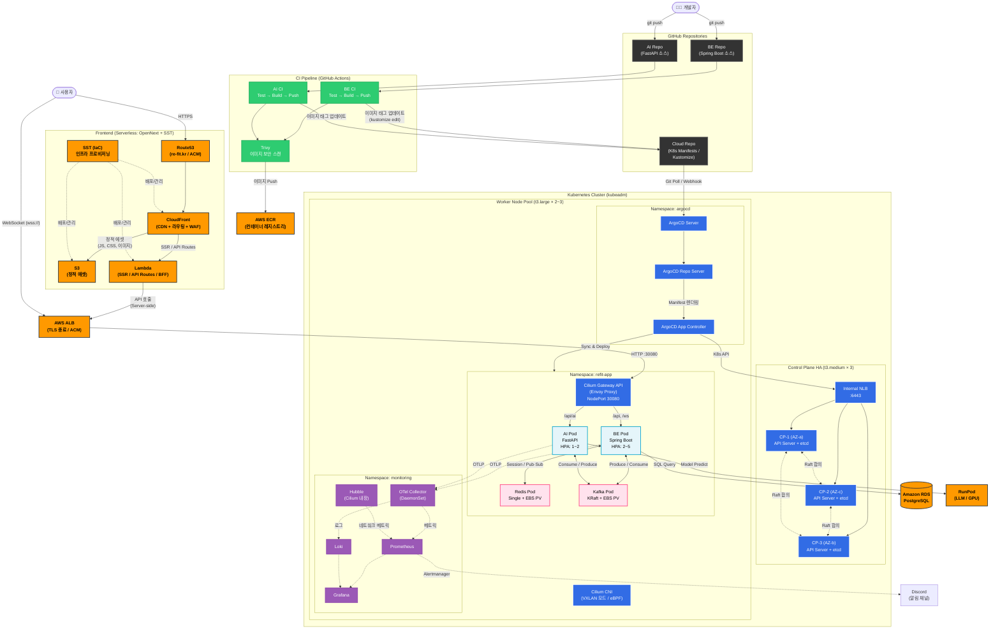
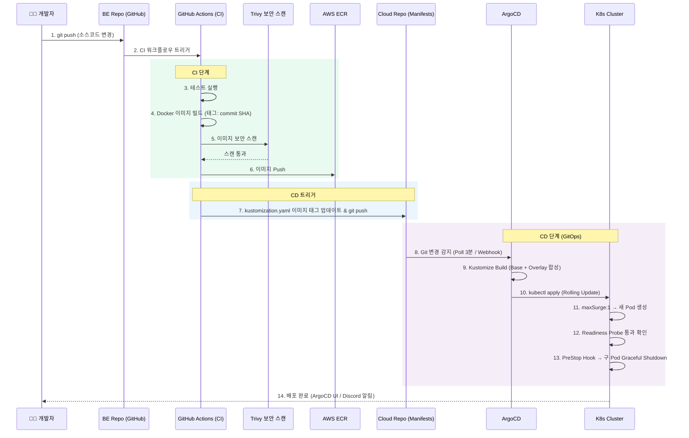
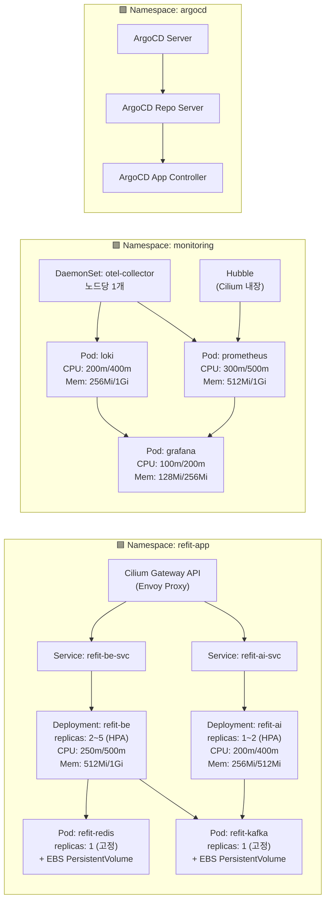
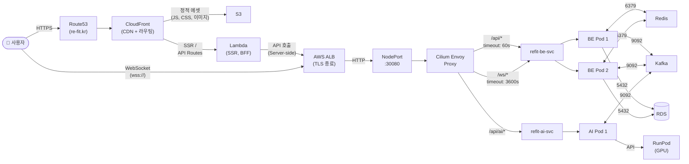
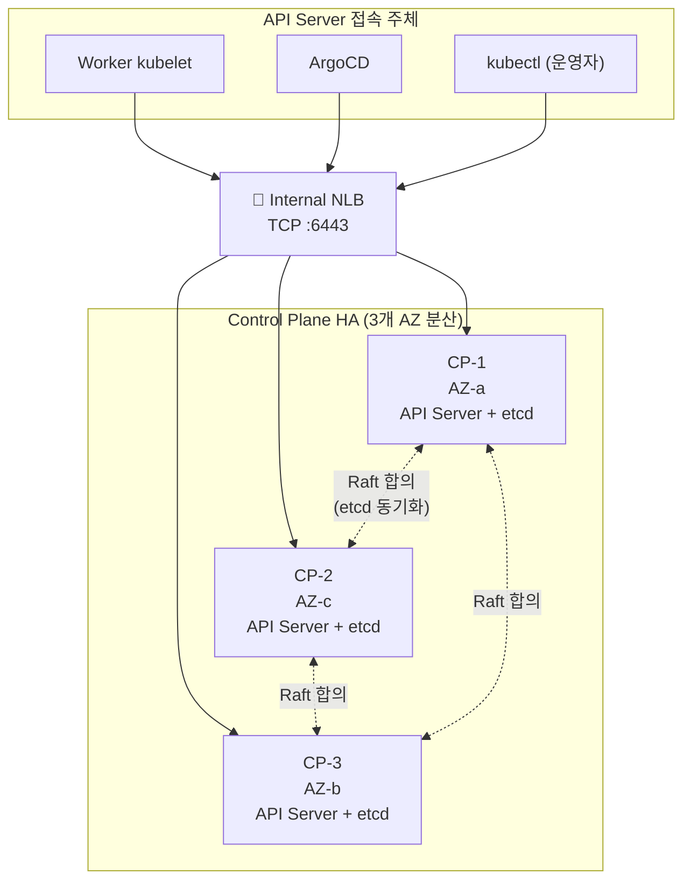
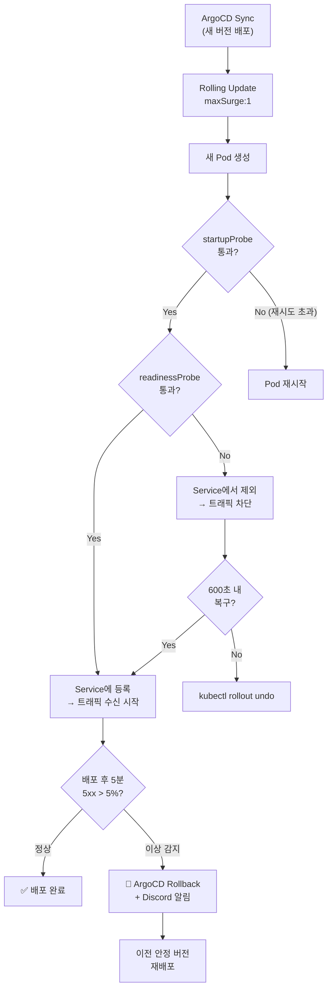

# Re-Fit 쿠버네티스 아키텍처 다이어그램

> K8s_design_v2.md 설계서 기반 전체 아키텍처 Mermaid 초안

---

## 1. 전체 아키텍처 (인프라 + CI/CD + 모니터링 통합)

---

## 2. CI/CD 파이프라인 상세 흐름

---

## 3. 네임스페이스별 리소스 배치도

---

## 4. 트래픽 흐름 상세 (사용자 요청 → 응답)

---

## 5. Control Plane HA 구성

---

## 6. 장애 대응 및 롤백 흐름

---

## 7. K8s 클러스터 + GitOps 포커스 다이어그램

> ALB 이후 K8s 클러스터 내부 구성과 GitOps(CI/CD) 배포 흐름만 집중한 다이어그램

```mermaid
graph TD
    %% ── 진입점 ──
    ALB["AWS ALB<br/>(TLS 종료)"]

    %% ── Git 저장소 ──
    subgraph GitOps ["GitOps Pipeline"]
        BE_Repo["BE Repo<br/>(Spring Boot)"]
        AI_Repo["AI Repo<br/>(FastAPI)"]
        GHA["GitHub Actions<br/>(CI: Test → Build →<br/>Trivy 스캔 → ECR Push)"]
        ECR["AWS ECR"]
        Cloud_Repo["Cloud Repo<br/>(K8s Manifests /<br/>Kustomize)"]
    end

    %% ── Kubernetes 클러스터 ──
    subgraph K8s_Cluster ["Kubernetes Cluster (kubeadm)"]

        %% Control Plane HA
        subgraph CP ["Control Plane HA (t3.medium × 3, 3 AZ)"]
            NLB["Internal NLB<br/>:6443"]
            CP1["CP-1 (AZ-a)<br/>API Server / etcd<br/>Scheduler / Controller Manager"]
            CP2["CP-2 (AZ-c)<br/>API Server / etcd<br/>Scheduler / Controller Manager"]
            CP3["CP-3 (AZ-b)<br/>API Server / etcd<br/>Scheduler / Controller Manager"]
        end

        %% Worker Node (물리 인프라 레이어)
        subgraph Worker_Nodes ["Worker Nodes (t3.large × 2~3)"]
            subgraph W1 ["Worker-1 (AZ-a)"]
                W1_Kubelet["kubelet"]
                W1_KubeProxy["kube-proxy"]
                W1_Cilium["Cilium Agent"]
            end
            subgraph W2 ["Worker-2 (AZ-c)"]
                W2_Kubelet["kubelet"]
                W2_KubeProxy["kube-proxy"]
                W2_Cilium["Cilium Agent"]
            end
            subgraph W3 ["Worker-3 (AZ-a) — 피크 시 추가"]
                W3_Kubelet["kubelet"]
                W3_KubeProxy["kube-proxy"]
                W3_Cilium["Cilium Agent"]
            end
        end

        %% Pod 논리 배치 레이어 (스케줄러가 동적 배치)
        subgraph Pod_Layer ["Pod 배치 레이어 (동적 스케줄링)"]

            %% ── Namespace: kube-system ──
            subgraph NS_System ["Namespace: kube-system"]
                CoreDNS["CoreDNS<br/>(클러스터 내부 DNS /<br/>서비스 디스커버리)"]
                MetricsSvr["Metrics Server<br/>(HPA용 CPU/Mem<br/>메트릭 수집)"]
                EBS_CSI["EBS CSI Driver<br/>(PV 동적 프로비저닝)"]
            end

            %% ── Namespace: refit-app ──
            subgraph NS_App ["Namespace: refit-app"]
                Gateway["Cilium Gateway API<br/>(Envoy Proxy)<br/>NodePort 30080"]

                BE["BE Pod (Spring Boot)<br/>HPA: 2~5<br/>CPU: 250m/500m<br/>Mem: 512Mi/1Gi"]
                AI["AI Pod (FastAPI)<br/>HPA: 1~2<br/>CPU: 200m/400m<br/>Mem: 256Mi/512Mi"]

                Redis["Redis Pod<br/>Single + EBS PV"]
                Kafka["Kafka Pod<br/>KRaft + EBS PV"]
            end

            %% ── Namespace: monitoring ──
            subgraph NS_Mon ["Namespace: monitoring"]
                OTel["OTel Collector<br/>(DaemonSet)"]
                Prom["Prometheus"]
                Loki["Loki"]
                Grafana["Grafana"]
                Hubble["Hubble<br/>(Cilium 내장)"]
            end

            %% ── Namespace: argocd ──
            subgraph NS_Argo ["Namespace: argocd"]
                ArgoServer["ArgoCD Server"]
                ArgoRepo["ArgoCD Repo Server"]
                ArgoCtrl["ArgoCD App Controller"]
            end
        end
    end

    %% ── 외부 서비스 ──
    RDS[("Amazon RDS<br/>PostgreSQL")]
    RunPod["RunPod<br/>(LLM / GPU)"]
    EBS[("AWS EBS<br/>(gp3 볼륨)")]
    Discord["Discord<br/>(알림)"]

    %% ━━━━━━ ALB → 클러스터 트래픽 ━━━━━━
    ALB -->|"HTTP :30080"| Gateway
    Gateway -->|"/api, /ws"| BE
    Gateway -->|"/api/ai"| AI

    %% ━━━━━━ 서비스 간 통신 ━━━━━━
    BE <-->|"Session / Pub·Sub"| Redis
    BE <-->|"Produce / Consume"| Kafka
    AI <-->|"Consume / Produce"| Kafka
    BE -->|"SQL"| RDS
    AI -->|"Model Predict"| RunPod

    %% ━━━━━━ Worker 노드 → CP 통신 ━━━━━━
    W1_Kubelet -->|"Pod 상태 보고"| NLB
    W2_Kubelet -->|"Pod 상태 보고"| NLB
    W3_Kubelet -.->|"Pod 상태 보고"| NLB

    %% ━━━━━━ Worker 노드 → Pod 레이어 ━━━━━━
    W1 ---|"Pod 호스팅"| Pod_Layer
    W2 ---|"Pod 호스팅"| Pod_Layer

    %% ━━━━━━ kube-system 연결 ━━━━━━
    CoreDNS -.->|"DNS 해석<br/>(svc.cluster.local)"| NS_App
    MetricsSvr -->|"CPU/Mem<br/>메트릭 수집"| W1_Kubelet
    MetricsSvr -->|"CPU/Mem<br/>메트릭 수집"| W2_Kubelet

    %% ━━━━━━ EBS CSI ↔ PV ━━━━━━
    EBS_CSI -->|"PV 프로비저닝"| EBS
    Redis -.->|"PVC"| EBS_CSI
    Kafka -.->|"PVC"| EBS_CSI

    %% ━━━━━━ GitOps CI/CD 흐름 ━━━━━━
    BE_Repo --> GHA
    AI_Repo --> GHA
    GHA -->|"이미지 Push"| ECR
    GHA -->|"이미지 태그 업데이트<br/>(kustomize edit set image)"| Cloud_Repo
    Cloud_Repo -->|"Git Poll /<br/>Webhook"| ArgoServer
    ArgoServer --> ArgoRepo
    ArgoRepo -->|"Manifest<br/>렌더링"| ArgoCtrl
    ArgoCtrl -->|"Sync &<br/>Rolling Update"| NS_App
    ArgoCtrl -->|"K8s API"| NLB

    %% ━━━━━━ Control Plane HA ━━━━━━
    NLB --> CP1 & CP2 & CP3
    CP1 <-.->|"Raft"| CP2
    CP2 <-.->|"Raft"| CP3
    CP3 <-.->|"Raft"| CP1

    %% ━━━━━━ 모니터링 ━━━━━━
    BE -.->|"OTLP"| OTel
    AI -.->|"OTLP"| OTel
    OTel -.->|"메트릭"| Prom
    OTel -.->|"로그"| Loki
    Hubble -.->|"네트워크 메트릭"| Prom
    Prom -.-> Grafana
    Loki -.-> Grafana
    Prom -.->|"Alertmanager"| Discord

    %% ━━━━━━ 스타일 ━━━━━━
    classDef aws fill:#FF9900,stroke:#232F3E,stroke-width:2px,color:black,font-weight:bold
    classDef k8s fill:#326CE5,stroke:#fff,stroke-width:2px,color:white
    classDef app fill:#E5F5FA,stroke:#00A2CC,stroke-width:2px,color:black
    classDef infra fill:#FFE2ED,stroke:#FF4081,stroke-width:2px,color:black
    classDef ci fill:#2ECC71,stroke:#27AE60,stroke-width:2px,color:white
    classDef mon fill:#9B59B6,stroke:#8E44AD,stroke-width:2px,color:white
    classDef git fill:#333,stroke:#555,stroke-width:2px,color:white
    classDef system fill:#1ABC9C,stroke:#16A085,stroke-width:2px,color:white
    classDef worker fill:#3498DB,stroke:#2980B9,stroke-width:2px,color:white

    class ALB,ECR,RDS,RunPod,EBS aws
    class NLB,CP1,CP2,CP3,Gateway k8s
    class BE,AI app
    class Redis,Kafka infra
    class GHA ci
    class OTel,Prom,Loki,Grafana,Hubble mon
    class BE_Repo,AI_Repo,Cloud_Repo git
    class ArgoServer,ArgoRepo,ArgoCtrl k8s
    class CoreDNS,MetricsSvr,EBS_CSI system
    class W1_Kubelet,W1_KubeProxy,W1_Cilium,W2_Kubelet,W2_KubeProxy,W2_Cilium,W3_Kubelet,W3_KubeProxy,W3_Cilium worker
```

