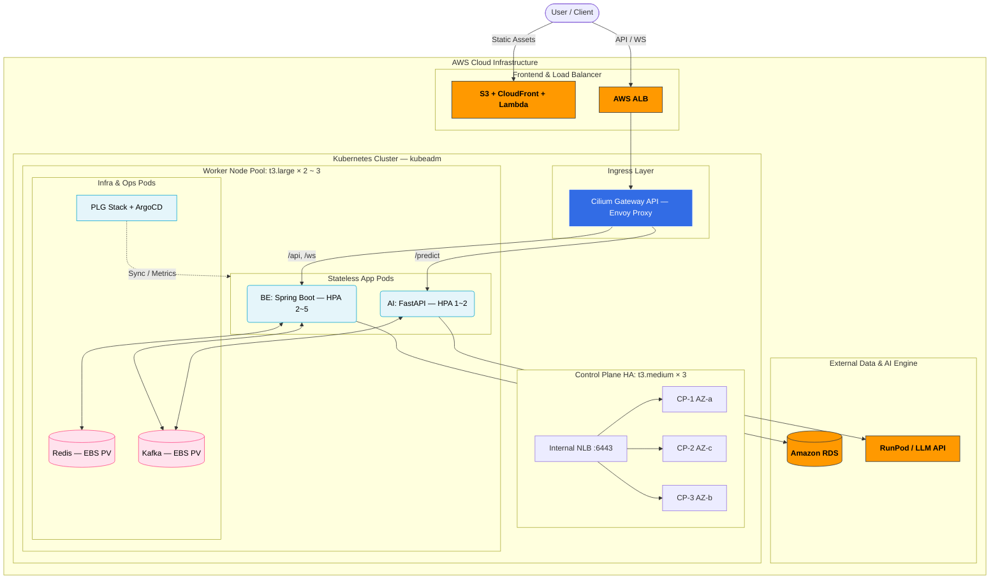
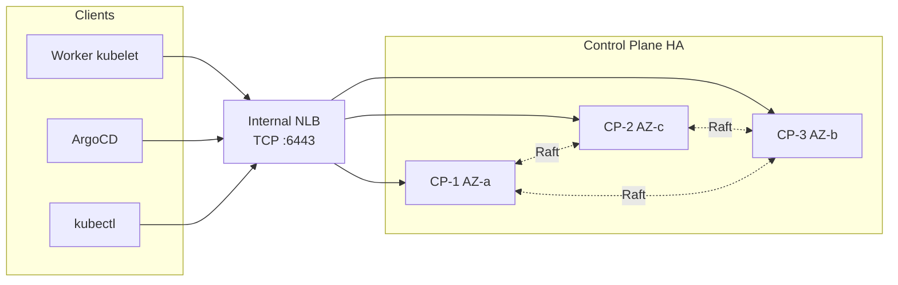

# K8s 클러스터 설계 문서

## 목차

<strong>Part 1. 도입 배경 및 필요성</strong>

- [1. Docker + ASG에서 Kubernetes로 전환하는 이유](#1-docker--asg에서-kubernetes로-전환하는-이유)

<strong>Part 2. 클러스터 아키텍처 설계</strong>

- [2. 클러스터 구성 개요](#2-클러스터-구성-개요)
- [3. 노드 구성 및 사이징](#3-노드-구성-및-사이징)
- [4. CNI 선정: Cilium (VXLAN 모드)](#4-cni-선정-cilium-vxlan-모드)
  - [4.1 CNI가 해결해야 하는 문제](#41-cni가-해결해야-하는-문제)
  - [4.2 후보 비교](#42-후보-비교)
  - [4.3 Cilium을 선택한 이유](#43-cilium을-선택한-이유)
  - [4.4 VXLAN 모드 선택](#44-vxlan-모드-선택)
  - [4.5 NetworkPolicy 설계](#45-networkpolicy-설계)
  - [4.6 네트워크 CIDR](#46-네트워크-cidr)
- [5. Ingress 설계: Gateway API (Cilium 구현체)](#5-ingress-설계-gateway-api-cilium-구현체)
  - [5.1 Ingress가 해결해야 하는 문제](#51-ingress가-해결해야-하는-문제)
  - [5.2 Gateway API와 기존 Ingress API 비교](#52-gateway-api와-기존-ingress-api-비교)
  - [5.3 후보 비교](#53-후보-비교)
  - [5.4 Gateway API + Cilium 구현체 선정 근거](#54-gateway-api--cilium-구현체-선정-근거)
  - [5.5 구성 및 트래픽 흐름](#55-구성-및-트래픽-흐름)
- [6. 네임스페이스 및 자원 격리 정책](#6-네임스페이스-및-자원-격리-정책)

---

# Part 1. 도입 배경 및 필요성

## 1. Docker + ASG에서 Kubernetes로 전환하는 이유

### 1.1 Re-Fit 서비스의 트래픽 특성

| 지표 | 비시즌 | 채용 시즌 (Peak) |
|:-----|:-------|:----------------|
| DAU | 5,000 ~ 8,000 | 30,000 ~ 50,000 |
| 피크 CCU | ~ 800 | ~ 5,000 |
| 피크 RPS | ~ 100 | ~ 500 |
| AI 분석 요청 | ~ 400건/일 | ~ 2,500건/일 |

비시즌과 피크 사이 트래픽 편차가 5 ~ 7배입니다. 그리고 트래픽 종류가 단일하지 않습니다. WebSocket 기반 장기 연결(채팅)과 비동기 AI 분석 요청이 동일 백엔드를 공유합니다.

### 1.2 기존 Docker + ASG 구조가 풀지 못한 문제

이전 단계인 Docker + ASG 설계는 배포 자동화(15분 → 1~2분)와 인스턴스 단위 확장을 확보하면서 운영 역량을 한 단계 끌어올렸습니다. 그러나 운영을 해나가면서 구조적으로 해결되지 않는 두 가지 문제가 남아 있었습니다.

<strong>① 장애 감지 단위의 한계</strong>

Docker + ASG 환경에서 건강 상태는 EC2 인스턴스 레벨에서만 확인됩니다. ALB Health Check 주기는 30초이고, EC2 인스턴스 자체는 살아 있지만 내부 프로세스가 응답을 거부하는 상태를 구분하지 못합니다.

Re-Fit에서 이 30초는 단순한 수치가 아닙니다. WebSocket은 연결을 유지하고 있는 사용자가 메시지를 전송하는 순간 실패를 체감합니다. 프로세스가 죽지 않았지만 요청을 처리하지 못하는 상태, 즉 *"프로세스는 살아 있으나 트래픽을 받지 못하는 상태"*를 ALB Health Check는 잡지 못합니다.

<strong>② BE와 AI의 확장 기준이 엮여 있는 구조</strong>

공채 시즌에 실제로 부하를 받는 지점은 두 곳입니다.
- BE: WebSocket 연결 수 급증 (CCU 800 → 5,000)
- AI: 이력서 분석 요청 큐 급증 (400 → 2,500건/일)

그러나 ASG는 EC2 인스턴스 단위로만 확장됩니다. BE와 AI가 동일 인스턴스 위에서 동작하므로, 어느 쪽이 병목인지 구분하지 않고 인스턴스 전체를 늘리게 됩니다. 결과적으로 AI burst가 BE 자원을 잠식하거나, BE 확장이 AI 소비 속도를 불필요하게 높이는 상황이 발생합니다.

WebSocket 채팅과 AI 분석을 같은 확장 단위로 묶어두면, 두 워크로드를 <strong>서로 보호하면서</strong> 운영하기가 구조적으로 어렵습니다.

### 1.3 전환의 핵심 동기: 처리량이 아닌 운영 제어 단위

절대 처리량만 놓고 보면 Docker + ASG로도 현재 규모는 충분히 감당할 수 있습니다. 전환의 이유는 성능이 아닙니다.

<strong>Pod 단위 감지·격리·확장</strong>이 필요했습니다. 구체적으로는:
- 프로세스 레벨이 아닌 애플리케이션 레벨에서 건강 상태를 판단하고 즉시 트래픽을 차단할 것
- BE와 AI를 서로 독립적인 확장 단위로 분리해, 채팅 경로를 AI burst로부터 보호할 것
- 배포 시 WebSocket 연결을 먼저 정리하고 종료하는 과정이 플랫폼 수준에서 보장될 것

이 세 가지는 Docker + ASG 구조에서는 운영자 스크립트와 숙련도에 의존해야 합니다. Kubernetes에서는 플랫폼이 보장합니다.

### 1.4 kubeadm을 선택한 이유

Kubernetes 클러스터를 구성하는 방법은 여러 가지입니다. EKS(관리형), kops, k3s, kubeadm 중 kubeadm을 선택했습니다.

| 옵션 | 설명 | 판단 |
|:-----|:-----|:-----|
| <strong>EKS</strong> | AWS 완전 관리형 Control Plane | Control Plane 비용 $0.10/hr (~$73/월) + Node Group 비용. 소규모 클러스터에서 비용 구조가 불리. Control Plane 내부 구조를 직접 다루지 못함 |
| <strong>kops</strong> | AWS 자동화 클러스터 프로비저닝 | Route53, S3 등 AWS 의존성이 강하고 추상화 계층이 두껍습니다. 직접 제어하기 어렵습니다 |
| <strong>k3s</strong> | 경량 Kubernetes | IoT/엣지 용도에 최적화. etcd 대신 SQLite 기본값으로 HA 구성 시 별도 설정 필요. 표준 kubeadm 워크플로우와 다릅니다 |
| <strong>kubeadm</strong> | 공식 Kubernetes 클러스터 부트스트랩 도구 | Control Plane 구성, etcd, 인증서, 노드 조인까지 표준 방식으로 직접 제어. 프로덕션 환경 구성 방식과 동일합니다 |

kubeadm은 <strong>Kubernetes 공식 클러스터 부트스트랩 도구</strong>입니다. 불필요한 추상화 없이 클러스터 컴포넌트를 직접 제어할 수 있고, 프로덕션 환경에서의 K8s 운영 방식과 동일합니다. AWS 크레딧이 제한된 상황에서 EKS 대비 Control Plane 비용을 절감할 수 있다는 점도 현실적인 이유였습니다.

---

# Part 2. 클러스터 아키텍처 설계

## 2. 클러스터 구성 개요

### 2.1 아키텍처 다이어그램



### 2.2 클러스터 내부/외부 배치 기준

클러스터 경계를 어디에 그을지는 "K8s 위에 올리면 운영 이득이 있는가"를 기준으로 판단했습니다. 운영 이득이란 구체적으로 Self-Healing, 선언적 배포, 자원 격리 중 하나 이상을 얻을 수 있는지입니다.

<strong>클러스터 내부 배치:</strong>

| 구성요소 | 형태 | 배치 근거 |
|:---------|:-----|:---------|
| BE (Spring Boot) | Deployment | 채팅 경로의 핵심. Pod 단위 건강 상태 관리와 무중단 배포가 필수입니다 |
| AI (FastAPI) | Deployment | BE와 독립적인 확장 단위 분리. Kafka Consumer 병렬도를 독립적으로 제어합니다 |
| Cilium Gateway API | Envoy Proxy | `/ws`와 `/api`의 연결 수명이 다르므로 경로별 타임아웃 제어가 필요합니다 |
| Kafka | Single Pod + EBS PV | AI 요청 큐. 채팅 경로와 분리된 비동기 처리를 보장합니다 |
| Redis | Single Pod + EBS PV | 채팅 세션 + Pub/Sub. 앱과 같은 클러스터 내 낮은 지연 접근이 필요합니다 |
| 모니터링 (PLG) | DaemonSet / StatefulSet | 클러스터 내부 이벤트를 직접 수집해야 "왜 채팅이 끊겼는가"를 빠르게 파악할 수 있습니다 |
| ArgoCD | Deployment | Git 기준 단일 배포 소스 확보. 수동 조작 없는 선언적 운영을 위해 내부에 둡니다 |

<strong>클러스터 외부 유지:</strong>

| 구성요소 | 유지 근거 |
|:---------|:---------|
| DB (RDS) | 복구 목표가 "수 분 내 재기동"이 아니라 "유실 방지"입니다. 복구 책임을 RDS에 위임하는 것이 더 현실적입니다 |
| AI 모델 (RunPod) | 클러스터의 목적은 요청 조정이지 GPU 연산이 아닙니다. 모델 서빙은 외부 GPU 전용 서비스로 분리합니다 |
| FE (Next.js) | 정적 자산 제공과 엣지 캐싱은 K8s가 잘하는 일이 아닙니다. Worker 자원을 API 처리에 집중합니다 |

---

## 3. 노드 구성 및 사이징

### 3.1 Control Plane: t3.medium × 3 (HA)

Control Plane은 트래픽을 직접 처리하지 않습니다. 그러나 Control Plane이 없으면 Pod 재스케줄링, HPA 확장, `kubectl rollout undo` 같은 <strong>복구 행위 자체가 불가능</strong>해집니다. 즉, CP 장애는 곧 클러스터의 자기치유 능력 마비입니다.

<strong>단일 CP의 위험:</strong>

단일 CP 환경에서는 기존 Pod가 계속 동작하더라도, CP 장애가 다른 장애와 겹치면 복구 능력이 동시에 사라집니다.

| 동시 발생 시나리오 | 결과 |
|:----------------|:-----|
| CP 장애 + BE Pod OOMKilled | Pod 재생성 불가 → 채팅 수용 용량 감소 |
| CP 장애 + 피크 트래픽 급증 | HPA 확장 불가 → 기존 Pod만으로 버텨야 함 |
| CP 장애 + 긴급 롤백 필요 | rollout undo 불가 → 장애 버전이 계속 서빙 |

WebSocket 기반 채팅이 핵심인 서비스에서 CP 부재 시 HPA와 Self-Healing이 동시에 멈추는 리스크는 감수하기 어렵습니다.

<strong>왜 t3.medium (2 vCPU / 4GB)인가:</strong>

Control Plane 컴포넌트들의 상시 메모리 점유는 다음과 같습니다.

| 컴포넌트 | 상시 메모리 |
|:---------|:-----------|
| kube-apiserver | ~ 500MB |
| etcd | ~ 200MB |
| kube-controller-manager | ~ 200MB |
| kube-scheduler | ~ 100MB |
| OS / kubelet | ~ 600MB |
| <strong>합계</strong> | <strong>~ 1.6GB</strong> |

- t3.small (2GB): 시스템 컴포넌트 1.6GB 점유 후 남는 400MB로는 etcd 스냅샷 생성 시 일시적 메모리 급증(~500MB)을 버티지 못합니다. OOM 위험이 상존합니다.
- <strong>t3.medium (4GB): 시스템 컴포넌트 1.6GB + etcd 스냅샷/운영 여유 1GB + 파일 캐시 1.4GB. kubeadm 공식 최소 사양(2 vCPU, 2GB)의 2배 여유를 확보합니다.</strong>
- t3.large (8GB): Worker 3대 / Pod 20개 미만 소규모 클러스터에서 과잉입니다. 추가 비용을 Worker에 투자하는 것이 효율적입니다.

<strong>HA 구성의 세 가지 요소:</strong>

*① etcd Quorum*

etcd는 Raft 합의 알고리즘 기반 분산 데이터베이스로, <strong>과반수(n/2+1)가 정상이어야</strong> 읽기/쓰기가 가능합니다. 3대 구성에서는 1대 장애까지 허용합니다. 2대가 생존하면 쿼럼이 유지되어 클러스터 상태 변경이 계속 가능합니다.

kubeadm의 Stacked etcd 방식을 사용합니다. 각 CP 노드에 API Server와 etcd가 함께 실행되어 별도 etcd 전용 노드가 필요 없습니다.

*② Internal NLB (API Server 앞단 로드밸런서) — HA에서 NLB가 여전히 필요한 이유*

HA(CP 3대)를 구성해도 NLB는 반드시 필요합니다. HA가 해결하는 것은 "CP 1대가 죽어도 클러스터가 동작한다"는 것이고, NLB가 해결하는 것은 별개의 문제입니다.

CP가 3대가 되면 kubelet, ArgoCD, kubectl 같은 API Server 접속 주체가 <strong>어떤 CP에 접속할지 알 수 없습니다.</strong> CP IP는 세 개이지만 클라이언트는 하나의 엔드포인트를 가져야 합니다. NLB 없이 해결하는 대안은 다음과 같습니다.

| 대안 | 문제 |
|:-----|:-----|
| 각 클라이언트에 CP IP 목록을 직접 설정 | CP 1대가 죽으면 클라이언트가 해당 IP로 계속 접속 시도 → 연결 실패. 수동 재설정 필요 |
| keepalived + VIP (Virtual IP) | EC2에서 Gratuitous ARP 방식 VIP는 AWS VPC에서 동작하지 않음 |
| kubeadm에서 고정 CP IP 사용 | CP 3대 중 어디로 가야 하는지 클라이언트가 결정할 수 없음 |

결론: AWS 환경에서 CP 3대의 단일 진입점을 안정적으로 만드는 현실적인 방법은 Internal NLB뿐입니다. HA와 NLB는 서로 다른 문제를 해결합니다.

```
HA: CP 1대 장애 시 클러스터가 계속 동작하는가
NLB: 클라이언트가 항상 살아 있는 CP에 접속할 수 있는가
```

`kubeadm init` 시 `--control-plane-endpoint=<NLB DNS>:6443`으로 지정합니다.



*③ 인증서 공유*

`kubeadm init --upload-certs`로 CA 인증서를 클러스터 Secret에 업로드하고, 추가 CP는 `kubeadm join --control-plane --certificate-key <key>`로 자동 수신합니다.

<strong>AZ 분산: 왜 2:1이 아닌 1:1:1인가</strong>

CP 3대를 2개 AZ에 2:1로 배치하면, 2대가 있는 AZ 장애 시 1대만 생존해 쿼럼(과반수)이 붕괴됩니다. <strong>어느 AZ가 장애를 일으켜도 2대가 생존하려면 반드시 3개 AZ에 1:1:1 배치</strong>여야 합니다.

<strong>단일 CP vs HA CP 비교:</strong>

| 항목 | 단일 CP | HA CP (3대) |
|:-----|:-------|:-----------|
| CP 장애 시 영향 | 신규 스케줄링·HPA·롤백 전면 불가 | 1대 장애 시 무중단, 자동 페일오버 |
| AZ 장애 시 영향 | CP가 해당 AZ에 있으면 클러스터 관리 마비 | 3개 AZ 분산 → 어느 AZ 장애에도 쿼럼 유지 |
| 추가 비용 | 없음 | 인스턴스 2대 + NLB (~월 $99) |
| 복구 전략 | etcd 백업 기반 수동 재구축 (30분+) | 자동 페일오버. 백업은 전체 재구축 시 2차 방어선 |

---

### 3.2 Worker Node: t3.large × 2~3

<strong>왜 CPU보다 메모리를 먼저 보는가</strong>

Re-Fit의 BE는 JVM 기반 Spring Boot입니다. JVM은 시작 시 heap을 예약하므로, CPU 평균치보다 <strong>메모리 하한선</strong>이 먼저 병목이 됩니다. `-XX:MaxRAMPercentage=70%` 기준 컨테이너 512Mi의 70%인 ~350MB가 heap에 선점됩니다.

<strong>Bottom-Up 적산:</strong>

*Step 1. 노드당 시스템 예약 자원*

| 항목 | CPU | Memory |
|:-----|:----|:-------|
| kubelet + containerd | 100m | 256Mi |
| kube-proxy | 100m | 128Mi |
| Cilium (CNI + eBPF) | 250m | 256Mi |
| OS 커널 / 파일 캐시 | — | ~ 512Mi |
| <strong>소계</strong> | <strong>~ 450m</strong> | <strong>~ 1.15Gi</strong> |

t3.large (2 vCPU / 8Gi) 기준 Pod에 할당 가능한 Allocatable: <strong>~ 1,550m CPU / ~ 6.85Gi Memory</strong>

*Step 2. 상시 워크로드 requests 합산 (비시즌)*

| 워크로드 | 수량 | CPU req | Memory req |
|:---------|:-----|:--------|:-----------|
| BE (Spring Boot) | 2 | 250m × 2 = 500m | 512Mi × 2 = 1Gi |
| AI (FastAPI) | 1 | 200m | 256Mi |
| Redis | 1 | 100m | 256Mi |
| Kafka | 1 | 200m | 512Mi |
| Cilium Envoy Proxy | 1 | 100m | 128Mi |
| PLG (Prometheus + Loki + Grafana) | 각 1 | 600m | 1Gi |
| ArgoCD | 1 | 200m | 512Mi |
| OTel Collector (DaemonSet) | 노드당 1 | 200 ~ 300m | 256 ~ 384Mi |
| <strong>합계</strong> | | <strong>~ 2.1 ~ 2.3 core</strong> | <strong>~ 3.9 ~ 4.2Gi</strong> |

*Step 3. 피크 시 HPA 확장 추가 자원*

| 확장 대상 | 변화 | 추가 CPU | 추가 Memory |
|:---------|:-----|:---------|:-----------|
| BE | 2 → 5 Pod (+3) | +750m | +1.5Gi |
| AI | 1 → 2 Pod (+1) | +200m | +256Mi |
| <strong>합계</strong> | | <strong>+950m</strong> | <strong>+1.75Gi</strong> |

피크 시 총 필요: <strong>~ 3.2 core / ~ 5.9Gi</strong>

*Step 4. 노드 수 결정*

| 구성 | Allocatable 합계 | 상시 | 피크 | 판단 |
|:-----|:----------------|:-----|:-----|:-----|
| Worker 2대 | ~ 3.1 core / ~ 13.7Gi | 충분 | CPU 여유 없음 | 최소 마지노선 |
| <strong>Worker 3대</strong> | <strong>~ 4.65 core / ~ 20.5Gi</strong> | <strong>충분</strong> | <strong>CPU 여유 ~31%</strong> | <strong>안정적 운영</strong> |

비시즌 Worker 2대 운영, 채용 시즌 진입 전 또는 실부하 테스트 기점에서 3대로 확장하는 탄력적 운영입니다.

<strong>왜 t3.medium이 아닌 t3.large인가</strong>

- t3.medium (4GB): 시스템 예약 1.15Gi 제외 후 Allocatable ~2.85Gi. BE 1개(512Mi) + Redis(256Mi) + Kafka(512Mi) = 1.28Gi 소비 후 Prometheus(512Mi) 추가 시 여유 ~1Gi. HPA 확장 Pod가 Pending 상태에 빠지는 것은 시간 문제입니다.
- <strong>t3.large (8GB): Allocatable ~6.85Gi. 상시(~4.2Gi) + HPA 확장분(~1.75Gi) + 스파이크 여유 확보. JVM의 메모리 특성을 감안해도 OOMKilled 위험이 낮습니다.</strong>
- t3.xlarge (16GB): 비시즌 기준 노드당 10Gi 이상 유휴. 비용 2배($75 → $150/대)에 사용률 30% 미만으로 비용 대비 효율이 급감합니다.

<strong>왜 t3 (Burstable) 계열인가</strong>

Re-Fit의 CPU 부하는 비시즌(RPS ~100)에 매우 낮고 채용 시즌 피크에 집중됩니다. t3 Burstable 인스턴스는 기본 CPU 성능을 보장하면서 유휴 시 CPU 크레딧을 적립하고 피크 시 버스트로 소진하는 구조입니다. 이 모델이 Re-Fit의 계절성 트래픽 패턴과 정확히 부합합니다.

m5/m6i 같은 고정 성능 인스턴스는 상시 고부하가 있을 때 의미가 있습니다. 비시즌 CPU 사용률이 20~30% 수준인 서비스에서 고정 성능 프리미엄을 지불할 이유가 없습니다.

<strong>월 비용 요약:</strong>

| 항목 | 스펙 | 수량 | 월 비용 |
|:-----|:-----|:-----|:-------|
| Control Plane (HA) | t3.medium | 3대 | ~$38 × 3 = ~$114 |
| Internal NLB | TCP 6443 | 1개 | ~$18 |
| Worker Node | t3.large | 2대 | ~$75 × 2 = ~$150 |
| EBS (OS + PV) | gp3 | ~210GB | ~$20 |
| <strong>합계</strong> | | | <strong>~$302 (약 40만원)</strong> |

---

### 3.3 Pod 스케줄링 전략

#### 워크로드별 리소스 할당

<strong>산정 원칙:</strong>
- `requests`: 스케줄러가 노드를 선택하는 기준값입니다. "이것이 보장되지 않으면 Pod가 정상 동작하지 않는다"는 최솟값입니다.
- `limits`: 순간 부하 버퍼입니다. 단, limits가 높을수록 작은 클러스터에서 다른 Pod를 밀어낼 수 있습니다.
- limits ≤ requests × 2 운영 규칙: 소규모 클러스터에서 과도한 over-commit을 막기 위한 기준입니다.

| 워크로드 | 상시 / 피크 | CPU req / lim | Memory req / lim | 산정 근거 |
|:---------|:-----------|:-------------|:----------------|:---------|
| <strong>BE</strong> | 2 / 5 Pod | 250m / 500m | 512Mi / 1Gi | JVM heap ~350MB (`-XX:MaxRAMPercentage=70%` × 512Mi) + 스레드 스택 + 메타스페이스. 250m CPU는 비시즌 Pod당 ~50 RPS 처리에 충분합니다 |
| <strong>AI</strong> | 1 / 2 Pod | 200m / 400m | 256Mi / 512Mi | FastAPI async 경량 프로세스. 모델은 RunPod 외부 호출이므로 메모리 점유가 낮습니다 |
| <strong>Redis</strong> | 1 Pod (고정) | 100m / 200m | 256Mi / 512Mi | CCU 5,000 세션 (~1KB/세션) = ~5MB. 실부하보다 내부 구조 오버헤드와 Pub/Sub 버퍼를 고려한 여유 할당입니다 |
| <strong>Kafka</strong> | 1 Pod (고정) | 200m / 500m | 512Mi / 1Gi | AI 분석 요청 큐 (일 ~2,500건). KRaft 단일 브로커. 페이지 캐시 확보를 위해 limits를 requests 대비 2배로 설정합니다 |
| <strong>Cilium Envoy Proxy</strong> | 1 Pod (고정) | 100m / 200m | 128Mi / 256Mi | L7 라우팅 전용. WebSocket 프록시는 연결 유지만 하므로 자원 소모가 미미합니다 |

#### Pod AntiAffinity

<strong>목적:</strong> 동일 Deployment의 Pod가 단일 노드에 집중되는 것을 방지해, 노드 1대 장애 시에도 서비스를 유지합니다.

<strong>적용 대상:</strong> BE Deployment (replicas ≥ 2인 핵심 서비스)

BE에만 강하게 AntiAffinity를 거는 이유는 명확합니다. Re-Fit에서 WebSocket 채팅 경로는 <strong>노드 1대 장애가 곧 해당 노드 위 채팅 연결 전체 유실</strong>을 의미합니다. 동일 노드에 BE Pod 2개가 모두 올라가 있고 그 노드가 NotReady가 되면, 재스케줄링이 완료되기 전까지 서비스가 절반으로 줄거나 완전히 중단됩니다.

```yaml
affinity:
  podAntiAffinity:
    preferredDuringSchedulingIgnoredDuringExecution:
      - weight: 100
        podAffinityTerm:
          labelSelector:
            matchLabels:
              app: refit-be
          topologyKey: kubernetes.io/hostname
```

`preferred` (Soft)를 선택한 이유는 `required` (Hard) 방식이 Worker 2대 환경에서 replicas 3 이상일 때 Pending을 유발할 수 있기 때문입니다. weight 100으로 최우선 적용하되, 자원이 부족한 극단적 상황에서는 스케줄러가 유연하게 판단할 수 있도록 했습니다.

AI, Redis, Kafka는 AntiAffinity를 적용하지 않습니다. AI는 상시 1 Pod이고, Redis/Kafka는 각 1 Pod 고정이라 분산 대상이 없습니다.

#### Taint / Toleration — 의도적 미사용

Taint/Toleration은 특정 노드에 특정 워크로드만 배치하기 위한 메커니즘입니다. Re-Fit은 단일 Worker Pool 구조(2~3대)이며, 노드를 역할별로 분리할 만큼 규모가 크지 않습니다. Taint를 적용하면 특정 노드에 Pod가 집중되어 오히려 자원 불균형이 발생할 수 있습니다. 네임스페이스 + ResourceQuota로 논리적 격리가 충분하므로, 이 규모에서 Taint/Toleration은 과한 제어입니다.

---

## 4. CNI 선정: Cilium (VXLAN 모드)

### 4.1 CNI가 해결해야 하는 문제

CNI(Container Network Interface)는 K8s 클러스터 내 Pod 간 통신을 구현하는 네트워크 플러그인입니다. K8s 자체는 "모든 Pod가 서로 통신할 수 있어야 한다"는 규칙만 정의하고, 실제 네트워크 구현은 CNI의 몫입니다. CNI 없이는 Pod에 IP가 할당되지 않고, Pod 간 통신 자체가 불가능합니다.

Re-Fit 클러스터의 특성을 먼저 정리합니다.

- 서비스(BE/AI), 인프라(Redis/Kafka), 운영(PLG/ArgoCD) Pod가 <strong>동일 Worker 노드 풀에 혼재</strong>합니다.
- Redis에는 사용자 세션 토큰·채팅 메시지, Kafka에는 이력서 분석 요청이 저장됩니다. K8s 기본 상태에서는 클러스터 내 모든 Pod가 이들에 자유 접근 가능합니다.
- EKS가 아닌 kubeadm 자체 구축 환경입니다.
- Worker 2~3대, 총 Pod ~20개의 소규모 클러스터입니다.

이 상황에서 CNI가 해결해야 하는 문제는 세 가지입니다.

| # | 문제 | 왜 문제인가 |
|:--|:-----|:-----------|
| ① | <strong>Pod 간 접근 제어 (NetworkPolicy)</strong> | 서비스·인프라·운영 Pod가 혼재하는 환경에서 Grafana나 ArgoCD에 보안 취약점이 생기면 공격자가 해당 Pod를 거점으로 Redis/Kafka에 직접 접근할 수 있습니다. 최소 권한 원칙(Least Privilege)에 따라 Redis는 BE만, Kafka는 BE와 AI만 접근하도록 격리가 필수입니다. |
| ② | <strong>kubeadm + AWS VPC 호환</strong> | AWS VPC 위의 kubeadm 클러스터에서 VPC 라우팅 테이블 수동 관리 없이 Pod 네트워크가 즉시 구성되어야 합니다. |
| ③ | <strong>네트워크 관측성</strong> | 네트워크 문제 발생 시 원인을 빠르게 파악할 수 있어야 합니다. "BE → Redis 연결 실패"가 발생했을 때 어떤 정책이 차단했는지, 어떤 Pod가 비정상 접근을 시도했는지 <strong>실시간으로 확인</strong>할 수 있어야 합니다. |

### 4.2 후보 비교

| CNI | ① NetworkPolicy (접근 제어) | ② kubeadm + AWS 호환 | ③ 네트워크 관측성 | 판정 |
|:----|:--------------------------|:-------------------|:----------------|:-----|
| <strong>Cilium</strong> | L3/L4/L7 NetworkPolicy + DNS 기반 정책. Pod IP·포트뿐 아니라 HTTP 경로·DNS 이름 기반까지 세밀한 정책 가능 | VXLAN 모드: AWS VPC 설정 변경 없이 즉시 동작 (Amazon Linux 2 커널 5.10+ 충족) | <strong>Hubble 내장</strong>. 모든 Pod 간 트래픽 흐름을 실시간 시각화하고, `hubble observe --verdict DROPPED`로 차단된 트래픽 즉시 필터링 가능. Prometheus 메트릭 export로 기존 Grafana 통합 가능 | <strong>선정</strong> |
| <strong>Calico</strong> | L3/L4 NetworkPolicy 완전 지원 | VXLAN 모드 즉시 동작 | `iptables -L`, `conntrack -L` 등 표준 도구로 디버깅 가능하나, 규칙이 수십~수백 줄이 되면 수동 분석 비용이 높습니다. 트래픽 흐름 시각화 없음 | 차선 — 관측성 부족 |
| <strong>Flannel</strong> | NetworkPolicy <strong>미지원</strong> | 즉시 동작 | 단순 | 탈락 — ①번 해결 불가 |
| <strong>AWS VPC CNI</strong> | 제한적 (Calico 병행 필요) | EKS 전제 설계. kubeadm에서 ENI 관리·IAM 연동 등 추가 작업 과중 | VPC Flow Logs | 탈락 — ②번 해결 불가 |
| <strong>Weave Net</strong> | NetworkPolicy 지원 | 즉시 동작 | 제한적 | 탈락 — 2024년 프로젝트 유지보수 중단(archive), 보안 패치 미지원 위험 |

### 4.3 Cilium을 선택한 이유

#### ① eBPF: kube-proxy의 역할, 한계, 그리고 대체로 얻는 것

Flannel을 제외한 후보들은 모두 NetworkPolicy를 지원합니다. 그렇다면 왜 Calico가 아닌 Cilium인가. 핵심은 <strong>NetworkPolicy와 Service 라우팅을 어떻게 구현하는가</strong>입니다.

**kube-proxy가 하는 일**

K8s에서 Service는 가상 IP(ClusterIP)를 제공합니다. BE Pod가 `refit-redis-svc:6379`로 접속을 시도하면, 이 요청은 실제로 Redis Pod의 IP로 변환되어야 합니다. 이 변환이 없으면 Service 자체가 동작하지 않습니다.

이 변환을 담당하는 것이 `kube-proxy`입니다. kube-proxy는 모든 Worker Node에서 DaemonSet으로 실행되며, API Server를 관측해 Service와 Endpoints 변화를 감지합니다. 변화가 생길 때마다 해당 노드의 iptables NAT 체인을 갱신합니다.

```
BE Pod가 refit-redis-svc:6379로 패킷 전송
  → iptables PREROUTING NAT 규칙에 의해 Redis Pod IP:6379로 DNAT
  → Redis Pod 도달
```

CNI의 NetworkPolicy도 같은 계층에서 작동합니다. Calico는 허용/차단 규칙을 iptables FILTER 체인에 등록합니다. 결과적으로 패킷 하나의 처리 경로는 다음과 같습니다.

```
패킷 → NIC → iptables PREROUTING(NAT, kube-proxy) → iptables FORWARD(FILTER, Calico) → 목적지 Pod
```

**iptables 방식의 구조적 문제**

iptables는 규칙을 <strong>순차 탐색</strong>합니다. 규칙이 N개면 최악의 경우 N번 비교합니다. Pod 20개, Service 10개, NetworkPolicy 5개만 돼도 체인 규칙이 수백 줄입니다.

더 큰 문제는 <strong>갱신 방식</strong>입니다. kube-proxy는 Service나 Endpoints가 변경될 때마다 해당 노드의 iptables 전체를 재작성합니다(`iptables-restore`). 규칙 100개짜리 iptables를 갱신하려면 100개를 전부 다시 씁니다. Pod가 스케일 아웃되거나 롤링 업데이트가 진행되는 순간마다 이 비용이 발생합니다.

디버깅도 어렵습니다. "BE → Redis 연결이 왜 안 되나"를 추적하려면 `iptables -L -t nat`, `iptables -L FORWARD`, `conntrack -L`을 순서대로 확인해야 합니다. 출력이 수천 줄이면 원인을 찾는 데 시간이 걸립니다.

**Cilium + eBPF가 다른 이유**

eBPF(extended Berkeley Packet Filter)는 커널에 안전하게 실행되는 소형 프로그램을 로드하는 메커니즘입니다. Cilium은 eBPF 프로그램을 네트워크 스택의 훅 포인트에 부착해, iptables 체인을 거치지 않고 패킷을 직접 처리합니다.

```
패킷 → NIC → eBPF XDP/TC 훅
                  ↓
          [eBPF 해시 맵에서 Service → Pod IP 조회 (O(1))]
          [eBPF 해시 맵에서 NetworkPolicy 허용 여부 확인 (O(1))]
                  ↓
              목적지 Pod (허용 시) / DROP (차단 시)
```

iptables 체인을 전혀 거치지 않습니다. Service 변환과 NetworkPolicy 판단이 동일한 eBPF 훅에서 <strong>한 번에</strong> 처리됩니다.

규칙 조회도 다릅니다. Cilium은 규칙을 eBPF 해시 맵에 저장합니다. 해시 맵은 키로 직접 조회하므로 규칙이 늘어도 O(1)입니다. Pod가 100개든 1,000개든 조회 비용이 동일합니다.

갱신 방식도 다릅니다. Service나 Endpoints가 변경되면 해당 엔트리만 해시 맵에서 교체합니다. 전체 규칙을 재작성하지 않으므로 롤링 업데이트 중 iptables 갱신 비용이 없습니다.

**Cilium의 kube-proxy 완전 대체 (`kubeProxyReplacement: true`)**

Cilium은 `kubeProxyReplacement: true` 설정 시 kube-proxy 없이 클러스터를 운영할 수 있습니다. kube-proxy가 하던 Service ClusterIP 변환을 eBPF가 전부 담당합니다.

| 항목 | kube-proxy + iptables | Cilium eBPF (`kubeProxyReplacement: true`) |
|:-----|:---------------------|:------------------------------------------|
| Service ClusterIP 변환 | kube-proxy가 iptables NAT 체인 관리 | eBPF 해시 맵에서 직접 변환. kube-proxy 프로세스 불필요 |
| NetworkPolicy 적용 | CNI가 iptables FILTER 체인 관리 | eBPF TC/XDP 훅에서 직접 처리 |
| 패킷 처리 경로 | NIC → iptables NAT → iptables FILTER → Pod | NIC → eBPF (변환 + 정책 동시) → Pod |
| 규칙 조회 방식 | 순차 탐색 O(N) | 해시 맵 O(1) |
| 규칙 갱신 방식 | 전체 iptables 재작성 | 해당 엔트리만 교체 |
| 노드당 추가 프로세스 | kube-proxy DaemonSet (노드당 1개) | 없음 (Cilium agent가 통합 처리) |
| 디버깅 | `iptables -L` (수천 줄 수동 분석) | `hubble observe` (실시간 트래픽 흐름) |

Re-Fit 규모(Pod ~20개)에서 iptables 순차 탐색 비용은 무시할 수 있습니다. <strong>성능이 아니라 운영 복잡도가 선택 이유입니다.</strong> iptables 규칙을 이해하지 못해도 `hubble observe`로 트래픽 흐름을 바로 볼 수 있고, kube-proxy라는 별도 컴포넌트를 관리하지 않아도 됩니다.

#### ② 접근 제어: NetworkPolicy 미적용 시 Re-Fit에서 발생하는 문제

K8s 기본 상태에서 NetworkPolicy를 설정하지 않으면 모든 Pod가 포트 제한 없이 서로 통신할 수 있습니다. Re-Fit의 구체적 위협 시나리오는 다음과 같습니다.

| 시나리오 | 경로 | 피해 |
|:---------|:-----|:-----|
| Grafana 취약점 악용 | 공격자 → Grafana Pod → Redis 6379 직접 접속 | 모든 사용자 세션 토큰 열람·삭제. 채팅 메시지 노출 |
| ArgoCD 취약점 악용 | 공격자 → ArgoCD Pod → Kafka 9092 직접 접속 | 이력서 분석 요청 큐 전체 조작·삭제. AI 처리 중단 |
| AI Pod 침해 | 공격자 → AI Pod → Redis 직접 접속 | AI는 Redis를 사용하지 않음에도 세션 데이터 접근 가능 |

NetworkPolicy가 있으면 이 경로가 원천 차단됩니다. "내부망이니 신뢰한다"는 가정은, 내부 컴포넌트 중 하나가 침해되는 순간 클러스터 전체가 위험해지는 구조를 만듭니다.

#### ③ L7 정책 확장성: Calico 대비 선택한 실질적 이유

현재 Re-Fit의 정책 요구사항은 L3/L4 수준입니다. "BE Pod만 Redis 6379 접근 허용" 같은 IP·포트 기반 제어는 Calico로도 충분히 구현됩니다.

그럼에도 Cilium을 선택한 이유는 두 가지입니다.

<strong>첫째, 같은 기반에서 더 세밀한 정책으로 확장할 수 있습니다.</strong> 향후 내부 API가 늘어났을 때 "특정 HTTP 경로만 허용", "특정 DNS 이름으로의 아웃바운드만 허용" 같은 L7 정책을 추가하면 Calico에서는 새로운 도구를 도입해야 합니다. Cilium에서는 같은 정책 체계 안에서 `CiliumNetworkPolicy`의 `matchLabels`를 확장하는 수준으로 처리됩니다.

<strong>둘째, Cilium은 CNI와 Gateway API 구현체를 하나로 통합합니다.</strong> Calico + ingress-nginx 조합에서는 L4 NetworkPolicy와 L7 라우팅이 서로 다른 도구에서 관리됩니다. NetworkPolicy는 Calico 설정에, 경로 라우팅은 NGINX 어노테이션에 분산됩니다. Cilium을 선택하면 네트워크 접근 제어(NetworkPolicy)와 트래픽 라우팅(Gateway API)을 동일한 Cilium 정책 엔진에서 처리합니다. 정책 간 충돌·불일치를 구조적으로 줄이는 효과가 있습니다.

#### ④ 관측성: Hubble이 선택의 결정적 이유

Cilium 선정에서 가장 결정적인 요인입니다. Re-Fit에서 네트워크 문제는 "통신이 안 된다"로 끝나지 않습니다. 실제로는 <strong>채팅 메시지 누락, AI 작업 적체, readiness 실패</strong>로 나타납니다. 이때 운영자가 가장 먼저 알아야 하는 것은 "어디가 막혔는가"입니다.

Calico 환경에서 "BE → Redis 연결 왜 안 되나"를 추적하려면 `iptables -L`, `conntrack -L`, tcpdump 순으로 올라가야 합니다. 규칙이 수십 줄이면 가능하지만, Pod가 늘고 정책이 쌓이면 체인이 수백 줄이 됩니다. 트래픽 흐름 시각화가 없어 문제를 찾는 데 시간이 걸립니다.

Cilium의 Hubble은 eBPF 레이어에서 직접 트래픽을 관측합니다. 모든 Pod 간 통신이 Hubble을 통과하므로, 추가 에이전트 없이 실시간 트래픽 흐름이 기록됩니다.

| Hubble 기능 | 운영 시나리오 |
|:------------|:------------|
| `hubble observe --from-pod refit-be --to-pod refit-redis` | BE↔Redis 간 모든 트래픽과 적용된 정책을 실시간 확인 |
| `hubble observe --verdict DROPPED` | NetworkPolicy에 의해 차단된 트래픽만 필터링. 정책 오류를 즉시 진단합니다 |
| Prometheus 메트릭 export | Hubble이 네트워크 메트릭(RPS, 에러율, 레이턴시)을 Prometheus 형식으로 내보냅니다. 기존 Grafana 대시보드에 네트워크 패널을 추가해 별도 도구 없이 통합 관측이 가능합니다 |
| DNS 관측 | Pod 간 DNS 쿼리 추적. 잘못된 Service 이름이나 DNS 해석 오류를 즉시 파악합니다 |

Re-Fit은 이미 Prometheus + Grafana 기반 모니터링을 운영합니다. Hubble은 별도 인프라 없이 기존 스택에 통합되므로 추가 비용이 없습니다.

#### ⑤ 프로젝트 지속성

Cilium은 2024년 CNCF Graduated 프로젝트입니다. 장기 지속성과 거버넌스가 보장됩니다. Weave Net의 2024년 프로젝트 아카이브 사례처럼, CNI를 교체하면 기존 NetworkPolicy 전체를 다시 작성해야 합니다. 선택 시점에 프로젝트 지속성을 함께 판단하는 이유입니다.

<strong>Calico 대비 인지해야 할 트레이드오프:</strong>

| 항목 | 내용 | 완화 |
|:-----|:-----|:-----|
| 리소스 | Cilium agent 노드당 ~250m/256Mi (Calico ~150m/128Mi 대비 +100m/+128Mi) | Ingress Controller를 Cilium Gateway API로 통합하면 별도 ingress Pod(~100m/128Mi) 불필요 → 순 증가분 미미합니다 |
| eBPF 학습 곡선 | eBPF 내부 동작 이해 필요 | 일상 운영은 `cilium status`, `hubble observe` 수준입니다. Hubble UI가 직관적이라 진입 장벽이 낮습니다 |
| 커뮤니티 레퍼런스 | ingress-nginx 대비 한국어 자료 부족 | Cilium Slack + 공식 문서. Gateway API 자체는 K8s 공식 표준이므로 구현체 무관 자료 활용이 가능합니다 |

### 4.4 VXLAN 모드 선택

#### 후보 비교

| 모드 | 동작 방식 | 장점 | 단점 |
|:-----|:---------|:-----|:-----|
| <strong>VXLAN (오버레이)</strong> | Pod 패킷을 VXLAN 헤더로 캡슐화하여 노드 간 UDP 전송 | VPC 라우팅 테이블 변경 불필요. 어떤 환경에서든 즉시 동작 | 캡슐화 오버헤드로 ~5~10% 레이턴시 추가 |
| BGP | BGP 프로토콜로 Pod CIDR을 노드 간 광고 | 캡슐화 없어 네이티브 성능. 대규모 클러스터에서 효율적 | AWS VPC는 BGP 피어링을 기본 지원하지 않음. Transit Gateway 또는 별도 구성 필요 |
| Native Routing (정적) | 호스트 라우팅 테이블 직접 사용 | 캡슐화 없는 최단 경로 | 노드 추가/제거 시마다 VPC 라우팅 테이블 수동 갱신 필요 |
| AWS ENI | AWS ENI를 직접 Pod에 할당 | VPC 네이티브 IP, 최고 성능 | EKS 전제 설계. kubeadm 환경 사용 불가 |

#### VXLAN 선택 이유

Re-Fit은 kubeadm + AWS VPC 환경입니다. 이 환경에서 BGP/Native Routing은 다음 문제가 있습니다.

- <strong>BGP</strong>: AWS VPC는 내부에서 BGP 피어링을 기본 지원하지 않습니다. Transit Gateway 없이는 구성 자체가 불가능하거나 매우 복잡합니다.
- <strong>Native Routing</strong>: 노드가 추가/제거될 때마다 해당 노드의 Pod CIDR을 VPC 라우팅 테이블에 수동 등록해야 합니다. Worker 스케일 아웃마다 이 작업이 반복됩니다.

VXLAN은 이 운영 부담을 구조적으로 없앱니다. Pod 패킷을 UDP로 캡슐화해 기존 VPC 네트워크 위에서 전송하므로 VPC 라우팅 테이블 변경이 전혀 필요 없습니다.

<strong>성능 트레이드오프는 Re-Fit 규모에서 수용 가능합니다.</strong> VXLAN 캡슐화 오버헤드는 ~5~10% 레이턴시 추가(노드 간 RTT ~0.5ms 수준)입니다. Re-Fit의 내부 트래픽(BE↔Redis, BE↔Kafka)은 동일 노드 또는 인접 노드 간 통신이므로 실질적 영향이 없습니다.

| | VXLAN | BGP | Native Routing |
|:--|:-----|:----|:--------------|
| VPC 라우팅 테이블 조작 | 불필요 | Transit GW 필요 | 노드마다 수동 갱신 |
| 성능 | ~5~10% 오버헤드 | 네이티브 | 네이티브 |
| kubeadm 환경 적합성 | 즉시 동작 | 구성 복잡 | 수동 관리 부담 |
| Re-Fit 규모(Pod ~20개) | <strong>성능 차이 무의미. 운영 부담 없음</strong> | 과잉 구성 | 운영 부담 |

유일한 요구사항은 <strong>커널 5.10 이상</strong>인데, Re-Fit이 사용하는 Amazon Linux 2의 기본 커널이 5.10이므로 추가 조치 없이 충족됩니다.

### 4.5 NetworkPolicy 설계

최소 권한 원칙을 클러스터 내부 통신에 적용합니다. 핵심은 "실제 호출 관계만 열어두는 것"입니다.

| 정책 | 방향 | 허용 대상 | 차단 대상 |
|:-----|:-----|:---------|:---------|
| Redis Ingress | 인바운드 | `app: refit-be` Pod만 | PLG, ArgoCD 등 비인가 Pod 직접 접근 차단 |
| Kafka Ingress | 인바운드 | `app: refit-be`, `app: refit-ai` Pod만 | 그 외 모든 Pod 직접 접근 차단 |
| BE Egress | 아웃바운드 | Redis(6379), Kafka(9092), RDS(5432), AI Service(8000) | 그 외 내부 목적지 차단 |
| AI Egress | 아웃바운드 | Kafka(9092), RunPod API(외부) | Redis 직접 접근 불필요 → 차단 |

Cilium의 Hubble로 차단된 트래픽을 실시간 모니터링하여 정책 오류를 즉시 감지할 수 있습니다.

### 4.6 네트워크 CIDR

| CIDR | 대역 | 선택 이유 |
|:-----|:-----|:---------|
| Pod CIDR | `10.244.0.0/16` | kubeadm 기본값. 최대 65,536개 Pod IP 확보. VPC CIDR(10.0.0.0/16)과 겹치지 않도록 분리. Cilium VXLAN 호환성이 검증된 대역입니다 |
| Service CIDR | `10.96.0.0/12` | kubeadm 기본값. 최대 1,048,576개 Service IP 확보합니다 |

기본값을 변경할 기술적 이유가 없고, 커뮤니티 레퍼런스와 트러블슈팅 문서가 기본 CIDR 기준으로 작성되어 있어 디버깅 시 참고 자료 활용이 용이합니다.

---

## 5. Ingress 설계: Gateway API (Cilium 구현체)

### 5.1 Ingress가 해결해야 하는 문제

Re-Fit의 트래픽 특성을 먼저 정리합니다.

- <strong>두 가지 성격의 연결이 공존합니다:</strong> REST API(`/api/*`)는 요청-응답 즉시 종료, WebSocket 채팅(`/ws/*`)은 수십 분 ~ 수 시간 장기 연결 유지.
- <strong>kubeadm 자체 구축 환경:</strong> 클라우드 전용 로드밸런서 컨트롤러 사용에 제약이 있습니다.
- <strong>제한된 Worker 자원:</strong> Ingress 컴포넌트 자체의 리소스 점유를 최소화해야 합니다.
- <strong>장기 운영 가능성:</strong> 신규 채택하는 도구의 EOL이 임박하면 재전환 비용이 발생합니다.

이 특성에서 Ingress 레이어가 해결해야 하는 문제는 세 가지입니다.

| # | 문제 | 왜 문제인가 |
|:--|:-----|:-----------|
| ① | <strong>경로별 타임아웃 차등 제어</strong> | `/ws` 경로에 짧은 타임아웃(60초)이 적용되면 정상 채팅 연결이 강제 종료됩니다. `/api` 경로에 3,600초가 적용되면 버려진 연결이 오래 유지되어 프록시 자원이 낭비됩니다. 경로마다 다른 타임아웃이 필수입니다. |
| ② | <strong>kubeadm 환경 호환 + 최소 리소스</strong> | 클라우드 API에 의존하면 추가 설정 부담이 늘어납니다. Worker 자원이 제한적이므로 Ingress 자체의 리소스 점유를 최소화해야 합니다. |
| ③ | <strong>장기 지속 가능한 기술 선택</strong> | 신규 채택하는 도구의 EOL이 임박하면 곧 재전환이 필요합니다. K8s 공식 표준 기반으로 장기 지속성을 확보해야 합니다. |

### 5.2 Gateway API와 기존 Ingress API 비교

Gateway API는 K8s <strong>공식 차세대 트래픽 관리 표준</strong>입니다. 기존 Ingress API를 대체하기 위해 K8s SIG-Network에서 설계했으며, 2023년 10월 v1.0 GA 이후 주요 구현체들이 안정화되었습니다.

| | 기존 Ingress API | Gateway API |
|:--|:---------------|:-----------|
| 타임아웃 제어 | 구현체별 어노테이션 (비표준) | <strong>HTTPRoute `timeouts` 필드로 표준화</strong> |
| 경로별 설정 | 구현체에 따라 다름 | <strong>route 단위 설정이 기본 설계</strong> |
| 역할 분리 | 단일 리소스에 모든 설정 집중 | Gateway(인프라팀) / HTTPRoute(개발자) 역할 분리 |
| 구현체 이식성 | 어노테이션이 구현체 종속 → 구현체 변경 시 설정 재작성 | 표준 API이므로 구현체 교체 시 매니페스트 재사용 가능 |
| 프로젝트 지속성 | ingress-nginx: 2026.03 EOL | K8s SIG-Network 공식 표준, EOL 없음 |

### 5.3 후보 비교

| 후보 | ① 경로별 타임아웃 | ② kubeadm 호환 + 리소스 | ③ 장기 지속성 | 판정 |
|:-----|:---------------|:---------------------|:------------|:-----|
| <strong>Gateway API (Cilium 구현체)</strong> | HTTPRoute `timeouts` 필드로 route 단위 <strong>표준 API</strong> 제어 | Cilium에 통합. 별도 Ingress Pod 불필요 | K8s SIG-Network 공식 표준, EOL 없음 | <strong>선정</strong> |
| <strong>ingress-nginx</strong> | 어노테이션(`proxy-read-timeout`)으로 가능하나 <strong>비표준</strong> | `helm install` 즉시 동작 ~100m/128Mi | <strong>2026.03 커뮤니티 EOL</strong> — 보안 패치 중단 리스크 | 탈락 — EOL |
| <strong>Traefik</strong> | EntryPoint(글로벌) 레벨만 가능. <strong>경로별 제어 불가</strong> (GitHub Issue #3237, 2018년~ 미해결) | 즉시 동작, 경량 | 활발한 개발 | 탈락 — ①번 미충족 |
| <strong>Contour</strong> | HTTPProxy CRD `timeoutPolicy`로 경로별 제어 가능 | 즉시 동작 | CNCF Incubating | 차선 — Envoy 2계층 운영 복잡도 추가 |
| <strong>Kong</strong> | KongIngress CRD로 경로별 제어 | ~300m/512Mi — BE Pod 1개분 이상 | 활발한 개발 | 탈락 — 리소스 과잉 + Spring Security와 기능 중복 |
| <strong>AWS ALB Controller</strong> | ALB 단위 타임아웃만 가능. 경로별 불가 | EKS 전제 설계 | AWS 관리형 | 탈락 — ①②번 미충족 |

### 5.4 Gateway API + Cilium 구현체 선정 근거

<strong>① 경로별 타임아웃: K8s 표준 필드로 네이티브 제어</strong>

Gateway API의 `HTTPRoute`는 `rules[].timeouts` 필드를 <strong>K8s 공식 표준 스펙</strong>으로 제공합니다. 구현체별 어노테이션이 아니므로 구현체를 교체하더라도 동일한 매니페스트가 그대로 동작합니다.

```yaml
# /ws 경로: WebSocket 장기 연결
apiVersion: gateway.networking.k8s.io/v1
kind: HTTPRoute
metadata:
  name: refit-ws
spec:
  parentRefs:
    - name: refit-gateway
  rules:
    - matches:
        - path:
            type: PathPrefix
            value: /ws
      timeouts:
        request: 3600s
        backendRequest: 3600s
      backendRefs:
        - name: refit-be-svc
          port: 8080
---
# /api 경로: 일반 REST API
apiVersion: gateway.networking.k8s.io/v1
kind: HTTPRoute
metadata:
  name: refit-api
spec:
  parentRefs:
    - name: refit-gateway
  rules:
    - matches:
        - path:
            type: PathPrefix
            value: /api
      timeouts:
        request: 60s
        backendRequest: 60s
      backendRefs:
        - name: refit-be-svc
          port: 8080
```

Traefik이 탈락한 결정적 이유는 이 요구사항을 2018년부터 미해결 상태로 두고 있기 때문입니다. ingress-nginx는 어노테이션으로 가능하지만 비표준이고, 2026년 3월 커뮤니티 EOL이 확정되어 있어 현 시점 신규 채택은 곧 재마이그레이션 비용을 의미합니다.

<strong>② CNI와의 통합: 컴포넌트 수 최소화</strong>

Cilium을 CNI로 이미 사용하므로, Cilium 내장 Gateway API 구현체를 활성화하면 별도 Ingress Controller 없이 L7 라우팅이 가능합니다. Cilium은 내부적으로 Envoy를 프록시로 사용해 Gateway/HTTPRoute 리소스를 처리합니다.

| 구성 | 컴포넌트 수 | 관리 포인트 |
|:-----|:-----------|:-----------|
| CNI(Calico) + ingress-nginx 분리 | DaemonSet + Ingress Deployment = 2개 | Calico 설정 + NGINX 어노테이션 = 도구 2개 |
| <strong>Cilium CNI + Gateway API 통합</strong> | <strong>Cilium DaemonSet (CNI + Gateway API 통합) = 1개 도구</strong> | <strong>NetworkPolicy와 트래픽 라우팅을 동일 Cilium 정책 엔진에서 처리</strong> |

NetworkPolicy와 트래픽 라우팅을 동일 도구로 처리하면 "정책은 열렸는데 프록시에서 막힌다" 같은 도구 간 불일치 문제가 구조적으로 줄어듭니다.

<strong>③ 장기 지속성</strong>

Gateway API는 K8s SIG-Network 공식 표준입니다. 2023년 10월 v1.0 GA 이후 안정화되었으며 EOL 계획이 없습니다. 향후 구현체를 Envoy Gateway나 다른 구현체로 교체해도 HTTPRoute 매니페스트를 그대로 재사용할 수 있습니다.

<strong>탈락 후보 상세:</strong>

| 후보 | 탈락 사유 |
|:-----|:---------|
| <strong>ingress-nginx</strong> | 2026.03 커뮤니티 EOL. 현 시점 신규 채택 시 보안 패치 중단 리스크. 경로별 타임아웃은 가능하나 비표준 어노테이션 의존 |
| <strong>Traefik</strong> | WebSocket 타임아웃이 EntryPoint 글로벌 레벨에서만 설정 가능 (2018년부터 커뮤니티 feature request, 미해결). 핵심 요구사항 미충족 |
| <strong>Contour</strong> | 기능적으로 우수(경로별 타임아웃 + Envoy 동적 리로드)하나, HTTPProxy CRD 별도 학습 + Envoy 2계층 운영 복잡도 추가. Cilium Gateway API가 동일 Envoy 기반으로 더 적은 컴포넌트로 동일 기능 제공 |
| <strong>Kong</strong> | DB-less 모드에서도 ~300m/512Mi 리소스 소비. API Gateway 기능(인증, Rate Limit)이 Spring Security + ALB WAF와 중복 → 기능 과잉 + 리소스 과잉 |
| <strong>AWS ALB Controller</strong> | kubeadm에서 IAM/VPC/IRSA 연동 부담 과중 + ALB 단위 타임아웃으로 경로별 WebSocket 차등 제어 불가 |

<strong>인지해야 할 한계:</strong>

| 한계 | 심각도 | 완화 |
|:-----|:------|:-----|
| Cilium Gateway API 커뮤니티 레퍼런스가 ingress-nginx 대비 적음 | 중간 | Cilium 공식 문서 + Cilium Slack. Gateway API 자체는 K8s 공식 표준이므로 구현체 무관 자료 활용 가능 |
| CNI + Ingress를 하나의 도구(Cilium)에 의존 | 중간 | CNI 장애 자체가 클러스터 전체 네트워크 장애이므로 분리해도 실질적 차이 없음. Gateway API 표준 사용으로 구현체 교체 시 매니페스트 재사용 가능 |

### 5.5 구성 및 트래픽 흐름

- <strong>TLS 종료:</strong> AWS ALB + ACM에서 처리. 클러스터 내부는 HTTP 통신. 인증서 운영 부담을 클러스터 외부에 위임합니다.
- <strong>Gateway 진입:</strong> Cilium Gateway API (Envoy Proxy, NodePort 30080)
- <strong>GatewayClass:</strong> `cilium`

```
사용자(HTTPS) → CloudFront + WAF → AWS ALB(ACM TLS 종료) → NodePort 30080 → Cilium Envoy Proxy → BE/AI Service
```

<strong>WebSocket 설정 주의사항:</strong>

ALB의 `idle_timeout`은 Gateway API의 `timeouts.request`보다 반드시 같거나 길어야 합니다. ALB가 먼저 연결을 끊으면 Gateway API 설정에 관계없이 WebSocket이 종료됩니다. ALB `idle_timeout: 3600초` 이상이 필수입니다.

Envoy 기반이므로 라우팅 설정 변경 시 <strong>xDS 동적 업데이트</strong>로 기존 WebSocket 연결을 끊지 않고 새 규칙이 반영됩니다. ingress-nginx는 설정 변경 시 NGINX worker 프로세스를 reload하는데, 이 순간 기존에 열려 있는 WebSocket 연결이 강제 종료됩니다. Envoy의 xDS는 런타임에 설정을 동적으로 교체하므로 reload 없이 새 규칙이 적용되어 기존 연결이 유지됩니다.

---

## 6. 네임스페이스 및 자원 격리 정책

### 6.1 왜 네임스페이스 분리가 필요한가

`default` 네임스페이스 하나에 모든 워크로드를 두면 운영 도구(Prometheus, ArgoCD)의 자원 burst가 서비스 Pod를 밀어내는 상황이 발생할 수 있습니다. 특히 Prometheus는 scrape 주기마다 메모리가 일시적으로 급증합니다. 이 burst가 BE Pod의 eviction을 유발하면 채팅 연결이 끊깁니다.

네임스페이스 분리의 목적은 행정적 구분이 아닙니다. <strong>ResourceQuota를 통해 "서비스 Pod가 가장 먼저 보호되는 구조"를 강제하는 것</strong>입니다.

### 6.2 네임스페이스 설계

| 네임스페이스 | 포함 워크로드 | 분리 목적 |
|:-----------|:-----------|:---------|
| `refit-app` | BE, AI, Redis, Kafka, Cilium Envoy Proxy | 사용자 트래픽 직접 처리 컴포넌트 전용. 모니터링/배포 도구와 자원 경합을 차단합니다 |
| `monitoring` | Prometheus, Loki, Grafana, OTel Collector | 관측 스택 격리. scrape/ingest burst가 서비스 Pod에 영향을 주지 않도록 합니다 |
| `argocd` | ArgoCD Server, Repo Server, Application Controller | 배포 파이프라인 독립. Git Sync 연산이 서비스/모니터링에 영향 없도록 합니다 |

### 6.3 ResourceQuota

각 네임스페이스에 자원 총량 상한을 설정해 채팅 서비스 보호 우선순위를 강제합니다.

| 네임스페이스 | CPU req 상한 | Memory req 상한 | CPU lim 상한 | Memory lim 상한 | 근거 |
|:-----------|:------------|:---------------|:------------|:---------------|:-----|
| `refit-app` | 3 core | 8Gi | 6 core | 16Gi | 상시 ~1.1 core + HPA 확장분 ~950m + 여유 ~950m. BE 5 Pod까지 확장해도 상한을 넘지 않습니다 |
| `monitoring` | 1 core | 4Gi | 2 core | 8Gi | PLG + OTel ~900m. 수집 burst 대비 여유를 확보합니다 |
| `argocd` | 500m | 1Gi | 1 core | 2Gi | 상시 ~300m. Sync 작업 burst 대비입니다 |

### 6.4 LimitRange

requests/limits를 지정하지 않은 컨테이너의 무제한 자원 소비를 방지합니다. 협업 중 신규 매니페스트가 들어올 때 누군가 리소스 설정을 빠뜨려도 운영 실수가 즉각적인 장애로 번지지 않게 하는 방어선입니다.

<strong>`refit-app` 네임스페이스:</strong>

| 항목 | CPU | Memory | 목적 |
|:-----|:----|:-------|:-----|
| default (limits 기본값) | 500m | 512Mi | 미지정 Pod가 무한정 자원을 소비하지 않도록 방어합니다 |
| defaultRequest | 100m | 128Mi | 스케줄러가 적절히 분산 배치할 수 있도록 최소 requests를 보장합니다 |
| max | 1 core | 2Gi | 단일 컨테이너가 노드 전체를 독점하는 것을 차단합니다 |
| min | 50m | 64Mi | 지나치게 작은 requests로 인한 불안정한 스케줄링을 방지합니다 |

<strong>`monitoring` 네임스페이스:</strong>

| 항목 | CPU | Memory | 목적 |
|:-----|:----|:-------|:-----|
| default | 300m | 512Mi | Prometheus 등 자원 집약 컴포넌트의 기본 상한입니다 |
| defaultRequest | 100m | 256Mi | — |
| max | 1 core | 2Gi | Loki 인제스터 burst 시에도 상한을 제어합니다 |

### 6.5 Label 체계

K8s에서 Service, HPA, NetworkPolicy는 모두 Label Selector로 대상 Pod를 식별합니다. Label 체계가 느슨하면 잘못된 서비스 연결이나 정책 누락이 직접적인 운영 사고로 이어집니다. HPA, Service, NetworkPolicy가 동일한 기준으로 대상을 식별할 때 "배포는 됐는데 트래픽은 안 감", "정책은 열렸는데 다른 Pod까지 열림" 같은 문제를 사전에 방지할 수 있습니다.

| Label Key | 값 예시 | 용도 |
|:----------|:-------|:-----|
| `app` | `refit-be`, `refit-ai`, `refit-redis`, `refit-kafka` | Service Selector, NetworkPolicy podSelector, HPA scaleTargetRef |
| `component` | `backend`, `ai`, `cache`, `queue`, `monitoring`, `gitops` | 워크로드 성격별 그룹핑 (운영 시 일괄 조회) |
| `tier` | `app`, `infra`, `ops` | Stateless 앱 / Stateful 인프라 / 운영 도구 구분 |