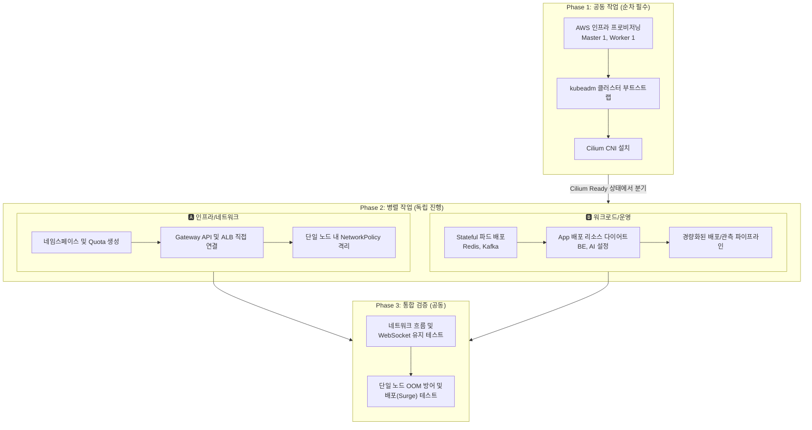

# K8s 클러스터 가성비 구축 작업 분할 가이드 (2인 기준)

본 문서는 `K8s_design_v2` 설계를 바탕으로, 비용 최적화를 위해 **1 마스터 (t3.medium) + 1 워커 (t3.large)** 구성으로 축소한 쿠버네티스 클러스터를 **2명의 작업자가 가장 효율적으로 구축하기 위한 가이드**입니다.

## 1. 역할 분담 원칙

단일 워커 노드(가용 메모리 약 6.85GB)에 모든 워크로드와 운영 툴을 안정적으로 올리기 위해, 구축 작업은 크게 "가벼운 클러스터 네트워크망 구성"과 "극한의 메모리 최적화 운영"으로 나뉩니다.

| 역할 | 🅰 인프라 · 네트워크 담당 | 🅱 워크로드 · 운영 담당 |
| :--- | :--- | :--- |
| **목표** | "비용 낭비 없이 안정적인 트래픽 길을 뚫는다" | "제한된 메모리 안에 모든 앱과 툴을 구겨 넣는다" |
| **핵심 키워드** | 단일 노드 라우팅, 보안 격리, 최소 인프라 | 리소스 다이어트, 단일 노드 배포 최적화, 경량화 |
| **주요 기술** | AWS (VPC, EC2 2대, ALB), kubeadm, Cilium | K8s Workload, JVM 튜닝, Helm, 배포 전략 최적화 |

---

## 2. 작업 의존성 흐름

작업 분할의 핵심은 **"상대방의 작업을 기다리느라 발생하는 병목(Blocking)을 최소화"**하는 것입니다.

---

## 3. 단계별 작업 상세

### 🟢 Phase 1: 클러스터 기반 구축 (~1일)
> **Cilium(CNI) 설치까지는 클러스터의 근간이므로 두 사람이 조율하며 순차적으로 진행합니다.**
> 고가용성(HA) 구성이 빠졌기 때문에 이 단계는 매우 빠르게 완료될 수 있습니다.

| 순서 | 작업 내용 | 담당 | 비고 / 완료 기준 |
| :--- | :--- | :--- | :--- |
| **1** | **AWS 인프라 프로비저닝** | 🅰 주도 | VPC, Subnet, Security Group 구성. **EC2 단 2대(Master: t3.medium, Worker: t3.large) 생성.** (NLB 불필요) |
| **2** | **kubeadm 클러스터 부트스트랩** | 공동 | 마스터 1대 `kubeadm init`, 워커 1대 `kubeadm join` 완료 |
| **3** | **Cilium CNI 설치** | 공동 | Helm으로 Cilium 설치 (Gateway API 모드 활성화). `cilium status` 기준 노드 Ready 달성 |

---

### 🟡 Phase 2: 병렬 트랙 (동시 진행, ~3~5일)
> **클러스터 기반이 마련되면, 각자의 트랙에서 완전히 독립적으로 작업을 진행합니다.**
> 단, 🅱의 Pod 배포를 위해 🅰가 **네임스페이스와 LimitRange를 가장 먼저 생성**해주어야 합니다.

#### 🅰 인프라 · 네트워크 트랙 상세
**목표: 단일 워커 노드로 향하는 트래픽 제어 및 파드 간 엄격한 보안 완비**

| 가상 순서 | 작업 내용 | 방향성 / 주의점 | 완료 기준 (DoD) |
| :--- | :--- | :--- | :--- |
| A-1 | **네임스페이스 & 자원 격리** | 🅱의 메모리 초과를 시스템적으로 방어하기 위해 `ResourceQuota`, `LimitRange`를 매우 타이트하게 설정합니다. | `refit-app`, `monitoring`, `argocd` 네임스페이스 및 리소스 제한 생성 완료 |
| A-2 | **Gateway API 및 ALB 연동** | ALB의 타겟 그룹을 **유일한 워커 노드 1대**의 NodePort(30080)로 직접 꽂습니다. | `Gateway` 리소스 생성, ALB 트래픽 포워딩 성공. `HTTPRoute`(/ws, /api) 타임아웃 차등 적용. |
| A-3 | **NetworkPolicy 구성** | 1대의 노드 안에 모든 파드가 혼재하므로, 보안상 접근 제어가 더 중요합니다. (BE -> Redis/Kafka 오픈만 허용) | Ingress/Egress 규칙이 적용된 `CiliumNetworkPolicy` 생성 및 테스트 완료 |

#### 🅱 워크로드 · 운영 트랙 상세
**목표: 6.85GB 워커 노드 안에서 모든 애플리케이션과 운영 툴을 터지지 않게 구동**

| 가상 순서 | 작업 내용 | 방향성 / 주의점 | 완료 기준 (DoD) |
| :--- | :--- | :--- | :--- |
| B-1 | **App 및 Stateful 리소스 다이어트** | Spring Boot JVM 힙 메모리 등 자원 할당량(requests/limits)을 극한으로 줄여서 Deployment/StatefulSet을 작성합니다. | BE, AI, Redis, Kafka의 매니페스트 작성 및 `resources.requests` 최적화 완료 |
| B-2 | **워크로드 배포 최적화** | 워커 노드가 1대이므로 배포 시 `maxSurge`를 조절해 새 파드가 뜰 공간을 확보하거나, 배포 전략을 튜닝해야 합니다. AntiAffinity는 의미가 없으므로 제외합니다. | 무중단(또는 최소 지연) 배포 시 노드 자원 부족 코드가 뜨지 않고 교체 완료 |
| B-3 | **배포/관측 파이프라인 (타협)** | ArgoCD와 PLG 스택을 구동하되, 남은 노드 메모리를 보며 각 컴포넌트의 기능을 최소화(Loki 보존 주기 감소, Prometheus 수집 주기 증가 등)하여 띄웁니다. | 단일 워커 메모리 85%를 넘기지 않는 선에서 ArgoCD 및 모니터링 파드 구동 완료 |
| B-4 | **HPA 구성 (제한적)** | 트래픽 스파이크 시 무한 증식을 막기 위해 `maxReplicas`를 보수적으로 설정합니다. | HPA 설정 완료 및 정상 반응 확인 |

---

### 🔴 Phase 3: 통합 생존 검증 (~1~2일)
> **장애 복구(Self-Healing) 머신 테스트가 아닌, "단일 노드 한계 (OOM) 테스트" 위주로 진행합니다.**

| 검증 항목 | 주도 | 테스트 방법 |
| :--- | :--- | :--- |
| **End-to-End 트래픽 흐름** | 🅰 | 외부 접속 -> ALB -> 단일 워커 노드 -> 파드까지의 트래픽 라우팅 정상 동작 확인 |
| **단일 노드 OOM 방어 모의** | 공동 | K6 등으로 BE에 트래픽을 넣으면서 `kubectl top node`로 해당 워커 노드의 메모리가 90%를 돌파하여 노드가 다운되지 않는지 점검 |
| **배포 시 터짐 방지 테스트** | 🅱 | ArgoCD를 통해 BE 버전 업그레이드 시, 자원 부족(Pending) 없이 기존 채팅 연결이 조용하게 드레이닝되고 새 파드로 넘어가는지 확인 |
| **NetworkPolicy 제한 테스트** | 🅰 | AI 파드 쉘 내에서 Redis 포트(6379)로 강제 호출 시 연결이 Block 되는지 확인 |

---

## 4. 이 분할 방식의 장점 (1:1 구성)

1. **포트폴리오 어필 (자원 최적화):** "장비가 넉넉한 환경에서 스케일 아웃 해봤다"보다 **"극도로 제한된 자원(1개의 8GB 워커) 환경에서 리소스 다이어트와 병목 해결을 통해 K8s 풀스택을 띄워냈다"**는 문제 해결 스토리가 면접에서 더 큰 무기가 될 수 있습니다.
2. **명확한 R&R 협업:** 
   - 🅰는 "단일 노드망에서의 네트워크 제어와 보안 정책(Cilium/ALB)"이라는 깊이 있는 인프라 최적화 경험을 얻습니다.
   - 🅱는 "JVM 메모리 프로파일링과 파드 배치 최적화, OOM 방지 전략"이라는 아주 실무적이고 디테일한 애플리케이션 운영 경험을 쌓게 됩니다.
3. **압도적인 인프라 비용 절감:** 기존 HA 모델(약 20~30만 원) 대비 **약 6만 5천 원 선**으로 지출을 틀어막아 프로젝트 예산 부담을 완전히 덜어냅니다.
