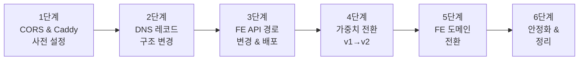
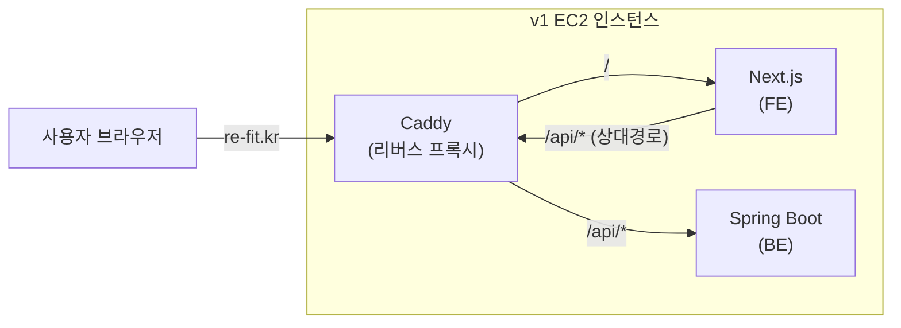
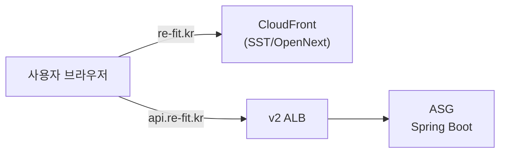
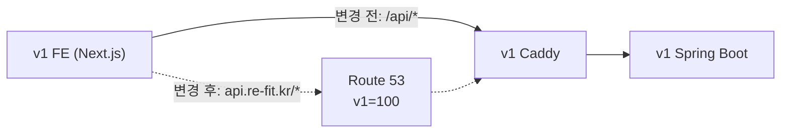

# Re-Fit LB 마이그레이션 가이드

## 이 문서는 무엇인가

Re-Fit의 API 트래픽을 v1 서버(단일 EC2)에서 v2 서버(ALB + ASG)로 옮기는 과정을 설명한다. "LB 마이그레이션"이라고 부르지만, 실제로는 **Route 53 DNS 가중치 라우팅**을 사용한 점진적 트래픽 전환이다.

이 문서를 읽고 나면 다음 질문에 답할 수 있다:

- 왜 한 번에 전환하지 않고 단계적으로 하는가?
- 각 단계에서 구체적으로 무엇을 하고, 무엇을 확인해야 하는가?
- 문제가 생기면 어떻게 돌아가는가?

---

## 전체 그림

마이그레이션은 크게 6단계로 진행된다. 각 단계는 이전 단계가 성공해야만 다음으로 넘어간다.



| 단계 | 한 줄 요약 | 서비스 영향 | 소요 시간 |
|------|-----------|-----------|----------|
| 1단계 | v1 서버가 새 도메인을 받을 준비 | 없음 | 1~2시간 |
| 2단계 | DNS 레코드를 가중치 방식으로 교체 | 없음 | 30분 |
| 3단계 | FE가 API를 새 도메인으로 호출하도록 변경 | 없음 (같은 서버로 감) | 1~2시간 |
| 4단계 | 트래픽을 v1에서 v2로 점진 이동 | 없음 (정상 시) | 3~4시간 |
| 5단계 | FE 도메인을 v2 CloudFront로 전환 | 없음 | 1~2시간 |
| 6단계 | v1 리소스 정리 | 없음 | 1주 후 |

---

## 현재 상태 이해하기

지금 v1이 어떻게 동작하는지 먼저 이해해야 한다.

### v1의 요청 흐름 (현재)



포인트:
- FE와 BE가 **같은 EC2** 안에 있다.
- FE는 API를 호출할 때 `/api/auth/login`처럼 **상대경로**를 사용한다. 도메인이 아니라 경로로 호출하는 것이다.
- Caddy가 `/`로 오는 요청은 FE로, `/api/*`로 오는 요청은 BE로 보내준다.
- `api.re-fit.kr`이라는 도메인은 이미 존재하지만, 현재 v2 ALB를 가리키고 있다. v1은 이 도메인을 사용하지 않는다.

### v2의 목표 상태



포인트:
- FE는 CloudFront + Lambda(SST)로 서비스된다.
- BE는 ALB + ASG로 서비스된다.
- FE와 BE가 **완전히 다른 도메인**이다 (`re-fit.kr` vs `api.re-fit.kr`).

### 마이그레이션의 핵심 과제

v1에서 v2로 가려면, FE의 API 호출 방식이 바뀌어야 한다:

```
현재:  /api/auth/login          (상대경로, 같은 서버)
목표:  https://api.re-fit.kr/auth/login  (절대경로, 다른 서버)
```

이 변경을 안전하게 하기 위해 아래 순서로 진행한다.

---

## 1단계: 사전 설정

### 이 단계의 목적

> v1 서버가 `api.re-fit.kr` 도메인으로 들어오는 요청을 처리할 수 있도록 준비한다.

나중에 FE가 `/api` 대신 `api.re-fit.kr`으로 호출하게 바꿀 건데, 그 전에 v1 서버가 이 도메인을 인식할 수 있어야 한다. 또한 FE와 BE가 서로 다른 도메인이 되면 **CORS 문제**가 발생하므로 이것도 미리 설정해야 한다.

### 1-1. CORS 설정 추가

#### 왜 필요한가

지금은 FE와 BE가 같은 도메인(`re-fit.kr`)이라서 CORS 문제가 없다. 하지만 FE가 `re-fit.kr`이고 BE가 `api.re-fit.kr`이면 **브라우저가 cross-origin 요청으로 판단**하고, BE가 CORS를 허용하지 않으면 요청을 차단한다.

이걸 사전에 설정하지 않으면, 3단계에서 FE base URL을 바꾸는 순간 **모든 API 호출이 실패**한다.

#### 무엇을 하는가

**v1 Spring Boot**에 CORS 허용 설정을 추가한다:

```
허용 Origin:  https://re-fit.kr, https://prod-v2.re-fit.kr
허용 Methods: GET, POST, PUT, DELETE, OPTIONS
허용 Headers: Content-Type, Authorization
Credentials:  true
```

**v2 Spring Boot**에도 동일한 설정이 되어있는지 확인한다.

#### 어떻게 확인하는가

CORS preflight 요청을 수동으로 보내서 확인한다:

```bash
curl -X OPTIONS https://api.re-fit.kr/auth/login \
  -H "Origin: https://re-fit.kr" \
  -H "Access-Control-Request-Method: POST" \
  -v
```

응답 헤더에 아래가 포함되어야 한다:

```
Access-Control-Allow-Origin: https://re-fit.kr
Access-Control-Allow-Methods: GET, POST, PUT, DELETE, OPTIONS
Access-Control-Allow-Credentials: true
```

### 1-2. v1 Caddy에 api.re-fit.kr 서버 블록 추가

#### 왜 필요한가

현재 v1의 Caddy는 `re-fit.kr` 도메인만 처리한다. 나중에 `api.re-fit.kr`이 v1 서버를 가리키게 되면, Caddy가 이 도메인으로 들어오는 요청도 처리할 수 있어야 한다.

#### 무엇을 하는가

v1 EC2에 접속해서 Caddyfile에 서버 블록을 추가한다:

```
api.re-fit.kr {
    reverse_proxy localhost:8080
}
```

여기서 `8080`은 Spring Boot가 돌고 있는 포트이다. 실제 포트 번호에 맞게 변경한다.

추가 후 Caddy를 리로드한다:

```bash
sudo systemctl reload caddy
```

#### 어떻게 확인하는가

```bash
# Caddy 상태 확인
sudo systemctl status caddy

# 에러 로그 확인
journalctl -u caddy --since "5 minutes ago" | grep -i error
```

이 시점에서는 DNS가 아직 v1을 가리키지 않으므로, `api.re-fit.kr`으로 v1에 직접 접속할 수는 없다. Caddy 설정 자체에 문법 오류가 없는지만 확인하면 된다.

### 1-3. Route 53 TTL 조정

#### 왜 필요한가

DNS TTL(Time To Live)은 클라이언트가 DNS 응답을 얼마나 오래 캐시하는지를 결정한다. TTL이 3600초(1시간)로 설정되어 있으면, 가중치를 바꿔도 최대 1시간 동안 이전 서버로 계속 요청이 갈 수 있다.

TTL을 60초로 낮추면, 가중치 변경 후 **최대 60초 내에** 새로운 비율이 적용된다. 문제 발생 시 롤백도 60초 내에 완료된다.

#### 무엇을 하는가

`api.re-fit.kr` 레코드의 TTL을 60초로 변경한다.

**방법 1: AWS 콘솔**

1. [Route 53 콘솔](https://console.aws.amazon.com/route53/) 접속
2. 좌측 메뉴 **Hosted zones** 클릭
3. `re-fit.kr` 호스팅 영역 클릭
4. `api.re-fit.kr` A 레코드를 체크하고 **Edit record** 클릭
5. **TTL (seconds)** 값을 `60`으로 변경
6. **Save** 클릭

**방법 2: AWS CLI**

```bash
# 현재 TTL 확인
dig api.re-fit.kr +short +ttlid
```

#### 주의사항

**이 작업은 최소 24시간 전에 해야 한다.** 기존 TTL이 3600초였다면, 이미 전 세계의 DNS 캐시에 3600초짜리 레코드가 퍼져 있다. TTL을 60초로 바꿔도 기존 캐시가 만료되려면 최대 3600초(1시간)가 걸린다. 안전하게 24시간 여유를 두는 것을 권장한다.

---

## 2단계: DNS 레코드 구조 변경

### 이 단계의 목적

> `api.re-fit.kr`의 DNS 레코드를 "단일 레코드"에서 "가중치 기반 레코드 2개"로 바꾼다.

### 현재 DNS 상태

```
api.re-fit.kr → v2 ALB (단일 Alias 레코드)
```

하나의 레코드가 v2 ALB만 가리키고 있다.

### 변경 후 DNS 상태

```
api.re-fit.kr
  ├── v1-backend (가중치: 100) → v1 EC2 Elastic IP
  └── v2-backend (가중치: 0)   → v2 ALB
```

같은 도메인에 두 개의 레코드가 있고, Route 53이 가중치 비율에 따라 DNS 질의에 다른 IP를 응답한다. 지금은 v1=100이므로 모든 응답이 v1 IP가 된다.

### 왜 v1=100으로 시작하는가

3단계에서 FE의 API base URL을 `api.re-fit.kr`으로 변경할 건데, 이때 `api.re-fit.kr`이 v1을 가리키고 있으면 **결과적으로 같은 서버로 가므로 안전하다.** 실질적인 변화가 없는 상태에서 FE 코드만 변경하는 것이다.

만약 `api.re-fit.kr`이 v2를 가리키는 상태에서 FE를 바꾸면, FE 코드 변경과 트래픽 전환이 동시에 일어나서 문제 발생 시 원인 파악이 어렵다.

### 무엇을 하는가

기존 단일 레코드를 삭제하고, 가중치 레코드 2개를 생성한다.

**방법 1: AWS 콘솔**

> 콘솔에서는 삭제+생성이 동시에 되지 않으므로, 작업 순서에 주의가 필요하다.
> 현재 v1 FE가 아직 상대경로를 쓰고 있어서 `api.re-fit.kr`이 잠깐 바뀌어도 사용자에게 영향은 없지만, 가능하면 빠르게 진행한다.

1. [Route 53 콘솔](https://console.aws.amazon.com/route53/) → **Hosted zones** → `re-fit.kr`
2. 기존 `api.re-fit.kr` A 레코드를 선택하고 **Delete record** 클릭
3. **Create record** 클릭하여 v1용 레코드 생성:
   - Record name: `api`
   - Record type: `A`
   - **Routing policy**: `Weighted`
   - Value: `v1 EC2 Elastic IP`
   - TTL: `60`
   - Weight: `100`
   - Record ID: `v1-backend`
   - **Create records** 클릭
4. 다시 **Create record** 클릭하여 v2용 레코드 생성:
   - Record name: `api`
   - Record type: `A`
   - **Routing policy**: `Weighted`
   - **Alias** 토글 ON
   - Route traffic to: `Alias to Application and Classic Load Balancer` → `Asia Pacific (Seoul)` → v2 ALB 선택
   - Weight: `0`
   - Record ID: `v2-backend`
   - **Create records** 클릭

**방법 2: AWS CLI (원자적 처리 — 권장)**

CLI를 사용하면 삭제+생성을 하나의 change-batch로 **원자적으로 처리**할 수 있다. 따로 실행하면 삭제와 생성 사이에 `api.re-fit.kr`이 아무것도 가리키지 않는 순간이 생긴다.

```bash
aws route53 change-resource-record-sets \
  --hosted-zone-id Z__________________ \
  --change-batch '{
    "Changes": [
      {
        "Action": "DELETE",
        "ResourceRecordSet": {
          "Name": "api.re-fit.kr",
          "Type": "A",
          "AliasTarget": {
            "HostedZoneId": "ZWKZPGTI48KDX",
            "DNSName": "현재_v2_ALB_DNS",
            "EvaluateTargetHealth": true
          }
        }
      },
      {
        "Action": "CREATE",
        "ResourceRecordSet": {
          "Name": "api.re-fit.kr",
          "Type": "A",
          "SetIdentifier": "v1-backend",
          "Weight": 100,
          "TTL": 60,
          "ResourceRecords": [{"Value": "v1_EC2_ELASTIC_IP"}]
        }
      },
      {
        "Action": "CREATE",
        "ResourceRecordSet": {
          "Name": "api.re-fit.kr",
          "Type": "A",
          "SetIdentifier": "v2-backend",
          "Weight": 0,
          "AliasTarget": {
            "HostedZoneId": "ZWKZPGTI48KDX",
            "DNSName": "v2_ALB_DNS",
            "EvaluateTargetHealth": true
          }
        }
      }
    ]
  }'
```

### 어떻게 확인하는가

**콘솔에서 확인:**

Route 53 콘솔 → **Hosted zones** → `re-fit.kr`에서 `api.re-fit.kr` 레코드가 2개(v1-backend, v2-backend)로 보이는지 확인한다.

**CLI로 확인:**

```bash
# DNS 응답 확인 — v1 EC2 IP만 반환되어야 함
dig api.re-fit.kr +short

# Route 53 레코드 확인 — 2개의 가중치 레코드가 보여야 함
aws route53 list-resource-record-sets \
  --hosted-zone-id Z__________________ \
  --query "ResourceRecordSets[?Name=='api.re-fit.kr.']"
```

### Caddy TLS 인증서

Route 53이 `api.re-fit.kr`을 v1 EC2로 가리키게 되면, Caddy가 Let's Encrypt 인증서를 자동 발급한다. 발급까지 1~2분 걸릴 수 있다.

```bash
# 인증서 발급 확인
curl -vI https://api.re-fit.kr 2>&1 | grep -E "subject|issuer|expire"
```

### 문제 발생 시

이 시점에서 v1 FE는 아직 상대경로(`/api`)를 사용 중이므로, `api.re-fit.kr` DNS가 어떻게 바뀌든 **사용자에게 영향이 없다.** v1 FE는 `api.re-fit.kr`을 호출하지 않기 때문이다.

---

## 3단계: FE API 경로 변경

### 이 단계의 목적

> v1 FE가 API를 호출하는 방식을 상대경로에서 도메인 기반으로 변경한다.

이 변경은 마이그레이션을 위한 **필수 선행 작업**이다. FE가 도메인 기반으로 API를 호출해야, 나중에 그 도메인이 가리키는 서버를 바꾸는 것만으로 트래픽을 전환할 수 있다.

### 무엇이 바뀌는가

```
변경 전: FE → /api/auth/login     → Caddy가 같은 EC2의 Spring Boot로 전달
변경 후: FE → api.re-fit.kr/auth/login → DNS → v1 EC2 → Caddy → Spring Boot
```

현재 `api.re-fit.kr`이 v1 EC2를 가리키고 있으므로(2단계에서 v1=100으로 설정), **결과적으로 같은 서버에 도달한다.** 사용자 입장에서는 아무 변화가 없다.



점선이 변경 후의 경로이다. 최종 목적지(v1 Spring Boot)는 동일하다.

### 무엇을 하는가

v1 Next.js 코드에서 API base URL 설정을 변경하고 배포한다.

```
# 환경 변수 예시
변경 전: NEXT_PUBLIC_API_URL=          (빈 값 또는 미설정 → 상대경로)
변경 후: NEXT_PUBLIC_API_URL=https://api.re-fit.kr
```

실제 코드에서는 이런 식으로 사용될 것이다:

```javascript
// 변경 전
fetch('/api/auth/login', { ... })

// 변경 후
fetch(`${process.env.NEXT_PUBLIC_API_URL}/auth/login`, { ... })
```

### 어떻게 확인하는가

배포 후 브라우저에서 `re-fit.kr`에 접속하고, 개발자 도구(F12) > Network 탭을 열어 확인한다.

**확인 항목 1: API 요청 URL**
- Network 탭에서 API 요청의 URL이 `https://api.re-fit.kr/...`으로 바뀌었는지 확인
- 기존처럼 `/api/...`로 호출되고 있으면 코드 변경이 반영되지 않은 것

**확인 항목 2: CORS 에러 없음**
- Console 탭에서 `Access-Control-Allow-Origin` 관련 에러가 없는지 확인
- CORS 에러가 보이면 1단계의 CORS 설정이 잘못된 것

**확인 항목 3: 주요 기능 동작**

| 기능 | 확인 |
|------|------|
| 로그인 | 정상 동작하는가? |
| 회원가입 | 정상 동작하는가? |
| 이력서 목록 조회 | 목록이 정상 출력되는가? |
| 이력서 업로드 | 업로드 후 정상 반영되는가? |
| AI 분석 요청 | 요청이 접수되고 결과가 나오는가? |
| 매칭 결과 조회 | 결과가 정상 출력되는가? |

### 문제 발생 시

FE 코드를 원래대로 되돌리고(상대경로) 재배포한다. Route 53 설정은 건드릴 필요 없다. FE가 상대경로를 쓰면 `api.re-fit.kr` DNS와 무관하게 같은 EC2의 Caddy로 요청이 간다.

---

## 4단계: 가중치 전환

### 이 단계의 목적

> `api.re-fit.kr`의 트래픽을 v1 EC2에서 v2 ALB로 점진적으로 옮긴다.

이것이 **LB 마이그레이션의 핵심**이다.

### 작동 원리

Route 53 가중치 라우팅은 DNS 레벨에서 동작한다. `api.re-fit.kr`에 대한 DNS 질의가 올 때, 가중치 비율에 따라 확률적으로 다른 IP를 응답한다.

예를 들어 v1=90, v2=10이면:
- DNS 질의 100번 중 약 90번은 v1 EC2 IP를 응답
- 약 10번은 v2 ALB IP를 응답

브라우저는 DNS 응답을 TTL(60초) 동안 캐시하므로, 한 사용자가 60초 이내에는 같은 서버로 계속 요청한다. 60초 후 다시 DNS 질의를 하면 그때 다른 서버로 갈 수 있다.

### 왜 한 번에 100%로 안 바꾸는가

v2에 아직 발견되지 않은 문제가 있을 수 있기 때문이다. 10%만 보내면 전체 사용자의 10%만 영향을 받고, 문제를 발견하면 즉시 v1=100으로 롤백할 수 있다. 점진적으로 비율을 높이면서 **각 단계에서 안전한지 확인한 후** 다음으로 넘어간다.

### 가중치 변경 방법

가중치를 변경하는 세 가지 방법이 있다. 어느 방법을 쓰든 결과는 동일하다.

**방법 1: AWS 콘솔**

1. Route 53 콘솔 → **Hosted zones** → `re-fit.kr`
2. `api.re-fit.kr`의 v1-backend 레코드를 체크하고 **Edit record** 클릭
3. **Weight** 값을 원하는 값(예: `90`)으로 변경 → **Save**
4. v2-backend 레코드도 같은 방식으로 **Weight**를 변경(예: `10`) → **Save**

> 콘솔에서는 두 레코드를 하나씩 변경해야 하므로 몇 초의 시차가 생긴다. 가중치 합계가 일시적으로 맞지 않아도 Route 53은 비율로 계산하므로 문제없다. (예: v1=100, v2=10인 순간에는 100:10 = 약 91:9 비율로 동작)

**방법 2: 스크립트 (권장)**

미리 준비한 스크립트를 사용하면 두 레코드를 한 번에 변경한다:

```bash
# 사용법: ./switch-weight.sh <v1_가중치> <v2_가중치>
./scripts/switch-weight.sh 90 10
```

**방법 3: AWS CLI 직접 실행**

```bash
aws route53 change-resource-record-sets \
  --hosted-zone-id Z__________________ \
  --change-batch '{
    "Changes": [
      {
        "Action": "UPSERT",
        "ResourceRecordSet": {
          "Name": "api.re-fit.kr",
          "Type": "A",
          "SetIdentifier": "v1-backend",
          "Weight": 90,
          "TTL": 60,
          "ResourceRecords": [{"Value": "v1_EC2_ELASTIC_IP"}]
        }
      },
      {
        "Action": "UPSERT",
        "ResourceRecordSet": {
          "Name": "api.re-fit.kr",
          "Type": "A",
          "SetIdentifier": "v2-backend",
          "Weight": 10,
          "AliasTarget": {
            "HostedZoneId": "ZWKZPGTI48KDX",
            "DNSName": "v2_ALB_DNS",
            "EvaluateTargetHealth": true
          }
        }
      }
    ]
  }'
```

### 전환 절차

**시작 전**: k6 Soak Test를 별도 터미널에서 시작한다. 이 테스트는 `api.re-fit.kr`에 지속적으로 요청을 보내면서 에러율과 응답시간을 측정한다. Grafana에서 실시간으로 모니터링할 수 있다.

```bash
k6 run --dns-ttl=0s -e TARGET=v2 -o experimental-prometheus-rw scripts/soak-test.js
```

> `--dns-ttl=0s` 옵션이 중요하다. k6도 DNS를 캐시하는데, 이 옵션을 주면 매 요청마다 DNS를 다시 질의해서 가중치 변경 효과가 즉시 테스트에 반영된다.

---

#### 4-1. 카나리: v1=90, v2=10

```bash
./scripts/switch-weight.sh 90 10
```

전체 트래픽의 약 10%만 v2로 보낸다. "카나리(canary)"라고 부르는 이유는, 옛날 탄광에서 카나리아 새를 먼저 보내 위험을 감지한 것과 같은 원리이기 때문이다. 소수의 트래픽으로 v2에 문제가 없는지 먼저 확인한다.

**DNS 반영 확인:**

```bash
# 20회 질의해서 v1 IP와 v2 ALB IP가 대략 9:1로 나오는지 확인
for i in $(seq 1 20); do dig api.re-fit.kr +short; done | sort | uniq -c
```

**최소 30분 관찰.** Grafana에서 아래 지표를 확인한다:

| 지표 | 정상 | 위험 (롤백 고려) |
|------|------|-----------------|
| API 에러율 (5xx) | < 1% | > 3% |
| p95 응답시간 | < 500ms | > 1000ms |
| p99 응답시간 | < 1000ms | > 2000ms |
| ALB 타겟 Health | 전체 Healthy | Unhealthy 존재 |

**통과 → 다음 단계로.** **실패 → 즉시 롤백:**

```bash
./scripts/switch-weight.sh 100 0
```

또는 콘솔에서 v1-backend Weight=`100`, v2-backend Weight=`0`으로 변경한다.

> 이후 단계(4-2 ~ 4-5)의 롤백도 동일하다. 스크립트 또는 콘솔에서 v1=100, v2=0으로 되돌리면 된다.

---

#### 4-2. 확대: v1=70, v2=30

```bash
./scripts/switch-weight.sh 70 30
```

30%의 트래픽이 v2로 간다. 카나리에서는 보이지 않았던 문제가 더 많은 트래픽에서 드러날 수 있다. 예를 들어 동시 접속자가 많아지면서 v2의 DB 커넥션 풀이 부족한 경우 등이 있다.

**최소 30분 관찰.** 동일한 지표 확인.

---

#### 4-3. 균등: v1=50, v2=50

```bash
./scripts/switch-weight.sh 50 50
```

트래픽이 반반으로 나뉜다. v2가 실질적으로 의미 있는 양의 트래픽을 처리하는 첫 번째 단계이다. 이 단계를 통과하면 v2의 안정성에 대한 높은 신뢰를 갖게 된다.

**최소 30분 관찰.**

---

#### 4-4. 거의 전환: v1=10, v2=90

```bash
./scripts/switch-weight.sh 10 90
```

v2가 대부분의 트래픽을 처리한다. v1은 아직 10%를 받고 있으므로 롤백 경로가 유지된다.

**최소 30분 관찰.**

---

#### 4-5. 전환 완료: v1=0, v2=100

```bash
./scripts/switch-weight.sh 0 100
```

모든 트래픽이 v2로 간다. v1 서버에는 더 이상 API 요청이 가지 않는다.

**최소 1시간 관찰.** 이전 단계보다 더 오래 관찰한다. 이 시점에서 문제가 발생하면 v1으로 롤백해야 하는데, v1 서버의 상태(커넥션 풀 등)가 식었을 수 있으므로 더 신중해야 한다.

**통과하면 → BE 트래픽 전환 완료.**

---

#### 4-6. k6 Soak Test 종료

가중치 전환이 완료되면 k6 테스트를 종료하고 결과를 기록한다.

| 지표 | 전환 전 (v1=100) | 전환 후 (v2=100) |
|------|-----------------|-----------------|
| 에러율 | ___% | ___% |
| p95 응답시간 | ___ms | ___ms |
| p99 응답시간 | ___ms | ___ms |
| 총 요청 수 | ___ | ___ |
| checks 통과율 | ___% | ___% |

이 결과가 마이그레이션 성공의 근거 자료가 된다.

### 전체 가중치 전환 요약

```
v1=100, v2=0     (시작)
      │ 확인 ok
v1=90,  v2=10    (카나리, 30분)
      │ 확인 ok
v1=70,  v2=30    (30분)
      │ 확인 ok
v1=50,  v2=50    (30분)
      │ 확인 ok
v1=10,  v2=90    (30분)
      │ 확인 ok
v1=0,   v2=100   (1시간)
      │ 확인 ok
    BE 전환 완료 ✅
```

어느 단계에서든 문제가 생기면:

```bash
./scripts/switch-weight.sh 100 0    # 즉시 롤백 (60초 내 적용)
```

또는 Route 53 콘솔에서 v1-backend Weight=`100`, v2-backend Weight=`0`으로 변경한다.

---

## 5단계: FE 도메인 전환

### 이 단계의 목적

> FE 서비스를 v1 EC2(Caddy + Next.js)에서 v2 CloudFront(SST + OpenNext)로 전환한다.

4단계에서 BE 트래픽이 완전히 v2로 넘어갔으므로, 이제 FE만 남았다. FE 전환은 BE에 비해 단순하다. SST로 배포하면 CloudFront URL이 생성되고, `re-fit.kr` 도메인을 그 CloudFront로 가리키면 끝이다.

### 5-1. 사전 검증: prod-v2.re-fit.kr

본 도메인을 바꾸기 전에, 이미 v2 CloudFront에 연결되어 있는 `prod-v2.re-fit.kr`로 먼저 확인한다.

**무엇을 하는가:**

1. SST로 프로덕션 빌드를 배포한다 → `prod-v2.re-fit.kr`이 이미 이 CloudFront를 가리키고 있다.
2. `https://prod-v2.re-fit.kr`에 접속해서 아래를 확인한다:

| 확인 항목 | 왜 확인하는가 |
|-----------|-------------|
| SSR 페이지가 정상 렌더링되는가 | OpenNext가 Lambda에서 제대로 동작하는지 |
| 클라이언트 사이드 라우팅이 작동하는가 | SPA 라우팅이 CloudFront와 호환되는지 |
| API 호출(`api.re-fit.kr`)이 정상인가 | FE → BE 통신이 되는지 |
| 이미지와 정적 파일이 로딩되는가 | S3 Origin 설정이 맞는지 |
| 모바일 브라우저에서 정상인가 | 다양한 환경에서의 호환성 |

4. 내부 팀원에게 베타 URL을 공유하고 최소 1일 이상 테스트한다.

### 5-2. 메인 도메인 전환

베타 테스트를 통과했으면 본 도메인을 전환한다.

**사전 작업** (전환 24시간 전):
- `re-fit.kr` 레코드의 TTL을 60초로 조정한다 (1단계에서 `api.re-fit.kr`에 했던 것과 같은 이유).

**전환 실행:**

**방법 1: AWS 콘솔**

1. Route 53 콘솔 → **Hosted zones** → `re-fit.kr`
2. `re-fit.kr` A 레코드를 선택하고 **Edit record** 클릭
3. **Alias** 토글 ON
4. Route traffic to: `Alias to CloudFront distribution`
5. 배포 선택: v2 CloudFront 배포 도메인 (`d____________.cloudfront.net`)
6. **Save** 클릭

**방법 2: AWS CLI**

```bash
aws route53 change-resource-record-sets \
  --hosted-zone-id Z__________________ \
  --change-batch '{
    "Changes": [{
      "Action": "UPSERT",
      "ResourceRecordSet": {
        "Name": "re-fit.kr",
        "Type": "A",
        "AliasTarget": {
          "HostedZoneId": "Z2FDTNDATAQYW2",
          "DNSName": "d____________.cloudfront.net",
          "EvaluateTargetHealth": false
        }
      }
    }]
  }'
```

**확인:**

```bash
# DNS 확인 — CloudFront IP가 반환되어야 함
dig re-fit.kr +short

# 브라우저에서 접속 확인
# - 페이지가 정상 로딩되는가
# - API 호출이 정상인가
# - 로그인/이력서 등 주요 기능이 동작하는가
```

### 문제 발생 시

**콘솔:** Route 53 → `re-fit.kr` A 레코드 **Edit** → **Alias** OFF → Value에 v1 EC2 IP 입력 → TTL `60` → **Save**

**CLI:**
```bash
# re-fit.kr을 v1 EC2 IP로 되돌림
aws route53 change-resource-record-sets \
  --hosted-zone-id Z__________________ \
  --change-batch '{
    "Changes": [{
      "Action": "UPSERT",
      "ResourceRecordSet": {
        "Name": "re-fit.kr",
        "Type": "A",
        "TTL": 60,
        "ResourceRecords": [{"Value": "v1_EC2_ELASTIC_IP"}]
      }
    }]
  }'
```

TTL이 60초이므로 최대 60초 내에 v1으로 복귀한다.

---

## 6단계: 안정화 및 정리

### 6-1. 안정화 (1~2주)

v1 EC2 인스턴스를 바로 종료하지 않는다. 만약 v2에서 며칠 뒤에 문제가 발견되면 v1으로 급히 돌아가야 할 수 있기 때문이다.

이 기간 동안:
- Grafana에서 전체 지표를 매일 확인한다
- 사용자로부터 이상 보고가 없는지 모니터링한다
- v1 EC2는 켜져 있되 트래픽은 받지 않는 상태로 유지한다

### 6-2. 정리 (안정화 확인 후)

안정화가 확인되면 아래를 정리한다:

- Route 53에서 `api.re-fit.kr`의 v1-backend 가중치 레코드 삭제 (가중치 0인 상태)
- `prod-v2.re-fit.kr` 레코드 유지 또는 삭제 결정
- v1 EC2 인스턴스 종료

### 6-3. DB 마이그레이션 팀에 인계

BE 트래픽 전환이 완료되면, DB 마이그레이션 담당자에게 인계한다.

**인계 내용:**
- BE 트래픽 v2=100% 안정 확인됨
- v2 BE는 현재 **v1 RDS를 바라보고** 있음 (가중치 전환 중 데이터 일관성을 위해)
- v1 EC2는 아직 살아있음 (롤백 경로 유지 중)
- DB 마이그레이션(v1 RDS → v2 RDS)은 이 상태에서 시작하면 됨

---

## 롤백 가이드

모든 단계에서 문제 발생 시 빠르게 원래 상태로 돌아갈 수 있다.

### 긴급 롤백 명령어

**BE 트래픽 롤백 (api.re-fit.kr → v1)**

콘솔:
1. Route 53 → **Hosted zones** → `re-fit.kr`
2. `api.re-fit.kr`의 v1-backend 레코드 **Edit** → Weight를 `100`으로 → **Save**
3. v2-backend 레코드 **Edit** → Weight를 `0`으로 → **Save**

CLI:
```bash
./scripts/switch-weight.sh 100 0
```

**FE 도메인 롤백 (re-fit.kr → v1)**

콘솔:
1. Route 53 → **Hosted zones** → `re-fit.kr`
2. `re-fit.kr` A 레코드 **Edit** → **Alias** 토글 OFF → Value에 v1 EC2 Elastic IP 입력 → TTL `60` → **Save**

CLI:
```bash
aws route53 change-resource-record-sets \
  --hosted-zone-id Z__________________ \
  --change-batch '{
    "Changes": [{
      "Action": "UPSERT",
      "ResourceRecordSet": {
        "Name": "re-fit.kr",
        "Type": "A",
        "TTL": 60,
        "ResourceRecords": [{"Value": "v1_EC2_ELASTIC_IP"}]
      }
    }]
  }'
```

### 단계별 롤백 방법

| 단계 | 무엇이 잘못될 수 있나 | 롤백 방법 | 복구 시간 |
|------|---------------------|-----------|----------|
| 1단계 (사전 설정) | Caddy 설정 오류 | Caddy 설정 되돌리고 리로드 | 즉시 |
| 2단계 (DNS 교체) | DNS가 해소 안 됨 | 콘솔에서 레코드 재생성 또는 백업 JSON으로 CLI 복구 | ~60초 |
| 3단계 (FE 경로 변경) | CORS 에러, API 실패 | FE 코드를 상대경로로 되돌리고 재배포 | 수 분 |
| 4단계 (가중치 전환) | v2에서 에러 급증 | 콘솔에서 v1 Weight=100, v2 Weight=0 또는 `switch-weight.sh 100 0` | ~60초 |
| 5단계 (FE 전환) | 렌더링 오류, 라우팅 문제 | 콘솔에서 `re-fit.kr` 레코드를 v1 IP로 변경 또는 CLI 실행 | ~60초 |

### 롤백 판단 기준

| 지표 | 정상 | 주의 (추가 관찰) | 롤백 |
|------|------|-----------------|------|
| API 에러율 (5xx) | < 1% | 1% ~ 3% | > 3% |
| p95 응답시간 | < 500ms | 500ms ~ 1000ms | > 1000ms |
| p99 응답시간 | < 1000ms | 1000ms ~ 2000ms | > 2000ms |
| ALB Health Check | 전체 Healthy | 1개 Unhealthy | 2개 이상 Unhealthy |
| k6 checks 통과율 | > 99% | 97% ~ 99% | < 97% |

---

## 변경 이력

| 날짜 | 내용 |
|------|------|
| 2026-02-23 | 초안 작성 |