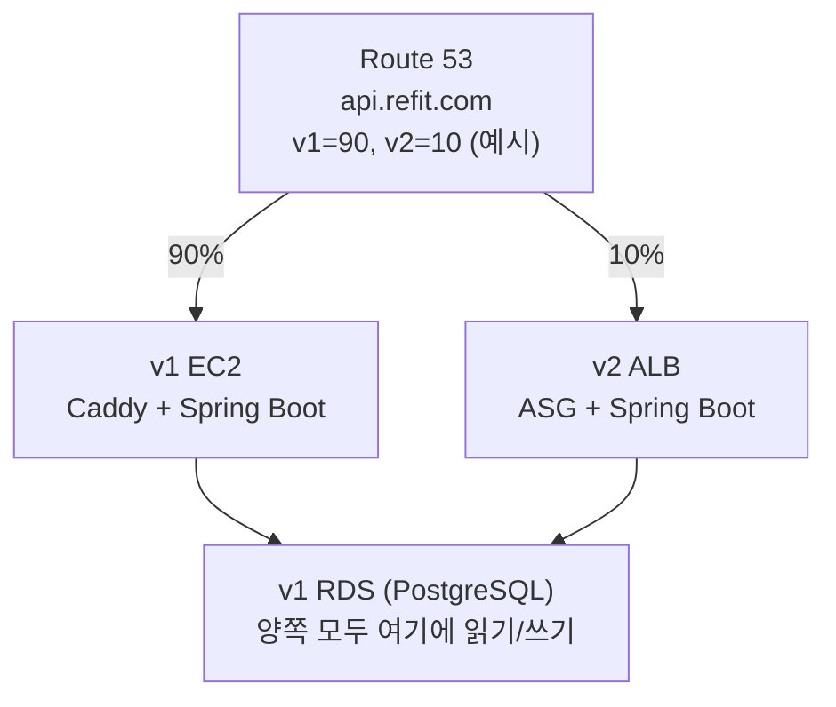
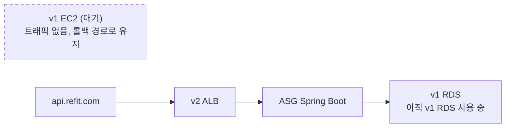
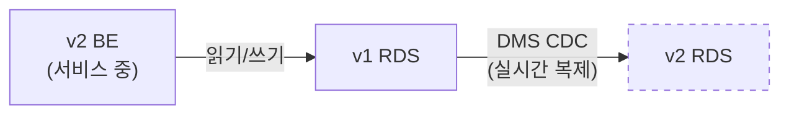

# Re-Fit 무중단 마이그레이션: LB 전환 → DB 이전 전체 흐름

## 요약

### 한 줄 요약

> **가중치 전환 중에는 같은 DB를 공유해서 데이터 일관성을 보장하고, 전환이 끝난 뒤 안전하게 DB를 옮긴다.**

### 전체 흐름

| | Phase 1 | Phase 2 | Phase 3 | Phase 4 | Phase 5 |
|---|---------|---------|---------|---------|---------|
| **단계** | 준비 | 가중치 전환 | 전환 완료 | DB 동기화 | DB 전환 |
| **v1 BE** | v1 RDS 사용 | v1 RDS 사용 | 트래픽 없음 | 대기 | 대기 |
| **v2 BE** | **v1 RDS** 사용 | **v1 RDS** 사용 | **v1 RDS** 사용 | **v1 RDS** 사용 | **v2 RDS** 사용 ✅ |
| **v2 RDS** | 비어있음 | 비어있음 | 비어있음 | DMS로 동기화 중 | 서비스 투입 |
| **가중치** | v1=100, v2=0 | v1↓ v2↑ (점진) | v1=0, v2=100 | v1=0, v2=100 | v1=0, v2=100 |
| **핵심** | v2 BE 연결 설정 | 양쪽 모두 v1 RDS | v2 안정성 확인 | v1→v2 단방향 복제 | connection string 전환 |

```
Phase 1 ──→ Phase 2 ──→ Phase 3 ──→ Phase 4 ──→ Phase 5
(LB 준비)   (LB 전환)   (LB 완료)   (DB 복제)   (DB 전환)
            ◄── LB 마이그레이션 ──►   ◄── DB 마이그레이션 ──►
```

### 왜 이 순서인가?

| 순서 | 이유 |
|------|------|
| DB보다 LB를 먼저 전환 | 가중치 전환 중 양쪽 BE가 같은 DB를 써야 하므로, DB를 먼저 옮기면 데이터 불일치 발생 |
| 전환 중 v2 BE → v1 RDS | 같은 DB를 공유하면 사용자가 v1↔v2를 왔다갔다 해도 데이터가 항상 일관됨 |
| v2=100% 달성 후 DB 이전 | v2만 트래픽을 받으니 단방향 DMS로 충분, 양방향 동기화의 충돌 문제 회피 |
| DMS CDC 사용 | 서비스 중단 없이 v1 RDS → v2 RDS 실시간 복제 가능 |

---

## Phase 1: 준비 — v2 BE가 v1 RDS를 바라보도록 설정

### 1.1 왜 필요한가

v1과 v2는 서로 다른 RDS 인스턴스를 갖고 있다. 가중치 전환 구간에서 사용자가 DNS에 의해 v1과 v2를 왔다갔다 할 수 있기 때문에, 두 BE가 같은 DB를 바라봐야 데이터 일관성이 보장된다.

만약 각자의 RDS를 바라보면 이런 일이 벌어진다:

```
10:00:00  사용자 A, DNS 질의 → v1 IP 받음
10:00:05  이력서 수정 → v1 BE → v1 RDS에 저장 ✅

10:01:00  DNS TTL 만료, 재질의 → v2 IP 받음 (가중치에 의해 바뀜)
10:01:05  이력서 조회 → v2 BE → v2 RDS에서 조회 → 수정한 내용이 없음 ❌
```

사용자 입장에서는 방금 수정한 이력서가 사라진 것처럼 보인다. 더 심각한 경우:

```
사용자 B, v2에서 회원가입 → v2 RDS에 계정 생성
DNS 갱신 → v1으로 감
로그인 시도 → v1 RDS에 계정 없음 → "계정이 존재하지 않습니다" ❌
```

이런 문제는 동기화 지연이 아니라 **아예 다른 DB를 보고 있는 것**이므로, 시간이 지나도 해결되지 않는다.

### 1.2 양방향 동기화는 왜 안 되나

"v1 RDS ↔ v2 RDS 양방향 동기화를 하면 되지 않나?"라고 생각할 수 있지만, 이는 실무에서 매우 위험하다.

**충돌(Conflict) 문제:**

```
10:00:01  v1 RDS: user_id=1의 전화번호를 "010-1111-2222"로 수정
10:00:01  v2 RDS: user_id=1의 전화번호를 "010-3333-4444"로 수정
          → 어느 값이 최종 값인가? 판단 불가
```

AWS DMS는 양방향 복제를 공식 지원하지 않으며, 설령 구현하더라도 conflict resolution 로직을 직접 작성해야 한다. 한 테이블이 아니라 전체 DB에 대해 이런 로직을 구현하는 것은 마이그레이션보다 복잡한 작업이 된다.

### 1.3 해결책: 전환 구간에서 v1 RDS 공유

가장 단순하고 안전한 방법은, 가중치 전환이 진행되는 동안 v2 BE의 DB connection string을 v1 RDS로 설정하는 것이다.

```
v1 BE ──→ v1 RDS  ┐
                   ├ 같은 DB → 데이터 일관성 100% 보장
v2 BE ──→ v1 RDS  ┘
```

사용자가 v1으로 가든 v2로 가든, 결국 같은 DB에서 읽고 쓰므로 데이터 불일치가 구조적으로 불가능하다.

### 1.4 설정 작업

#### 네트워크

v1 RDS와 v2 BE가 다른 VPC에 있으므로 통신 경로를 열어야 한다.

```
v2 VPC ──(VPC Peering)──→ v1 VPC
v2 BE 보안 그룹 → v1 RDS 보안 그룹 (PostgreSQL 5432 포트 허용)
```

같은 리전(ap-northeast-2) 내 VPC Peering은 추가 지연이 1ms 이하이므로 성능 문제는 없다.

#### v2 BE Connection String

```
# v2 BE 환경 변수 (가중치 전환 구간용)
DB_HOST=v1-rds-instance.xxxx.ap-northeast-2.rds.amazonaws.com
DB_PORT=5432
DB_NAME=refit
```

v2 RDS의 connection string이 아닌 v1 RDS의 엔드포인트를 사용한다.

#### 커넥션 수 확인

v1 BE와 v2 BE가 동시에 v1 RDS에 연결하므로, 커넥션 한도를 확인한다.

```sql
-- v1 RDS에서 확인
SHOW max_connections;

-- 현재 사용 중인 커넥션 수
SELECT count(*) FROM pg_stat_activity;
```

v1 BE가 사용하는 커넥션 수 + v2 BE가 사용할 커넥션 수의 합이 max_connections의 80% 이하인지 확인한다. 부족하면 RDS 인스턴스 파라미터 그룹에서 조정하거나, 커넥션 풀 사이즈를 줄인다.

---

## Phase 2: 가중치 전환 — v1에서 v2로 트래픽 점진 이동

### 2.1 이 단계에서의 아키텍처



> 핵심: **두 화살표가 같은 RDS로 향한다.** 이것이 데이터 일관성의 근거다.

### 2.2 가중치 변경 과정

```
단계 1: v1=100, v2=0      아직 v2로 트래픽 안 감. 설정만 확인.
          ↓ 정상 확인
단계 2: v1=90,  v2=10     10%의 요청이 v2로. 카나리 테스트.
          ↓ 30분 관찰, 에러율/응답시간 정상
단계 3: v1=70,  v2=30
          ↓ 30분 관찰
단계 4: v1=50,  v2=50
          ↓ 30분 관찰
단계 5: v1=10,  v2=90
          ↓ 30분 관찰
단계 6: v1=0,   v2=100    모든 트래픽이 v2로.
          ↓ 1시간 안정성 확인
        BE 전환 완료 ✅
```

각 단계에서 문제가 발생하면 v1=100, v2=0으로 즉시 롤백한다. Route 53 TTL이 60초이므로 최대 60초 내에 모든 트래픽이 v1으로 복귀한다.

### 2.3 이 단계에서 발생할 수 있는 문제

**Q: v2 BE가 v1 RDS에 쓰기를 하면 v1 BE의 캐시와 불일치가 생기지 않나?**

v1에는 캐시(Redis/Valkey)가 없으므로 이 문제는 없다. v2에는 ElastiCache가 있지만, v2에서 쓴 데이터를 v2 캐시에 반영하는 것은 v2 BE 애플리케이션 로직이 처리한다.

**Q: Kafka 메시지는 어떻게 되나?**

v1에는 Kafka가 없으므로, v1으로 간 요청은 기존처럼 동기 처리된다. v2로 간 요청만 Kafka를 통해 비동기 처리된다. 가중치 전환이 완료(v2=100%)되면 모든 요청이 Kafka를 거치게 된다.

**Q: AI 분석 요청은?**

v1으로 간 요청: v1 EC2 내 FastAPI로 처리 (기존 방식)
v2로 간 요청: v2 AI EC2 Docker로 처리 (새 방식)
두 경우 모두 결과를 같은 v1 RDS에 저장하므로 데이터 일관성은 유지된다.

---

## Phase 3: 전환 완료 — v2=100% 안정화

### 3.1 이 단계에서의 아키텍처



### 3.2 이 상태에서 확인할 것

- v2 BE가 모든 트래픽을 정상 처리하고 있는지 (에러율, 응답시간)
- v1 RDS에 대한 커넥션이 v2 BE만 사용하고 있는지 (v1 BE 커넥션 없음 확인)
- 최소 1시간 ~ 반나절 안정 운영 확인

### 3.3 아직 v2 RDS로 전환하면 안 되는 이유

이 시점에서 바로 v2 RDS로 전환하고 싶은 유혹이 있지만, 먼저 v2 BE 자체가 안정적으로 돌아가는지 충분히 관찰해야 한다. 만약 v2 BE에 문제가 있어서 v1으로 롤백해야 하는데, DB까지 이미 v2 RDS로 옮겨버렸다면 롤백이 매우 복잡해진다.

```
v2 BE 안정 확인 (충분한 관찰) → 그 다음에 DB 이전 시작
```

---

## Phase 4: DB 동기화 — DMS CDC로 v1 RDS → v2 RDS 복제

### 4.1 왜 이 시점이 안전한가

```
현재 상태:
- v1 BE: 트래픽 없음
- v2 BE: 모든 트래픽 처리 중 → v1 RDS에 읽기/쓰기
- v1 RDS: v2 BE의 요청만 받고 있음
- v2 RDS: 비어있음
```

v1 RDS에 쓰기를 하는 주체가 **v2 BE 하나뿐**이므로, v1 RDS → v2 RDS 단방향 복제만으로 충분하다. 양방향 동기화의 충돌 문제가 구조적으로 발생하지 않는다.

### 4.2 DMS CDC 동작 방식

DMS(Database Migration Service)의 CDC(Change Data Capture) 모드는 두 단계로 동작한다.

```
[Full Load]
v1 RDS의 전체 데이터를 v2 RDS로 복사
테이블 단위로 병렬 처리 가능
소요 시간: 데이터 크기에 따라 수 분 ~ 수 시간

[CDC — 지속적 변경 캡처]
Full Load 이후 v1 RDS에서 발생하는 모든 변경(INSERT, UPDATE, DELETE)을
실시간으로 v2 RDS에 반영
v1 RDS의 WAL(Write-Ahead Log)을 읽어서 변경분을 추출
```

서비스를 중단할 필요가 없다. v2 BE는 v1 RDS에 계속 읽기/쓰기를 하고, DMS는 그 변경을 실시간으로 v2 RDS에 복제한다.



### 4.3 복제 지연 모니터링

DMS 콘솔 또는 CloudWatch에서 복제 지연(CDC Latency)을 모니터링한다.

```
CDC Latency = v1 RDS에서 변경이 발생한 시각 - v2 RDS에 반영된 시각
```

이 값이 **0에 수렴**하면 v2 RDS가 v1 RDS와 거의 동일한 상태임을 의미한다.

### 4.4 데이터 정합성 검증

DMS 복제가 안정화된 후, 양쪽 데이터가 일치하는지 검증한다.

```sql
-- 테이블별 행 수 비교
SELECT 'users' as table_name, count(*) FROM users;
SELECT 'resumes' as table_name, count(*) FROM resumes;
-- ... 주요 테이블 전부

-- 최신 레코드 일치 확인
SELECT * FROM users ORDER BY updated_at DESC LIMIT 5;
```

v1 RDS와 v2 RDS에서 같은 쿼리를 실행해 결과가 일치하는지 확인한다.

---

## Phase 5: DB 전환 — v2 BE의 connection string을 v2 RDS로 변경

### 5.1 전환 직전 상태

```
v2 BE ──(서비스 중)──→ v1 RDS ──(DMS CDC, 지연 ~0초)──→ v2 RDS
```

v1 RDS와 v2 RDS의 데이터가 거의 동일한 상태이다.

### 5.2 전환 순서

이 부분이 전체 마이그레이션에서 **유일하게 짧은 서비스 영향**이 발생할 수 있는 구간이다.

```
[1] 전환 시점 결정
    - 트래픽이 가장 적은 시간대 (새벽 2~4시 권장)
    - DMS CDC 지연이 0에 수렴하는 상태 확인

[2] v2 BE의 connection string을 v2 RDS로 변경
    - 환경 변수 또는 설정 파일 변경
    - 방법 A: 애플리케이션 재시작 (확실하지만 짧은 다운타임)
    - 방법 B: 설정 핫 리로드 (Spring Cloud Config 등 사용 시 무중단 가능)

[3] 변경 즉시 확인
    - v2 BE → v2 RDS 연결 성공 확인
    - API 요청 정상 처리 확인
    - 최신 데이터가 v2 RDS에서 조회되는지 확인

[4] DMS 복제 태스크 중단
    - v2 BE가 v2 RDS를 바라보기 시작한 순간부터
      v1 RDS에는 새로운 쓰기가 없으므로 DMS를 중단해도 안전
```

### 5.3 connection string 전환 시 발생하는 일

```
변경 전:  v2 BE ──→ v1 RDS (읽기/쓰기)
            ↓ connection string 변경 + 재시작
변경 후:  v2 BE ──→ v2 RDS (읽기/쓰기)
```

재시작 중에는 요청이 실패할 수 있다. 이를 최소화하는 방법:

**ALB + ASG 롤링 재시작**: ASG의 인스턴스를 하나씩 재시작하면, ALB가 나머지 인스턴스로 트래픽을 분산하므로 사용자 입장에서는 다운타임이 없다. 다만 이 경우 재시작되지 않은 인스턴스는 아직 v1 RDS를 바라보고 있으므로, 전체가 v2 RDS로 전환되기까지 짧은 불일치 구간이 존재한다.

가장 안전한 방법은 **새벽 저트래픽 시간에 전체 인스턴스를 한 번에 재시작**하는 것이다. 몇 초의 다운타임이지만, 새벽이라 영향이 거의 없다.

### 5.4 전환 후 상태

```
v2 BE ──→ v2 RDS (via RDS Proxy) ✅
          ├── Primary: 읽기/쓰기
          └── Read Replica: 읽기

v1 RDS: 더 이상 사용하지 않음 → 스냅샷 백업 후 정리 예정
v1 EC2: 더 이상 사용하지 않음 → 안정화 확인 후 종료 예정
```

---

## Phase 5 이후: 정리

### 즉시

- [ ] DMS 복제 태스크 중단 및 삭제
- [ ] v2 BE → v2 RDS 연결 안정성 모니터링 (최소 24시간)

### 1주 후 (안정화 확인)

- [ ] v1 RDS 최종 스냅샷 생성 및 S3 보관
- [ ] v1 RDS 인스턴스 삭제
- [ ] v1 EC2 인스턴스 종료
- [ ] VPC Peering 해제
- [ ] Route 53에서 v1-backend 가중치 레코드 삭제

---

## 부록: 자주 묻는 질문

### Q1: v2 BE가 v1 RDS를 바라보면 v2의 RDS Proxy는 어떻게 되나?

가중치 전환 구간에서는 v2 RDS Proxy를 사용하지 않는다. v2 BE가 v1 RDS에 직접 연결한다. Phase 5에서 v2 RDS로 전환한 후에 v2 RDS Proxy를 경유하도록 설정한다.

```
전환 구간:  v2 BE → v1 RDS (직접 연결)
최종 상태:  v2 BE → v2 RDS Proxy → v2 RDS
```

### Q2: DMS Full Load 중에 v1 RDS 성능에 영향이 있나?

있을 수 있다. DMS가 v1 RDS에서 데이터를 읽어가므로 읽기 부하가 증가한다. 이를 완화하려면:
- DMS 태스크의 `MaxFullLoadSubTasks` 값을 낮춰 병렬도를 제한
- 트래픽이 적은 시간대에 Full Load 시작
- v1 RDS의 CloudWatch 지표(CPU, IOPS, 커넥션 수) 모니터링

### Q3: Full Load + CDC를 합치면 데이터가 중복되지 않나?

DMS가 내부적으로 처리한다. Full Load가 진행되는 동안 발생한 변경은 CDC가 캡처하고 있다가, Full Load 완료 후 CDC 변경분을 순서대로 적용한다. 중복이나 누락 없이 연속적인 데이터 상태가 보장된다.

### Q4: Phase 5에서 connection string 전환 시 진행 중인 트랜잭션은?

진행 중인 트랜잭션은 실패하고 롤백된다. 애플리케이션의 재시도 로직(retry)이 있다면 새로운 커넥션(v2 RDS)으로 재시도된다. Spring Boot + HikariCP 환경에서는 커넥션 풀이 자동으로 새 연결을 생성한다.

사전에 확인할 것:
- `spring.datasource.hikari.connection-timeout`: 커넥션 획득 타임아웃
- `spring.datasource.hikari.maximum-pool-size`: 최대 풀 사이즈
- 애플리케이션 레벨의 retry 로직 유무

### Q5: 롤백은 각 Phase에서 어떻게 하나?

| Phase | 롤백 방법 | 복구 시간 |
|-------|-----------|-----------|
| Phase 2 (가중치 전환 중) | Route 53에서 v1=100, v2=0으로 변경 | ~60초 |
| Phase 3 (v2=100% 직후) | Route 53에서 v1=100, v2=0으로 변경 | ~60초 |
| Phase 4 (DMS 동기화 중) | DMS 중단, v2 BE는 아직 v1 RDS를 바라보고 있으므로 서비스 영향 없음 | 즉시 |
| Phase 5 (DB 전환 후) | v2 BE connection string을 v1 RDS로 되돌리고 재시작. DMS로 v2 RDS → v1 RDS 역동기화 필요할 수 있음 | 수 분 ~ 수십 분 |

Phase 5 이후의 롤백이 가장 복잡하므로, Phase 5 진입 전에 충분한 안정화 확인이 필수다.

---

## 변경 이력

| 날짜 | 내용 |
|------|------|
| 2026-02-23 | 초안 작성 |