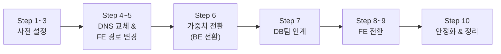

# v1 → v2 마이그레이션 가이드

# Re-Fit LB 마이그레이션 실행 가이드 (v1 → v2)

## 이 문서는 무엇인가

운영 서비스의 API 트래픽을 v1(단일 EC2)에서 v2(ALB + ASG)로 점진 전환하고, 이후 FE 도메인을 v2 CloudFront로 전환하는 **실행 가이드**이다. 위에서부터 순서대로 따라가면서 체크하면 된다.

### 도메인 정보

| 역할 | 도메인 |
| --- | --- |
| v1 FE + BE (현재 운영) | `re-fit.kr` |
| v2 BE (ALB) | `api.re-fit.kr` |
| v2 FE (CloudFront) | `prod-v2.re-fit.kr` |

### 전제 조건

- [ ]  **~~리허설(dev → v2) 완료** — 리허설에서 발견된 이슈가 모두 해결됨~~
- [x]  v2 VPC, 서브넷, 보안 그룹 구성 완료
- [x]  v2 ALB + Target Group + ASG + Spring Boot 배포 완료
- [x]  v2 BE → v1 RDS 연결 확인 완료
- [ ]  v2 BE → Kafka, ElastiCache, AI EC2 Docker 연결 확인 완료
- [x]  v2 ALB 엔드포인트로 직접 API smoke test 통과
- [ ]  ACM 인증서 발급 완료
- [x]  Prometheus + Grafana 모니터링 대시보드 준비 완료
- [ ]  k6 테스트 스크립트 준비 완료
- [ ]  `switch-weight.sh` 스크립트 준비 및 테스트 완료

### 전체 흐름



| 구간 | 서비스 영향 | 소요 시간 |
| --- | --- | --- |
| Step 1~3 (사전 설정) | 없음 | 1~2시간 |
| Step 4~5 (DNS 교체, FE 경로 변경) | 없음 | 1~2시간 |
| Step 6 (가중치 전환) | 없음 (정상 시) | 3~4시간 |
| Step 7 (DB팀 인계) | 없음 | — |
| Step 8~9 (FE 전환) | 없음 | 1~2시간 |
| Step 10 (안정화 & 정리) | 없음 | 1~2주 |

---

## 마이그레이션 전 상태 기록

### DNS 레코드 백업

```bash
aws route53 list-resource-record-sets \
  --hosted-zone-id Z__________________ \
  --query "ResourceRecordSets[?Name=='api.re-fit.kr.']" \
  > backup-api-record.json

aws route53 list-resource-record-sets \
  --hosted-zone-id Z__________________ \
  --query "ResourceRecordSets[?Name=='re-fit.kr.']" \
  > backup-fe-record.json
```

또는 Route 53 콘솔에서 각 레코드의 현재 설정을 스크린샷으로 저장한다.

- api.re-fit.kr
    
    
    
- re-fit.kr
    
    
    

### 사전 확인 정보

| 항목 | 값 |
| --- | --- |
| Route 53 Hosted Zone ID | Z05994701374OYY8FL2RN |
| v1 EC2 Elastic IP | 54.116.55.250 |
| v2 ALB DNS 이름 | dualstack.refit-prod-v2-external-alb-1785900646.ap-northeast-2.elb.amazonaws.com. |
| v2 ALB Hosted Zone ID | `ZWKZPGTI48KDX` (서울 리전 고정값) |
| v2 CloudFront 배포 도메인 | deh2dsxw16oma.cloudfront.net |
| CloudFront Hosted Zone ID | `Z2FDTNDATAQYW2` (CloudFront 고정값) |
| v1 Spring Boot 포트 | 8080 |
| 현재 `api.re-fit.kr` TTL | - |
| 작업 시작 예정 시각 | `____년 __월 __일 __:__` |

### v1 Caddyfile 백업

```bash
# v1 EC2에서
cp /etc/caddy/Caddyfile /etc/caddy/Caddyfile.backup.before-migration
```

### v1 FE 현재 API 설정 기록

```
현재 NEXT_PUBLIC_API_URL = https://re-fit.kr
```

---

## Step 1. CORS 설정 추가

### 왜 하는가

FE(`re-fit.kr`)가 BE(`api.re-fit.kr`)를 호출하면 cross-origin이 된다. CORS를 미리 설정하지 않으면 Step 5에서 FE base URL을 바꾸는 순간 모든 API 호출이 실패한다.

### v1 Spring Boot

```
허용 Origin:  https://re-fit.kr, https://prod-v2.re-fit.kr
허용 Methods: GET, POST, PUT, DELETE, OPTIONS
허용 Headers: Content-Type, Authorization
Credentials:  true
```

v1 BE를 재시작한다.

### v2 Spring Boot

동일한 CORS 설정이 되어있는지 확인한다.

### 확인

```bash
curl -X OPTIONS https://api.re-fit.kr/auth/login \
  -H "Origin: https://re-fit.kr" \
  -H "Access-Control-Request-Method: POST" \
  -v
```

응답에 아래 헤더가 포함되어야 한다:

```
Access-Control-Allow-Origin: https://re-fit.kr
Access-Control-Allow-Methods: GET, POST, PUT, DELETE, OPTIONS
Access-Control-Allow-Credentials: true
```

> 현재 `api.re-fit.kr`은 v2 ALB를 가리키고 있으므로, 위 curl은 v2 BE에 요청이 간다. v1 BE의 CORS는 Step 4에서 DNS를 변경한 후 확인할 수 있다.
> 
- [x]  v1 BE CORS 설정 추가 및 재시작
- [x]  v2 BE CORS 설정 확인
- [x]  v2 BE preflight 응답 확인

**완료 시각**: `__:__`

---

## Step 2. v1 Caddy에 api.re-fit.kr 서버 블록 추가

### 왜 하는가

Step 4에서 `api.re-fit.kr`이 v1 EC2를 가리키게 되면, Caddy가 이 도메인으로 들어오는 요청을 처리할 수 있어야 한다. 현재 Caddy는 `re-fit.kr` 도메인만 인식하므로, `api.re-fit.kr`으로 들어오는 요청은 거부된다.

### 무엇을 하는가

v1 EC2에 접속하여 Caddyfile에 추가한다:

```
api.re-fit.kr {
    reverse_proxy localhost:8080
}
```

```bash
sudo systemctl reload caddy
```

### 확인

```bash
sudo systemctl status caddy
journalctl -u caddy --since "5 minutes ago" | grep -i error
```

이 시점에서는 DNS가 아직 v1을 가리키지 않으므로 `api.re-fit.kr`으로 v1에 접속할 수는 없다. Caddy에 문법 에러가 없는지만 확인한다.

- [x]  Caddy 서버 블록 추가
- [x]  Caddy 리로드 성공, 에러 없음

**완료 시각**: 02/25 10:05

---

## Step 3. Route 53 TTL 조정

### 왜 하는가

TTL이 높으면(예: 3600초) 가중치를 변경해도 최대 1시간 동안 이전 서버로 요청이 간다. TTL을 60초로 낮추면 가중치 변경이 60초 내에 적용되고, 롤백도 60초 내에 완료된다.

### 무엇을 하는가

> ⚠️ **최소 24시간 전에 진행해야 한다.** 기존 TTL 캐시가 만료될 시간이 필요하다.
> 

`api.re-fit.kr` 레코드의 TTL을 확인한다. Alias 레코드인 경우 TTL을 직접 설정할 수 없고 대상 리소스의 TTL을 따르므로 이 단계를 건너뛴다.

**콘솔:** Route 53 → Hosted zones → `re-fit.kr` → `api.re-fit.kr` 레코드 확인 → TTL을 `60`으로 변경

**CLI:**

```bash
dig api.re-fit.kr +short +ttlid
```

- [x]  TTL 확인/조정 완료 (또는 Alias라서 건너뜀)
    - [x]  A레코드라서 건너뜀
- [ ]  24시간 이상 대기 완료

**완료 시각**: 02/25 02:00

---

## Step 4. Route 53 레코드를 가중치 기반으로 교체

### 왜 하는가

현재 `api.re-fit.kr`은 v2 ALB만 가리키는 단일 레코드이다. 이것을 가중치 레코드 2개(v1, v2)로 바꿔야 트래픽을 비율로 분배할 수 있다.

v1=100, v2=0으로 시작하는 이유: Step 5에서 FE base URL을 `api.re-fit.kr`로 바꿀 때, 이 도메인이 v1을 가리키고 있으면 결과적으로 같은 서버로 가므로 안전하다.

### 현재 → 변경 후

```
현재:
  api.re-fit.kr → v2 ALB (단일 Alias)

변경 후:
  api.re-fit.kr
    ├── v1-backend (가중치: 100) → v1 EC2 Elastic IP
    └── v2-backend (가중치: 0)   → v2 ALB (Alias)
```

### 방법 1: AWS 콘솔

1. Route 53 → **Hosted zones** → `re-fit.kr`
2. 기존 `api.re-fit.kr` A (Alias) 레코드 선택 → **Delete record**
3. **Create record** → v1용 레코드:
    - Record name: `api`
    - Record type: `A`
    - Routing policy: `Weighted`
    - Value: v1 EC2 Elastic IP
    - TTL: `60`
    - Weight: `100`
    - Record ID: `v1-backend`
    - **Create records**
4. **Create record** → v2용 레코드:
    - Record name: `api`
    - Record type: `A`
    - Routing policy: `Weighted`
    - **Alias** ON
    - Route traffic to: `Alias to Application and Classic Load Balancer` → `Asia Pacific (Seoul)` → v2 ALB 선택
    - Weight: `0`
    - Record ID: `v2-backend`
    - **Create records**

> 콘솔에서는 삭제+생성을 동시에 할 수 없어 짧은 공백이 생긴다. v1 FE가 아직 상대경로를 쓰고 있어 사용자 영향은 없지만, 빠르게 진행한다.
> 

### 방법 2: AWS CLI (원자적 처리 — 권장)

삭제+생성을 하나의 change-batch로 동시에 처리한다.

```bash
aws route53 change-resource-record-sets \
  --hosted-zone-id Z05994701374OYY8FL2RN \
  --change-batch '{
    "Changes": [
      {
        "Action": "DELETE",
        "ResourceRecordSet": {
          "Name": "api.re-fit.kr",
          "Type": "A",
          "AliasTarget": {
            "HostedZoneId": "ZWKZPGTI48KDX",
            "DNSName": "dualstack.refit-prod-v2-external-alb-1785900646.ap-northeast-2.elb.amazonaws.com.",
            "EvaluateTargetHealth": true
          }
        }
      },
      {
        "Action": "CREATE",
        "ResourceRecordSet": {
          "Name": "api.re-fit.kr",
          "Type": "A",
          "SetIdentifier": "v1-backend",
          "Weight": 100,
          "TTL": 60,
          "ResourceRecords": [{"Value": "v1_EC2_ELASTIC_IP"}]
        }
      },
      {
        "Action": "CREATE",
        "ResourceRecordSet": {
          "Name": "api.re-fit.kr",
          "Type": "A",
          "SetIdentifier": "v2-backend",
          "Weight": 0,
          "AliasTarget": {
            "HostedZoneId": "ZWKZPGTI48KDX",
            "DNSName": "dualstack.refit-prod-v2-external-alb-1785900646.ap-northeast-2.elb.amazonaws.com.",
            "EvaluateTargetHealth": true
          }
        }
      }
    ]
  }'
```

### 확인

**콘솔:** Route 53에서 `api.re-fit.kr` 레코드가 2개(v1-backend, v2-backend)로 보이는지 확인

**CLI:**

```bash
dig api.re-fit.kr +short
# v1 EC2 IP가 반환되어야 함

aws route53 list-resource-record-sets \
  --hosted-zone-id Z__________________ \
  --query "ResourceRecordSets[?Name=='api.re-fit.kr.']"
# 가중치 레코드 2개 확인
```

### Caddy TLS 인증서 확인

DNS가 v1 EC2를 가리키면 Caddy가 `api.re-fit.kr`에 대한 인증서를 자동 발급한다 (1~2분 소요).

```bash
# v1 EC2에서
journalctl -u caddy --since "5 minutes ago" | grep -i "certificate"

# 인증서 유효성 확인
curl -vI https://api.re-fit.kr 2>&1 | grep -E "subject|issuer|expire"
```

### 이 시점에서 운영 영향

v1 FE는 아직 상대경로(`/api`)를 사용 중이므로 `api.re-fit.kr` DNS가 어떻게 바뀌든 **사용자에게 영향이 없다.**

- [ ]  기존 단일 레코드 삭제
- [ ]  v1-backend (가중치 100, v1 EC2 IP) 생성
- [ ]  v2-backend (가중치 0, v2 ALB Alias) 생성
- [ ]  DNS 응답이 v1 EC2 IP인지 확인
- [ ]  TLS 인증서 발급 확인

**완료 시각**: `__:__`

---

## Step 5. v1 FE API base URL 변경

### 왜 하는가

FE가 도메인 기반(`api.re-fit.kr`)으로 API를 호출해야, 나중에 그 도메인이 가리키는 서버를 바꾸는 것만으로 트래픽을 전환할 수 있다. 현재 `api.re-fit.kr`은 v1을 가리키고 있으므로 결과적으로 같은 서버에 도달한다. 사용자 입장에서 변화 없음.

### 무엇을 하는가

v1 Next.js 코드에서 API base URL을 변경하고 배포한다.

```
변경 전: NEXT_PUBLIC_API_URL=          (빈 값 — 상대경로)
변경 후: NEXT_PUBLIC_API_URL=https://api.re-fit.kr
```

v1 서버에 배포한다.

### 확인

브라우저에서 `https://re-fit.kr`에 접속하고, 개발자 도구(F12) Network / Console 탭에서 확인한다.

| 확인 항목 | 결과 |
| --- | --- |
| API 요청 URL이 `api.re-fit.kr`으로 가는가 | ☐ Pass / ☐ Fail |
| CORS 에러 없는가 (Console 탭) | ☐ Pass / ☐ Fail |
| 로그인 | ☐ Pass / ☐ Fail |
| 회원가입 | ☐ Pass / ☐ Fail |
| 이력서 목록 조회 | ☐ Pass / ☐ Fail |
| 이력서 업로드 | ☐ Pass / ☐ Fail |
| AI 분석 요청 | ☐ Pass / ☐ Fail |
| 매칭 결과 조회 | ☐ Pass / ☐ Fail |

### 문제 발생 시

FE 코드를 원래 상대경로로 되돌리고 재배포한다. DNS 설정은 건드릴 필요 없다.

- [ ]  FE base URL 변경 및 배포 완료
- [ ]  모든 기능 정상 동작 확인

**완료 시각**: `__:__`

---

## Step 6. 가중치 전환 (BE 트래픽 전환)

### 시작 전: k6 Soak Test 실행

별도 터미널에서 k6를 시작한다. 전환 과정 전체를 모니터링한다.

bash

`k6 run --dns-ttl=0s \
  scripts/soak-test.js`

k6 터미널에 `http_req_failed`, `http_req_duration`, `checks` 등 메트릭이 실시간 갱신되는지 확인한다. 동시에 CloudWatch 대시보드(`LB-Migration-Monitor`)를 브라우저에 띄워둔다.

### baseline 지표 기록

Step 5 완료 직후, v1=100 상태에서의 지표를 기록한다:

| 지표 | baseline 값 |
| --- | --- |
| API 에러율 (5xx) | ____% |
| API p95 응답시간 | ____ms |
| API p99 응답시간 | ____ms |

### 가중치 변경 방법

**콘솔:** Route 53 → Hosted zones → `re-fit.kr` → 각 레코드 **Edit** → **Weight** 변경 → **Save**

**스크립트:** `./scripts/switch-weight.sh <v1_가중치> <v2_가중치>`

**CLI:** 직접 `aws route53 change-resource-record-sets` 실행

### 판정 기준

모든 단계에서 동일하게 적용한다:

| 지표 | Pass | Warning (추가 관찰) | Fail (롤백) |
| --- | --- | --- | --- |
| API 에러율 (5xx) | < 1% | 1% ~ 3% | > 3% |
| p95 응답시간 | < 500ms | 500ms ~ 1000ms | > 1000ms |
| p99 응답시간 | < 1000ms | 1000ms ~ 2000ms | > 2000ms |
| ALB 타겟 Health | 전체 Healthy | 1개 Unhealthy | 2개 이상 Unhealthy |

### 롤백 방법 (모든 단계 공통)

**콘솔:** v1-backend Weight=`100`, v2-backend Weight=`0`으로 변경
**스크립트:** `./scripts/switch-weight.sh 100 0`

TTL 60초이므로 최대 60초 내 복구.

---

### 6-1. 카나리: v1=90, v2=10

**콘솔:** v1-backend Weight=`90`, v2-backend Weight=`10`**스크립트:** `./scripts/switch-weight.sh 90 10`

bash

`# DNS 분배 확인
for i in $(seq 1 20); do dig api.re-fit.kr +short; done | sort | uniq -c`

- [ ]  v1 IP와 v2 ALB IP가 대략 9:1 비율로 반환

**최소 30분 관찰:**

| 시각 | 에러율 | p95 | p99 | ALB Health | 비고 |
| --- | --- | --- | --- | --- | --- |
| +5분 |  |  |  |  |  |
| +10분 |  |  |  |  |  |
| +15분 |  |  |  |  |  |
| +20분 |  |  |  |  |  |
| +25분 |  |  |  |  |  |
| +30분 |  |  |  |  |  |
- [ ]  **Pass** → 6-2로 진행
- [ ]  **Warning** → 15분 추가 관찰 후 재판정
- [ ]  **Fail** → 롤백

**완료 시각**: `__:__`

---

### 6-2. 확대: v1=70, v2=30

**콘솔:** v1-backend Weight=`70`, v2-backend Weight=`30`**스크립트:** `./scripts/switch-weight.sh 70 30`

**최소 30분 관찰:**

| 시각 | 에러율 | p95 | p99 | ALB Health | 비고 |
| --- | --- | --- | --- | --- | --- |
| +5분 |  |  |  |  |  |
| +10분 |  |  |  |  |  |
| +15분 |  |  |  |  |  |
| +20분 |  |  |  |  |  |
| +25분 |  |  |  |  |  |
| +30분 |  |  |  |  |  |
- [ ]  **Pass** → 6-3으로 진행
- [ ]  **Warning** → 추가 관찰
- [ ]  **Fail** → 롤백

**완료 시각**: `__:__`

---

### 6-3. 균등: v1=50, v2=50

**콘솔:** v1-backend Weight=`50`, v2-backend Weight=`50`**스크립트:** `./scripts/switch-weight.sh 50 50`

**최소 30분 관찰:**

| 시각 | 에러율 | p95 | p99 | ALB Health | 비고 |
| --- | --- | --- | --- | --- | --- |
| +5분 |  |  |  |  |  |
| +10분 |  |  |  |  |  |
| +15분 |  |  |  |  |  |
| +20분 |  |  |  |  |  |
| +25분 |  |  |  |  |  |
| +30분 |  |  |  |  |  |
- [ ]  **Pass** → 6-4로 진행
- [ ]  **Warning** → 추가 관찰
- [ ]  **Fail** → 롤백

**완료 시각**: `__:__`

---

### 6-4. 거의 전환: v1=10, v2=90

**콘솔:** v1-backend Weight=`10`, v2-backend Weight=`90`**스크립트:** `./scripts/switch-weight.sh 10 90`

**최소 30분 관찰:**

| 시각 | 에러율 | p95 | p99 | ALB Health | 비고 |
| --- | --- | --- | --- | --- | --- |
| +5분 |  |  |  |  |  |
| +10분 |  |  |  |  |  |
| +15분 |  |  |  |  |  |
| +20분 |  |  |  |  |  |
| +25분 |  |  |  |  |  |
| +30분 |  |  |  |  |  |
- [ ]  **Pass** → 6-5로 진행
- [ ]  **Warning** → 추가 관찰
- [ ]  **Fail** → 롤백

**완료 시각**: `__:__`

---

### 6-5. 전환 완료: v1=0, v2=100

**콘솔:** v1-backend Weight=`0`, v2-backend Weight=`100`**스크립트:** `./scripts/switch-weight.sh 0 100`

bash

`# 모든 DNS 응답이 v2 ALB인지 확인
for i in $(seq 1 20); do dig api.re-fit.kr +short; done | sort | uniq -c`

**최소 1시간 관찰:**

| 시각 | 에러율 | p95 | p99 | ALB Health | 비고 |
| --- | --- | --- | --- | --- | --- |
| +10분 |  |  |  |  |  |
| +20분 |  |  |  |  |  |
| +30분 |  |  |  |  |  |
| +40분 |  |  |  |  |  |
| +50분 |  |  |  |  |  |
| +60분 |  |  |  |  |  |
- [ ]  **Pass** → BE 트래픽 전환 완료 ✅
- [ ]  **Fail** → 롤백

**완료 시각**: `__:__`

---

### 6-6. k6 Soak Test 종료 및 결과 기록

k6 테스트를 종료하고 결과를 기록한다.

| 지표 | baseline (v1=100) | 최종 (v2=100) | 판정 |
| --- | --- | --- | --- |
| 에러율 | ____% | ____% | ☐ Pass / ☐ Fail |
| p95 응답시간 | ____ms | ____ms | ☐ Pass / ☐ Fail |
| p99 응답시간 | ____ms | ____ms | ☐ Pass / ☐ Fail |
| 총 요청 수 | ____ | ____ |  |
| checks 통과율 | ____% | ____% | ☐ Pass / ☐ Fail |

**완료 시각**: `__:__`

---

## Step 7. DB 마이그레이션 팀에 인계

BE 트래픽이 v2=100%로 안정된 것을 확인한 후, DB 마이그레이션 담당자에게 인계한다.

### 인계 내용

- [ ]  BE 트래픽 v2=100% 안정 확인됨 (에러율, 응답시간 기록 전달)
- [ ]  v2 BE는 현재 **v1 RDS를 바라보고** 있음
- [ ]  v1 EC2는 아직 살아있음 (롤백 경로 유지 중)
- [ ]  Route 53 상태: v1-backend (가중치 0), v2-backend (가중치 100)
- [ ]  DB 마이그레이션(DMS CDC로 v1 RDS → v2 RDS) 시작 가능 상태

### DB 마이그레이션 완료까지 대기

- [ ]  v1 EC2를 종료하지 않기로 합의
- [ ]  DB 마이그레이션 완료 통보 수신: `____년 __월 __일 __:__`
- [ ]  v2 BE → v2 RDS 정상 동작 확인됨

---

## Step 8. FE 사전 검증 (prod-v2.re-fit.kr)

> DB 마이그레이션이 완료되고, v2 BE가 v2 RDS를 바라보는 것이 확인된 후 진행한다.
> 

### SST 프로덕션 배포

- [ ]  SST로 프로덕션 빌드 배포 실행
- [ ]  `prod-v2.re-fit.kr`이 v2 CloudFront를 가리키고 있는지 확인

### 기능 검증

`https://prod-v2.re-fit.kr`에 접속하여 확인한다.

| 확인 항목 | 결과 |
| --- | --- |
| SSR 페이지 정상 렌더링 | ☐ Pass / ☐ Fail |
| 클라이언트 사이드 라우팅 정상 | ☐ Pass / ☐ Fail |
| API 호출 (`api.re-fit.kr`) 정상 | ☐ Pass / ☐ Fail |
| 이미지/정적 파일 로딩 정상 | ☐ Pass / ☐ Fail |
| 모바일 브라우저 정상 | ☐ Pass / ☐ Fail |
| 로그인 | ☐ Pass / ☐ Fail |
| 이력서 업로드 | ☐ Pass / ☐ Fail |
| AI 분석 요청 | ☐ Pass / ☐ Fail |
| 매칭 결과 조회 | ☐ Pass / ☐ Fail |
- [ ]  내부 팀원에게 `prod-v2.re-fit.kr` 공유
- [ ]  최소 1일 이상 테스트 후 이상 없음

### Core Web Vitals 측정

| 지표 | 측정값 |
| --- | --- |
| LCP | ____ms |
| FID | ____ms |
| CLS | ____ |

**완료 시각**: `__:__`

---

## Step 9. FE 메인 도메인 전환 (re-fit.kr)

### 사전 작업 (전환 24시간 전)

- [ ]  `re-fit.kr` 레코드의 현재 TTL 확인: `____초`
- [ ]  TTL을 `60`으로 변경
- [ ]  24시간 대기

### 전환 실행

**방법 1: AWS 콘솔**

1. Route 53 → **Hosted zones** → `re-fit.kr`
2. `re-fit.kr` A 레코드 선택 → **Edit record**
3. **Alias** ON
4. Route traffic to: `Alias to CloudFront distribution` → v2 CloudFront 배포 선택
5. **Save**

**방법 2: AWS CLI**

bash

`aws route53 change-resource-record-sets \
  --hosted-zone-id Z__________________ \
  --change-batch '{
    "Changes": [{
      "Action": "UPSERT",
      "ResourceRecordSet": {
        "Name": "re-fit.kr",
        "Type": "A",
        "AliasTarget": {
          "HostedZoneId": "Z2FDTNDATAQYW2",
          "DNSName": "d____________.cloudfront.net",
          "EvaluateTargetHealth": false
        }
      }
    }]
  }'`

### 확인

bash

`dig re-fit.kr +short
# CloudFront IP가 반환되어야 함`

브라우저에서 `https://re-fit.kr` 접속:

| 확인 항목 | 결과 |
| --- | --- |
| 페이지 정상 로딩 | ☐ Pass / ☐ Fail |
| API 호출 정상 | ☐ Pass / ☐ Fail |
| 로그인 | ☐ Pass / ☐ Fail |
| 이력서 업로드 | ☐ Pass / ☐ Fail |
| AI 분석 요청 | ☐ Pass / ☐ Fail |

### 전환 후 모니터링 (최소 1시간)

| 시각 | 페이지 로드 | API 호출 | 에러 보고 | 비고 |
| --- | --- | --- | --- | --- |
| +5분 |  |  |  |  |
| +15분 |  |  |  |  |
| +30분 |  |  |  |  |
| +45분 |  |  |  |  |
| +60분 |  |  |  |  |

### Core Web Vitals 전후 비교

| 지표 | Step 8 (prod-v2) | 전환 후 (re-fit.kr) | 판정 |
| --- | --- | --- | --- |
| LCP | ____ms | ____ms | ☐ Pass / ☐ Fail |
| FID | ____ms | ____ms | ☐ Pass / ☐ Fail |
| CLS | ____ | ____ | ☐ Pass / ☐ Fail |

### 문제 발생 시 롤백

**콘솔:** Route 53 → `re-fit.kr` A 레코드 **Edit** → **Alias** OFF → Value에 v1 EC2 IP 입력 → TTL `60` → **Save**

**CLI:**

bash

`aws route53 change-resource-record-sets \
  --hosted-zone-id Z__________________ \
  --change-batch '{
    "Changes": [{
      "Action": "UPSERT",
      "ResourceRecordSet": {
        "Name": "re-fit.kr",
        "Type": "A",
        "TTL": 60,
        "ResourceRecords": [{"Value": "v1_EC2_ELASTIC_IP"}]
      }
    }]
  }'`

- [ ]  FE 전환 완료, 1시간 관찰 통과

**FE 전환 완료 시각**: `__:__`

---

## Step 10. 안정화 및 정리

### 10-1. 안정화 (1~2주)

v1 EC2를 바로 종료하지 않는다. 며칠 뒤에 문제가 발견되면 v1으로 급히 돌아가야 할 수 있다.

- CloudWatch 대시보드에서 ALB, RDS, ASG 지표를 매일 확인
- 사용자 이상 보고 모니터링
- v1 EC2는 켜져 있되 트래픽은 받지 않는 상태로 유지

### 10-2. 리소스 정리 (안정화 확인 후)

- [ ]  Route 53에서 `api.re-fit.kr`의 v1-backend 가중치 레코드 삭제 (가중치 0인 상태)

**콘솔:** Route 53 → `api.re-fit.kr`의 v1-backend 레코드 선택 → **Delete record**

**CLI:**

bash

`aws route53 change-resource-record-sets \
  --hosted-zone-id Z__________________ \
  --change-batch '{
    "Changes": [{
      "Action": "DELETE",
      "ResourceRecordSet": {
        "Name": "api.re-fit.kr",
        "Type": "A",
        "SetIdentifier": "v1-backend",
        "Weight": 0,
        "TTL": 60,
        "ResourceRecords": [{"Value": "v1_EC2_ELASTIC_IP"}]
      }
    }]
  }'`

- [ ]  v1 EC2 인스턴스 종료
- [ ]  v1 관련 보안 그룹, Elastic IP 삭제
- [ ]  VPC Peering 정리 (v1 RDS 접근용으로 설정했던 것)
- [ ]  불필요한 Route 53 레코드 정리
- [ ]  `prod-v2.re-fit.kr` 레코드 유지 또는 삭제 결정

### 10-3. 문서화

- [ ]  마이그레이션 결과 기록 (소요 시간, 지표 변화)
- [ ]  발생한 이슈 및 교훈 정리
- [ ]  팀에 전환 완료 공유

---

## 긴급 롤백 요약

### BE 트래픽 롤백 (api.re-fit.kr → v1)

**콘솔:** v1-backend Weight=`100`, v2-backend Weight=`0`으로 변경
**스크립트:** `./scripts/switch-weight.sh 100 0`

### FE 도메인 롤백 (re-fit.kr → v1)

**콘솔:** Route 53 → `re-fit.kr` A 레코드 **Edit** → **Alias** OFF → v1 EC2 IP 입력 → TTL `60` → **Save**

**CLI:**

bash

`aws route53 change-resource-record-sets \
  --hosted-zone-id Z__________________ \
  --change-batch '{
    "Changes": [{
      "Action": "UPSERT",
      "ResourceRecordSet": {
        "Name": "re-fit.kr",
        "Type": "A",
        "TTL": 60,
        "ResourceRecords": [{"Value": "v1_EC2_ELASTIC_IP"}]
      }
    }]
  }'`

### 단계별 롤백 방법

| 단계 | 무엇이 잘못될 수 있나 | 롤백 방법 | 복구 시간 |
| --- | --- | --- | --- |
| Step 1 (CORS) | BE가 안 뜸 | 설정 되돌리고 재시작 | 즉시 |
| Step 2 (Caddy) | Caddy 에러 | 백업에서 Caddyfile 복원 후 리로드 | 즉시 |
| Step 4 (DNS 교체) | DNS 해소 안 됨 | `backup-api-record.json`으로 CLI 복구 또는 콘솔에서 재생성 | ~60초 |
| Step 5 (FE 경로 변경) | CORS 에러, API 실패 | FE 코드를 상대경로로 되돌리고 재배포 | 수 분 |
| Step 6 (가중치 전환) | v2에서 에러 급증 | 콘솔 또는 스크립트로 v1=100, v2=0 | ~60초 |
| Step 9 (FE 전환) | 렌더링 오류 | 콘솔 또는 CLI로 `re-fit.kr`을 v1 IP로 변경 | ~60초 |

### 롤백 판정 기준

| 지표 | Pass | Warning | Fail (롤백) |
| --- | --- | --- | --- |
| API 에러율 (5xx) | < 1% | 1% ~ 3% | > 3% |
| p95 응답시간 | < 500ms | 500ms ~ 1000ms | > 1000ms |
| p99 응답시간 | < 1000ms | 1000ms ~ 2000ms | > 2000ms |
| ALB Health Check | 전체 Healthy | 1개 Unhealthy | 2개 이상 Unhealthy |
| k6 checks 통과율 | > 99% | 97% ~ 99% | < 97% |

---

## 긴급 연락처

| 역할 | 담당자 | 연락처 |
| --- | --- | --- |
| LB 마이그레이션 |  |  |
| DB 마이그레이션 |  |  |
| BE 개발 |  |  |
| FE 개발 |  |  |

---

## 변경 이력

| 날짜 | 내용 |
| --- | --- |
| 2026-02-24 | 초안 작성 |